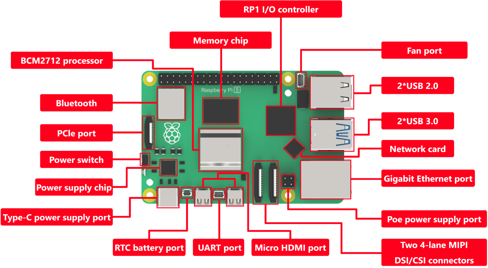
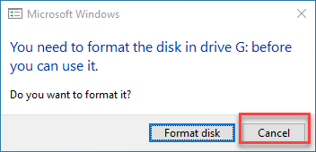
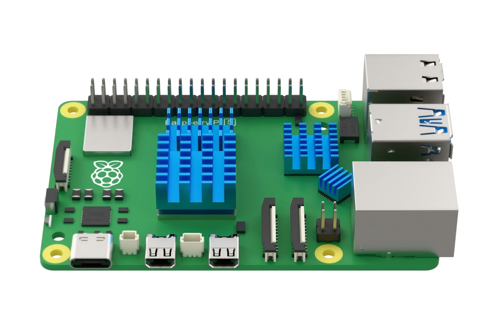
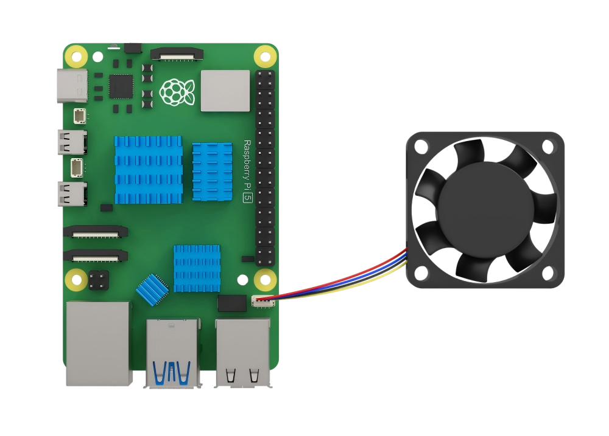

# 1. Read First

## 1.1 Raspberry 5 Introduction

### 1.1.1 Product Introduction

Raspberry Pi, abbreviated as RPi or RasPi/RPI, is a credit card-sized computer developed by the British Raspberry Pi Foundation with the mission of empowering global education. Aimed particularly at children, it serves as a tool for learning programming and gaining insight into computer operations.

Equipped with connectivity options such as keyboard, mouse, and network cable, Raspberry Pi features a TV output interface for analog video signals and an HDMI high-definition video output interface. Its versatility makes it suitable for users of all ages and skill levels. For instance, it facilitates learning programming languages like Python. Moreover, it performs various tasks akin to a conventional desktop computer, encompassing web browsing, high-definition video playback, spreadsheet creation, word processing, and gaming.

* **Raspberry 5 Introduction**

The Raspberry Pi 5 boasts a 64-bit quad-core **Arm Cortex-A76** processor clocked at 2.4GHz, marking a significant performance enhancement of 2 to 3 times compared to its predecessor, the Raspberry Pi 4. Augmenting this improvement is the substantially upgraded graphics prowess stemming from the 800MHz VideoCore VII GPU. With dual 4Kp60 display outputs via HDMI and advanced camera support facilitated by the re-architected Raspberry Pi image signal processor, users can expect a seamlessly enhanced desktop experience.

Representing a milestone, this iteration marks the inaugural full-size Raspberry Pi computer utilizing an internally built chip. The RP1, integral to the Raspberry Pi 5, revolutionizes peripheral performance and functionality. Notable enhancements include more than doubling the total USB bandwidth, enabling swifter transfers to external UAS drives and other high-speed peripherals. The previous dedicated dual-lane 1Gbps MIPI camera and display interfaces have been replaced by a pair of quad-lane 1.5Gbps MIPI transceivers, tripling the overall bandwidth and accommodating any combination of up to two cameras or displays. Furthermore, peak SD card performance is doubled through support for SDR104 high-speed mode. Notably, the platform introduces a single-lane PCI Express 2.0 interface, offering high-bandwidth peripheral support for the first time.

### 1.1.2 Raspberry Pi Structure & Feature

* **Hardware Structure**

* **Features**

(1) Quad-core Arm Cortex-A76 @ 2.4GHz with hardware AES encryption extension, featuring 512KB L2 cache per core and 2MB L3 cache.

(2) Options for 4GB or 8GB LPDDR4X-4267 SDRAM.

(3) Dual HDMI display outputs supporting 4kp60 resolution, HDR, and 4kp60 HEVC decoding.

(4) VideoCore VII graphics card with support for OpenGL-ES 3.1 and Vulkan 1.2.

(5) Integrated Raspberry Pi image sensor processor (ISP).

(6) Raspberry Pi connector for PCIe (1 x 2.0 port, additional HAT required).

(7) Dual-band 802.11ac Wi-Fi and Bluetooth 5.0 (BLE support included).

(8) Gigabit Ethernet connectivity.

(9) 2 USB 2.0 ports and 2 USB 3.0 ports capable of achieving full throughput concurrently.

(10) Power-over-Ethernet (PoE) support (requires additional HAT).

(11) Dual-channel 4-lane MIPI CSI/DSI transceiver, facilitating 2x displays, 2x cameras, or 1 display + 1 camera.

(12) Standard Raspberry Pi 40-pin GPIO connector.

(13) Dedicated fan connector.

(14) Built-in real-time clock (RTC).

(15) Onboard power button for convenient operation.

* **Advantages**

(1) Boasts robust computing capabilities.

(2) Built on open-source hardware, ensuring accessibility and user-friendliness.

(3) Offers cost-saving advantages compared to Microsoft systems, with free tools available.

(4) Serves as an economical development platform and troubleshooting tool.

(5) Operates offline, allowing for usage of all applications without internet access.

(6) Compact form factor, approximately the size of a credit card.

It is these inherent strengths that attract individuals worldwide to Raspberry Pi for acquiring programming expertise, undertaking hardware projects, engaging in home automation initiatives, and even incorporating them into industrial settings.

### 1.1.3 Comparison Between Raspberry Pi 5 and 4B

### 1.1.4 Dimension Diagram (Unit: mm)

### 1.1.5 Usage of Raspberry Pi

(1) Web Server: Thanks to its low power consumption, Raspberry Pi can operate continuously without the need for cooling fans or excessive electricity. It's capable of serving web pages swiftly, whether on the internet or within a local network.

(2) Laptop: Transform Raspberry Pi into the central processing unit of a laptop by pairing it with a computer screen.

(3) Home Theater Set-Top Box: Utilize various free operating systems to convert Raspberry Pi into a versatile set-top box, enabling seamless streaming of your preferred content.

(4) Game Emulator: Employ RetroPie OS on any Raspberry Pi to relive classic gaming experiences from platforms like Game Boy, arcade, and SNES.

(5) Surveillance Monitor: Easily assemble a budget-friendly surveillance system by connecting an external camera to Raspberry Pi.

(6) Wi-Fi Extender: Improve Wi-Fi coverage in problematic areas of your home by repurposing Raspberry Pi as an extender. With a USB Wi-Fi adapter, you can amplify signals using Raspberry Pi's built-in Wi-Fi.

(7) Multi-Room Music Streamer: Combine multiple Raspberry Pis with suitable software to establish an economical multi-room audio system, enabling synchronized music playback across different areas of your home.

(8) The Raspberry Pi isn't just a tool for development; it's a versatile companion in everyday life. Countless other applications exist beyond those mentioned here, demonstrating its adaptability to various needs and scenarios.

## 1.2 Raspberry Pi System Introduction and Installation

### 1.2.1 Mainstream Operating System Introduction

In the previous sections, we have already mentioned that Raspberry Pi itself is a miniature computer, so how can a computer function without an operating system?

An operating system (OS) is a collection of interconnected system software programs responsible for supervising and controlling computer operations, utilizing and managing hardware and software resources, and providing common services to organize user interactions. It serves as the first layer of software on top of hardware and acts as a bridge (or interface, intermediary, etc.) for communication between hardware and other software.

One of the commonly known operating systems is Windows. It provides foundational support for the operation of other programs, such as memory management, file systems, network communication, and graphical user interfaces.

Currently, common operating systems found on personal computers or servers include Linux, Windows, macOS, and others. Similarly, there are many distributions suitable for Raspberry Pi, which are sufficient to meet the needs of different user groups. If only specific functionality is required, choosing a third-party system is also feasible. In the following sections, several distribution versions will be listed to help everyone choose the most suitable system for themselves.

(1) **NOOBS**

As the official recommended system, NOOBS (New Out of Box System) is an extremely convenient multi-system boot manager. It includes all the files of the operating system, allowing users to directly install the system without relying on the network. Simply remember to update the system after installation.

(2) **Raspbian**

Also an official recommended system, Raspbian is the preferred operating system for Raspberry Pi users and is one of the most widely used systems currently. It is a version of Debian specifically tailored for the ARM architecture of Raspberry Pi, offering rich software resources and stable system security. In China, Raspbian has multiple update sources, making it easy for both beginners and experienced users to get started.

(3) **Windows IoT Core**

Windows IoT is an operating system designed for the Internet of Things within the Microsoft ecosystem. It has been compatible with Raspberry Pi since its initial release. However, it's important to clarify that this version differs from traditional Windows iterations. Unlike previous versions, it's not confined to the x86 architecture but can also operate on the ARM architecture.

(4) **Ubuntu MATE**

Users who have experience with Linux may find this familiar. It's a variant of Ubuntu, utilizing the MATE desktop environment, and serves as an official derivative of Ubuntu Linux. This platform represents the cutting edge in smart devices, capable of running software either locally or through cloud-based services.

(5) **Kali Linux**

Kali Linux is a Debian-based distribution tailored for digital forensics and penetration testing. It comes equipped with an array of penetration testing tools right out of the box, and users have the flexibility to run Kali Linux from a hard drive, live CD, or live USB. Available in both 32-bit and 64-bit versions for the X86 instruction set, as well as versions compatible with the ARM architecture.

(6) **OSMC**

The full name is Open Source Media Center, an audio-visual system officially endorsed by Raspberry Pi. It serves as a multimedia hub, facilitating playback of both local and online content, aiming to create a comprehensive home entertainment platform alongside the TV.

These are some of the more prevalent distribution systems for Raspberry Pi, marking the conclusion of the introduction to mainstream systems. Users keen on exploring further can conduct their own research. In this section, we will use the Raspbian operating system (which is based on Debian) as our illustrative example.

### 1.2.2 Preparation

> [!Note]
>
> Flashing the image will format the SD card. If there is any data on the SD card, please ensure to back it up beforehand.
>

You will need a card reader, a 32GB SD card (8GB or larger recommended), and a computer with internet access. Insert the SD card into the card reader and connect it to any available USB port on your computer.

### 1.2.3 Install System Online Using Official Tool

Raspberry Pi has introduced Raspberry Pi Imager, an official graphical tool for burning TF cards. This tool is compatible with operating systems such as Windows, macOS, and Ubuntu. With just one click, it can download and install images onto the SD card, making it incredibly user-friendly for beginners. Additionally, it simplifies the process of flashing custom images. This section will demonstrate the usage of this tool in a Windows environment as an example. For instructions on using other programming tools, please refer to online resources.

(1) Enter '**<https://www.raspberrypi.com/software/>**' on the web browser, and click-on '**Download for Windows**' to download the OS.

(2) After downloading, follow the instructions below to install the Raspberry Pi Imager, then open it.

(3) Click on "**CHOOSE DEVICE**" and select your Raspberry Pi model from the list. The Imager will always display the recommended version of Raspberry Pi OS for your specific model at the top of the list. In this case, we select "**Raspberry Pi 5**".

(4) Click-on '**CHOOSE OS**' to choose the operating system to be written. Here, we choose '**Raspberry Pi OS (64-bit)**'.

(5) Connect the SD card to the computer, then click-on '**CHOOSE STORAGE**'.

(6) Click-on '**NEXT**' to choose '**EDIT SETTINGS**' to customize the operating system.

(7) You can configure the the settings for Raspberry Pi before its initial startup, including user name, password, WiFi certificate, device host name, timezone, keyboard distribution and remote connection.

(8) Click-on '**SERVICES**' and tick '**Enable SSH service**', the click-on '**Save**' button.

(9) Choose '**Yes**' to apply the previous settings, then the setting will be flashed into the system, which will take a certain period of time.

(10) After the OS is written successfully, the window below will pop up prompting to format the SD card, click-on '**Cancel**'. Selecting 'Format Disk' will delete the download OS.

## 1.3 Protective Shell and Heat Sink Installation

### 1.3.1Heat Sink Installation

(1) Take out the heat sink, and peel off the paper on its back.

(2) Paste the heat sink to the position as pictured.

### 1.3.2 Protective Shell and Cooling Fan Installation

(1) Connect the cooling fan to the 4-PIN JST port of the Raspberry Pi.

(2) Attach the Raspberry Pi onto the black acrylic base plate.

(3) Having attached the Raspberry Pi onto the acrylic base plate successfully, take out the acrylic protective plate. Fix the protective case to the base plate aligning holes with the corresponding port as pictured:

(4) Attach the cooling fan to the acrylic upper board with the label facing inwards.

(5) Install the acrylic upper board onto the acrylic protective shell aligning the raised buckles.

(6) Insert the SD card into card slot on the side with the font side facing the bottom of the base plate.

## 1.4 Raspberry Pi 5 Use Instructions

### 1.4.1 Display

(1) Begin by connecting the power cable of the display to the Raspberry Pi. Subsequently, connect the HDMI cable. Ensure not to reverse this order, as doing so may result in the screen not activating after connection.

(2) If you start the Raspberry Pi 5 and log into the Raspberry System remotely prior to connecting the display, the remote connection will be severed. To address this issue, simply restart the Raspberry Pi 5.

### 1.4.2 Remote Login

When the Raspberry Pi 5 is connected to a monitor, if you remotely log into the desktop system, the resolution of the screen will match that of the monitor. Even if you change the resolution in the system, it will not take effect.

To apply the modified resolution while the monitor is connected, you need to unplug the monitor and then restart the Raspberry Pi.

In the event that the modified resolution takes effect on the Raspberry Pi, if an external display is connected, the resolution of the remote desktop system will match that of the screen.

### 1.4.3 Power Supply

The Raspberry Pi requires a power supply of 5.1V/5A. If the external power source fails to deliver this voltage and current during the initial startup, the operating system will issue an alert indicating that the current consumption is limited to 600mA.

For powering high-power consumption external devices such as disks and SSDs while ensuring peak performance, it's recommended to use a USB-PD power supply offering +5V (25W) current. If the Raspberry Pi 5 firmware detects a compatible 5A power supply, it will raise the current limit of the USB peripherals to 1.6A, thus providing an additional 5W of power for downstream USB devices, along with an extra 5W for the onboard power budget.

### 1.4.4 Firmware

You can only update the firmware of the Raspberry Pi 5 once you receive the update prompt from the official Raspberry Pi. For further information on firmware updates, please visit the official website: <https://www.raspberrypi.com/documentation/computers/raspberry-pi-5.html>

### 1.4.5 Use Notices

(1) Prolonged high-load operation may cause the temperature of Raspberry Pi 5 to rise excessively. It is recommended to take heat dissipation measures, such as attaching heat sinks, to ensure proper cooling.

(2) Before touching the Raspberry Pi, please make sure to ground yourself to eliminate static electricity and prevent damage to components.

(3) The operating voltage of GPIO pins is +3.3V. Do not forcibly input 5V voltage to avoid damage.

(4) The operating temperature range of Raspberry Pi is 0-50℃. Operating beyond this range may affect performance or lifespan.

(5) Please ensure compatibility between Raspberry Pi 5 and software to avoid compatibility issues.

## 1.5 GPIO Port Description

### 1.5.1 Introduction

The Raspberry Pi features 40 GPIO ports numbered from GPIO0 to GPIO27. The primary function of the Raspberry Pi 5 is to facilitate digital signal transmission between the Raspberry Pi and external devices.

### 1.5.2 GPIO Pin Function

1. **Power input/ output**

   Provide 5V, 3.3V and GND pins, which can input and output power to the external device.

2. **Digital input/ output**

   GPIO port supports input and output of the digital signal, read the digital signal of the external device, and output digital signal to control the external device.

3. **Wiring Communication Protocol**

   Some GPIO pins support I2C and SPI communication protocol. Through these pins, Raspberry Pi 5 can achieve serial communication with the external device.

4. **PWM output**

   The GPIO23 pin supports pulse width modulation (PWM) output functionality. It can be utilized to regulate motor speed or adjust the brightness of LEDs.

5. **Accessing Peripheral Devices**

   Various peripheral devices such as sensors, push buttons, LCD displays, etc., can be connected to the Raspberry Pi via the GPIO port to facilitate data transmission and reception.

6. **Touchpad or Keypad Input**

   GPIO can read the high and low level states of touch panels or switches to enable touch input or key control functions.

7. **Driving Output Devices**

   The GPIO port supports digital output, allowing for control over the switching of external LED lights, buzzers, and other output devices.

8. **Communication Module Control**

   Through GPIO, communication with GSM/GPRS modules and WiFi modules for information transmission can be established.

9. **Programmatic Control**

   Using Python and C languages, each GPIO pin can be flexibly programmed to realize various automation applications.

   For further development and learning, you can refer to the official tutorial at: official tutorial: **<https://www.raspberrypi.com/documentation/computers/raspberry-pi-5.html>**

## 1.6 PCle Port Description

### 1.6.1 Port Description

Compared to the Raspberry Pi 4B, the Raspberry Pi 5 has added a PCIe 2.0 interface, located to the left of the motherboard logo.

### 1.6.2 PCle Introduction

PCI Express (Peripheral Component Interconnect Express) is a high-speed serial computer expansion bus standard. It operates as a high-speed serial point-to-point dual-channel high-bandwidth transmission system. Each connected device is allocated exclusive channel bandwidth, eliminating the need to share bus bandwidth. PCIe comes in two forms: the M.2 interface channel form and the standard PCIe slot.

PCIe is highly scalable and supports various devices, including graphics cards, solid-state drives (in PCIe interface form), wireless network cards, wired network cards, sound cards, video capture cards, PCIe to M.2 interfaces, PCIe to USB interfaces, PCIe to Type-C interfaces, and more.

### 1.6.3 The Application of the PCIe Interface on Raspberry Pi 5

(1) Raspberry Pi 5 comes with a PCIe 2.0 interface, adhering to standard PCIe slot specifications, enabling a wide range of applications and significantly expanding the usability of Raspberry Pi 5. The following are the primary applications of the PCIe interface on Raspberry Pi 5:

(2) Utilize the PCIe slot to connect an Ethernet card supporting high-speed networks beyond Gigabit, enhancing the network connectivity capabilities of Raspberry Pi.

(3) Connect an independent GPU or hardware accelerator card, based on PCIe interface specifications, to provide graphics and computational processing power to Raspberry Pi 5.

(4) Connect a PCIe-based FPGA expansion card, leveraging its programmability to extend the functionalities of Raspberry Pi 5.

(5) Attach a PCIe SSD solid-state drive card to augment Raspberry Pi 5 with high-speed storage space.

(6) Link a PCIe audio interface card or DVI interface conversion card to expand the audio and video output capabilities of Raspberry Pi.

(7) Integrate a PCIe industrial control interface card to equip Raspberry Pi 5 with industrial control and automation interfaces.

(8) Incorporate a PCIe interface WiFi or 5G chip card to enable high-speed wireless networking functionality.

(9) Connect custom function expansion cards implemented through FPGA or CPLD.

(10) For further development and learning, please consult the official tutorial at: <https://www.raspberrypi.com/documentation/computers/raspberry-pi-5.html>

## 1.7 MIPI CSI&DSI Connection Description

### 1.7.1 Port Description

Raspberry Pi 5 introduces MIPI CSI (Camera Serial Interface) and MIPI DSI (Display Serial Interface) connectors to support MIPI standard cameras and displays. These connectors are located in the lower right corner of the motherboard.

### 1.7.2 MIPI CSI/DSI Introduction

(1) MIPI CSI

MIPI CSI (Camera Serial Interface) is a standard serial digital image transmission interface used to connect image sensors to host processors in embedded systems.

(2) MIPI DSI Connector

MIPI DSI (Display Serial Interface) is a serial interface utilized in display technology, compatible with DPI (Display Pixel Interface), DBI (Display Bus Interface), and DCS (Display Command Set). It transmits pixel information or instructions to peripherals in a serial manner, reads status information or pixel data from peripherals, and employs its own independent communication protocol during the transmission process, including data packet formatting, error correction, and error detection mechanisms.

### 1.7.3 Applications and Advantages of MIPI CSI/DSI Interfaces on Raspberry Pi 5

The standardized connection between Raspberry Pi 5 and MIPI-standard digital cameras and displays utilizes MIPI high-speed and low-power serial physical layer and link layer protocols. It supports a maximum 4-lane unidirectional transmission rate of 1.5Gbps, with a total bandwidth of up to 6Gbps. This standardized interface, smaller and more reliable than traditional CSI/DSI modules, enables direct connectivity to a wider range of MIPI visual products, significantly enhancing Raspberry Pi's compatibility in image acquisition and display.

Simultaneously, high-speed transmission meets the demands of real-time processing at higher resolutions. Through the MIPI interface, Raspberry Pi 5 finds application in a broader spectrum of visual projects, such as video surveillance, face recognition, etc. This reduces verification time and improves research and development efficiency, creating favorable conditions for Raspberry Pi 5's utilization in emerging fields such as visual AI.

For further development and learning, please refer to the official tutorial at: **<https://www.raspberrypi.com/documentation/computers/raspberry-pi-5.html>**

## 1.8 UART Connection

### 1.8.1 Port Position

Raspberry Pi 5 introduces a dedicated debugging UART interface to facilitate high-speed and low-latency serial communication. It is positioned in the lower left corner of the motherboard.

### 1.8.2 UART Introduction

UART, short for Universal Asynchronous Receiver/Transmitter, is a physical interface used for serial communication. It facilitates the conversion of data between serial and parallel communication formats. The transmitting UART transforms parallel data from a control device, such as a CPU, into serial format for transmission. Subsequently, the receiving UART converts the serial data back into parallel form for the receiving device.

### 1.8.3 Application of UART Interface in Raspberry Pi 5

The UART port remains active and enabled, offering direct access to early boot and firmware information, as well as the Linux console post-boot. It also facilitates connections with peripheral devices like GPS modules, GSM modules, debugging assistants, etc. However, it's crucial to ensure correct connections of the sending and receiving data lines to the corresponding RXD and TXD pins.

For further development and learning, please consult the official tutorial available at: **<https://www.raspberrypi.com/documentation/computers/raspberry-pi-5.html>**

## 1.9 Real-Time Clock

### 1.9.1 Port Position

Raspberry Pi 5 features a new RTC clock battery interface. Its primary function is to provide Raspberry Pi 5 with robust real-time capabilities, allowing it to perform limited tasks even when powered off. This broadens the application possibilities of Raspberry Pi 5. The interface is located in the lower left corner of the motherboard.

### 1.9.2 Real-Time Clock (RTC) Introduction

The RTC (Real Time Clock) functions as an autonomous timer. Equipped with a continuous technology counter, the RTC module offers clock and calendar functionalities upon software configuration. Adjusting the counter value allows for resetting the current time and date. Moreover, the RTC includes an automatic wake-up unit to manage low-power modes.

In the event of a power outage, the RTC can operate independently. As long as the chip's backup power supply remains active, the RTC will continue to keep time accurately.

### 1.9.3 Applications and Advantages of the RTC Real-Time Clock on Raspberry Pi 5

Equipped with an officially supplied rechargeable lithium manganese coin cell battery, pre-installed two-pin JST plug, and adhesive mounting pad,the RTC real-time clock enables Raspberry Pi 5 to maintain accurate timekeeping even when disconnected from the main power source, with power-off current measured in microamps (µA). This provides retention times measurable over months.

The RTC battery interface empowers Raspberry Pi 5 with robust real-time capabilities. It can perform limited tasks during power outages, such as recording time events, without losing records. In case of power interruptions, it can continue to execute preset scheduled tasks, record real-time data and events, and retain them for subsequent query and analysis. This significantly expands its application scope.

For further development and learning, please refer to the official tutorial at: **<https://www.raspberrypi.com/documentation/computers/raspberry-pi-5.html>**

## 1.10 Power over Ethernet (PoE) Connection Instructions

### 1.10.1 Port Position

The Ethernet port on the Raspberry Pi 5 supports PoE+ and complies with the IEEE 802.3at-2009 PoE standard. Its interface utilizes a 4-pin Power over Ethernet (PoE), positioned between the Ethernet port and two MIPI connectors.

### 1.10.2 Power over Ethernet Introduction

PoE (Power over Ethernet) is a technology that enables power transmission through network cables. It utilizes existing Ethernet infrastructure to simultaneously transmit data and provide power to IP terminal devices, such as IP phones, access points (APs), IP cameras, etc. This technology is also known as Power over LAN (PoL) or Active Ethernet, depending on the LAN-based application, and is commonly referred to as Power over Ethernet.

By integrating power delivery into the network cable used for data transmission, PoE eliminates the need for separate power sources for devices like IP phones, wireless APs, portable device chargers, card machines, cameras, data collection terminals, and others. This offers advantages such as reliable connections, simplified installations, and unified standards.

To standardize and promote the development of PoE technology and address compatibility issues between power supplies and powered equipment from different manufacturers, the IEEE Standards Committee has released three PoE standards: IEEE 802.3af, IEEE 802.3at, and IEEE 802.3bt.

### 1.10.3 Applications and Advantages of Power over Ethernet (PoE) on Raspberry Pi 5

Raspberry Pi 5 inherits the Ethernet port from Raspberry Pi 4B and supports PoE power supply. This enables bidirectional transmission of data and power through a single network cable, greatly simplifying the installation and deployment of Raspberry Pi 5 in edge scenarios requiring long-term networking, such as intelligent video surveillance and industrial Internet applications. Compared to traditional designs necessitating additional power supplies, PoE technology eliminates the need for complex power line layouts, significantly reducing installation costs and mitigating later maintenance challenges.

Moreover, PoE support adheres to IEEE standards, ensuring compatibility with existing PoE infrastructure and enhancing system reliability by mitigating potential failures stemming from power supply issues. In essence, PoE lays the groundwork for the widespread commercial application of Raspberry Pi 5 in the realm of the Internet of Things (IoT). Not only does it streamline installation processes, but it also reduces overall costs and enhances system stability—a crucial consideration for edge computing applications.

For further development and learning, please consult the official tutorial at: **<https://www.raspberrypi.com/documentation/computers/raspberry-pi-5.html>**