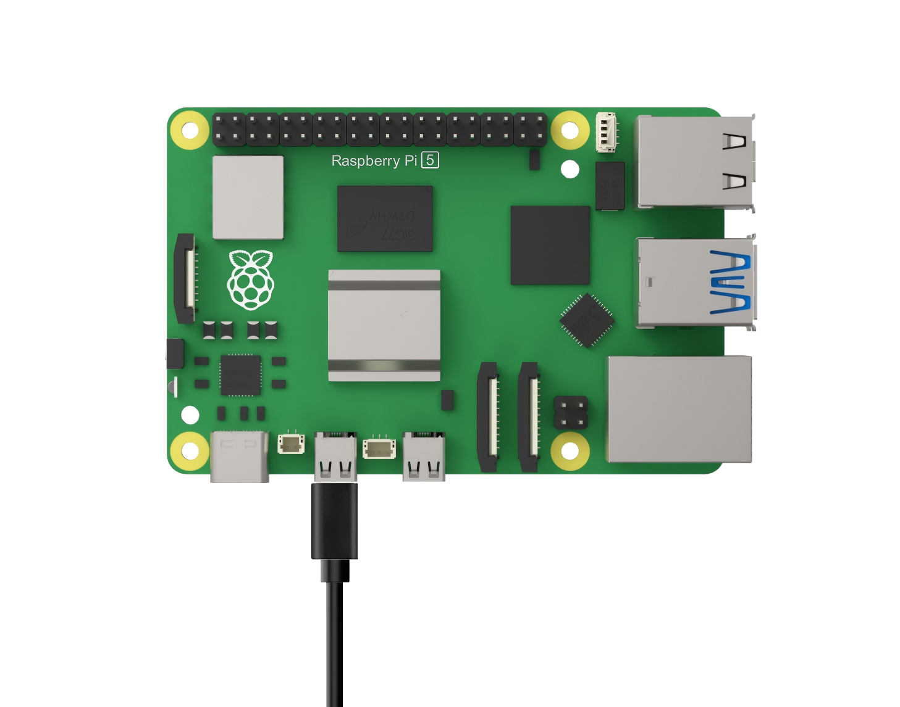
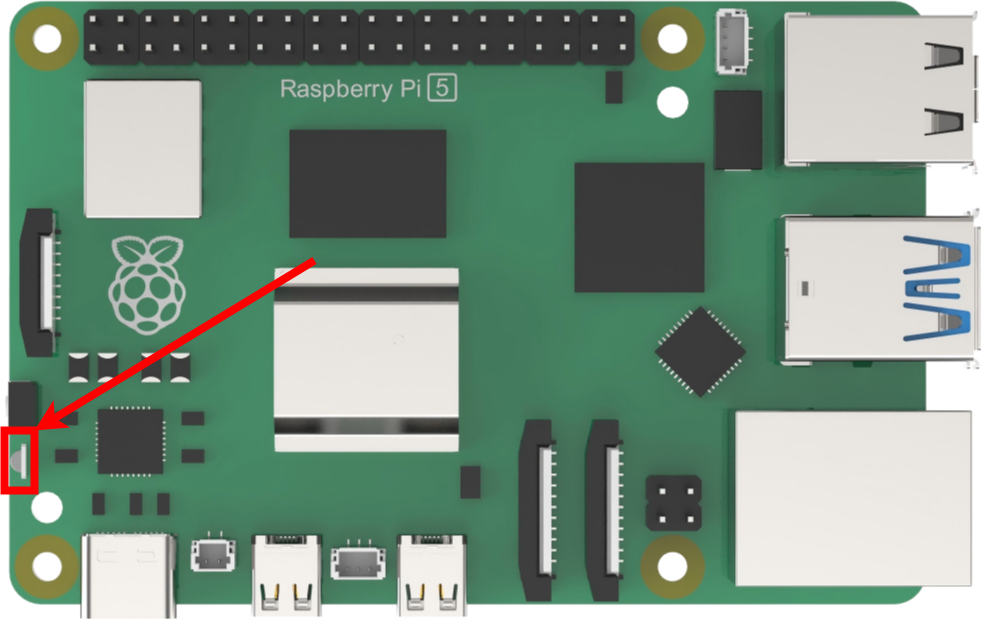
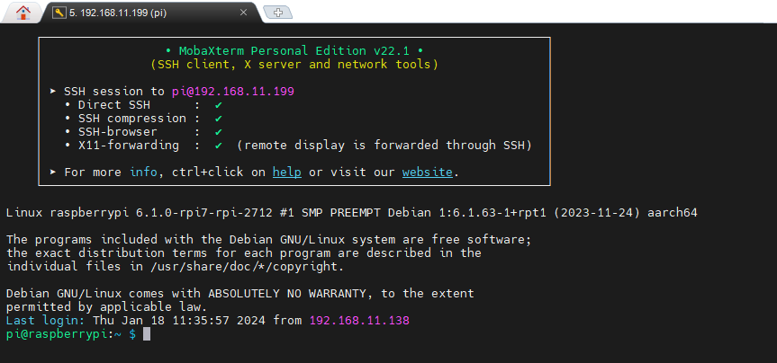
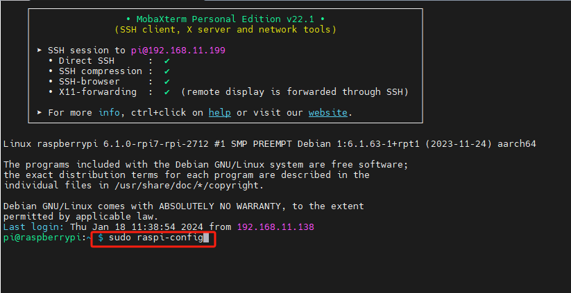
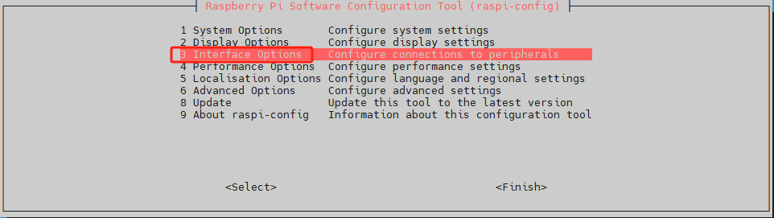
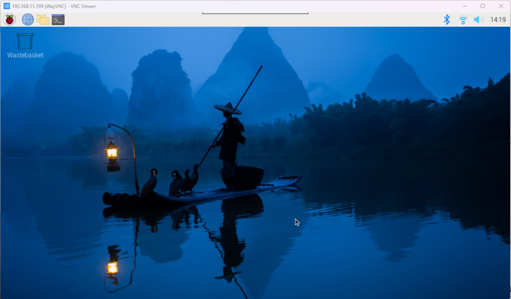

# 2. Raspberry Pi 5 Basic Operation and Configuration

## 2.1 Initial Setup and External Device Connection

> [!Note]
>
> If you lack peripheral devices such as a monitor, keyboard, and mouse, you can reference the "Lesson 2 Remote Access and Remote File Transfer" course within this chapter to establish a remote connection.
>

### 2.1.1 Preparation Before Startup

In the preceding chapters, we've readied the Raspberry Pi—similar to the process before using a new computer in daily life, where we assemble it, install the system, and then connect the wiring to prepare for startup.

Now, it's time to undertake some pre-boot tasks to kickstart the "**Raspberry Pi Journey**" officially! To begin, ensure you have a computer monitor, a set comprising a USB interface keyboard and mouse, and a Micro-HDMI cable. Depending on your monitor's interface, you may opt for an HDMI-to-VGA or HDMI-to-DVI cable to connect it.

(1) Insert the SD card containing the previously burned system image into the Raspberry Pi. Ensure that the gold finger of the SD card faces the Raspberry Pi motherboard, as depicted in the figure below:


(2) Next, connect the USB keyboard and mouse to the USB ports on the Raspberry Pi. Unlike the Raspberry Pi 3B/3B+ motherboard, two of the four USB ports on the Raspberry Pi 5 are USB 3.0 ports.


(3) Connect one end of the HDMI cable to the HDMI port of the Raspberry Pi, and plug the other end into the corresponding port on the monitor.



(4) Connect the power cord and switch on the power (you can press the button after plugging it into the power strip). Raspberry Pi 5 utilizes a Type-C power supply interface and supports larger power input (5.1V, 5A), thus it cannot be directly powered through the computer's USB interface.


### 2.1.2 Raspberry Pi Startup

After powering on, the indicator light will initially turn red, then transition to green. Wait for a few seconds for the green light to flash irregularly, indicating the desktop loading process. Once the desktop is fully loaded, the green light will remain steady.




## 2.2 Remote Access and Remote File Transfer

### 2.2.1 Preparation

* **Hardware**

Prepare a laptop computer. If you're using a desktop computer, please ensure you have a wireless network card, as it's necessary to connect to the same LAN as the Raspberry Pi 5.

* **MobaXterm Tool Installation and Usage**

MobaXterm is a software that integrates various remote computing tools and offers a graphical interface. By connecting to the Raspberry Pi's Wi-Fi hotspot, we can directly control the Raspberry Pi from the computer. Next, we will provide a step-by-step explanation of how to install the software.

(1) Double-click the '**MobaXterm_installer_22.1.msi**' file saved in the folder '**[Appendix](https://wiki.hiwonder.com/projects/Raspberry-Pi-5-Controller/en/latest/docs/Appendix.html)**'.


(2) Click-on '**Next**' and tick '**I accept the terms in the License Agreement**'.


(3) Select the storage path, then click-on '**Next**'.


(4) Click-on '**Next**'.


(5) Wait for the installation to complete. After a while, the installation completion prompt page will appear. Click-on the "**Finish**" button.


* **Start Raspberry Pi 5**

(1) Following the previous tutorial, we have connected the Raspberry Pi 5 to the LAN. Using the tutorial demonstration as an example, the Raspberry Pi 5 is connected to the "**Hiwonder**" hotspot. Therefore, our computer is also connected to the "**Hiwonder**" hotspot at this time.


(2) Open the "**Run**" window by pressing the **Win + R** keys, then enter "**cmd**" to open it in administrator mode.


(3) Type the command "**ping raspberrypi -4**" to view the IP address assigned to the Raspberry Pi 5 by the hotspot.


### 2.2.2 Connect to Raspberry Pi 5 Using MobaXterm

(1) Click-on '**Session**' button located on the upper left corner to create a new session.


(2) Choose '**SSH**', then input the robot's IP, which is **192.168.11.199**. Next, check '**Specify username**', and input the username '**pi**'. Finally, click the '**OK**' button.


(3) The initial login password is '**raspberrypi**'. As you type the password, it will not be displayed on the screen. After entering the password, press the Enter key to proceed.


(4) When you input the correct password, you will navigate to the system interface as below.



### 2.2.3 File Transfer

In our interactions with Raspberry Pi, file transfers between our computers and the device are common. This chapter will demonstrate the use of SSH and the MobaXterm tool as an example. For alternative file transfer methods, you can explore and learn from various online resources.

* **Send Files from Computer to Raspberry Pi**

(1) Once SSH connection is established, here's an example of creating a new file named test.txt on the desktop of your computer.

(2) Resize the MobaXterm window if needed, then simply drag the file you wish to transfer onto the MobaXterm interface.


(3) The file will be promptly transferred to the desktop of your Raspberry Pi system. Enter the command "**ls**" to display all files and directories, then press Enter. As depicted in the image below, you'll see that the files imported from your computer have been successfully transferred.


* **Send Files from Computer to Raspberry Pi**

Upon establishing an SSH connection, locate the desired file within the MobaXterm file area. Drag the file to your computer's desktop using your mouse, and the file will be automatically transferred to the desktop.


### 2.2.4 Enable VNC Connection

If you're not accustomed to command-line control and the official system image burned by Raspberry Pi 5 doesn't enable VNC connection by default, you can enable VNC connection through SSH and carry out the necessary operations.

(1) After connecting via SSH, enter the "**sudo raspi-config**" command and press Enter to open the Raspberry Pi 5 configuration window.



(2) In this interface, use the up and down arrow keys to navigate, press Enter to confirm selections, and press Esc to return to the previous level. Locate "**Interface Options**" and press Enter to access the relevant settings interface.



(3) Locate "**I2 VNC**" and press Enter to access the VNC switch interface.


(4) Choose '**Yes**', and hit Enter key to enable the VNC connection.


Once VNC connection is enabled, you can establish a connection to the Raspberry Pi 5 system using VNC.

### 2.2.5 VNC Connection and Installation

VNC is remote control software that provides a graphical desktop interface, similar to the commonly used Windows operating system.

* **VNC Installation**

(1) Double-click '**VNC-Viewer-6.17.731-Windows**' application saved in the '**[Appendix](https://wiki.hiwonder.com/projects/Raspberry-Pi-5-Controller/en/latest/docs/Appendix.html)**' folder, select 'English' to use, then click-on 'OK' button.


(2) Click-on '**Next**' button in the pop-up interface.


(3) Select the checkbox to agree to the terms in the new prompt box, then click "**Next**". The installation location settings will then appear. Keep the default settings and proceed by clicking "**Next**".


(4) Click-on '**Install**' on the pop-up interface.


(5) When the installation is complete, click-on '**Finish**' button.


(6) After installation, open .

* **VNC Connection**

(1) Following the previous tutorial, we've connected the Raspberry Pi 5 to the LAN. Using the tutorial demonstration as a reference, let's assume the Raspberry Pi 5 is connected to the "**Hiwonder**" hotspot. At this point, our computer is also connected to the "**Hiwonder**" hotspot.


(2) Launch the installed VNC client. Enter the IP address of the Raspberry Pi 5 (**192.168.11.199**) in the VNC Viewer, then press Enter. If prompted that the connection is not secure, click "**Continue**".


(3) A prompt will appear, requesting a password. Enter the password: "**raspberrypi**" (if an account is needed, use "**pi**"), check the "**Remember password**" box, then click "**OK**" to remotely access the Raspberry Pi desktop. (If the screen remains black with only a mouse pointer, consider restarting the Raspberry Pi and repeating the above steps.)




## 2.3 Source Update

The default software download server for Raspberry Pi is typically located abroad. However, to ensure faster download speeds and avoid potential errors, it's advisable to switch to a domestic server.

In this example, we'll demonstrate how to switch to the Tsinghua University open-source software mirror station. Alternatively, you can explore other servers listed on the official mirror list: <https://www.raspbian.org/RaspbianMirrors>


### 2.3.1 Revise sources.list File

(1) Press "**Ctrl+Alt+T**" to open the command line terminal, then enter the command "**sudo nano /etc/apt/sources.list**" and press Enter to edit the sources.list file.

```bash
sudo nano /etc/apt/sources.list
```

(2) Use the arrow keys "← →" to navigate to the position indicated in the screenshot.


(3) Press "**#**" to comment out all the contents of the original file.


(4) Next, navigate the cursor to the bottom empty line and add the following content sequentially. You can copy and paste, but avoid using **Ctrl+V** for pasting. Instead, use the middle or right mouse button and select "**Paste**". Please note that the provided source is the Tsinghua University open-source software mirror station. If you opt for other sources, kindly modify it accordingly. Additionally, ensure strict adherence to the specified format and avoid line wrapping, as it could invalidate the changes and lead to a failed source modification.

```bash
deb https://mirrors.tuna.tsinghua.edu.cn/debian/ bookworm main contrib
deb https://mirrors.tuna.tsinghua.edu.cn/debian/ bookworm-updates main contrib
deb https://mirrors.tuna.tsinghua.edu.cn/debian/ bookworm-backports main contrib
deb https://security.debian.org/debian-security bookworm-security main contrib
```


(5) Use short-cut '**Ctrl+O**' to save the change. When you receive the below prompt, hit Enter key.


(6) Having saved the change, use short-cut '**Ctrl+X**' to exit.

### 2.3.2 Revise raspi.list File

(1) Press '**Ctrl+Alt+T**' to open the command-line terminal, and execute the command '**sudo nano /etc/apt/sources.list.d/raspi.list**' to edit the '**raspi.list**' file, then hit Enter key.

```bash
sudo nano /etc/apt/sources.list.d/raspi.list
```

(2) Use arrow keys '← →' to move the cursor to the position as pictured.


(3) Hit '**\#**' key to comment out all contents of the original file.


(4) Next, navigate the cursor to the bottom empty line and sequentially append the following content. You can copy and paste, but refrain from using Ctrl+V for pasting. Instead, utilize the middle or right mouse button and select "**Paste**".

```bash
deb https://mirrors.tuna.tsinghua.edu.cn/raspberrypi/ bookworm main
```


(5) Use short-cut '**Ctrl+O**' to save the change. When the following prompt appears, hit Enter key.


(6) Having saved the file, use short-cut '**Ctrl+X**' to exit the file.

## 2.4 Lesson 4 Operating System Update

Regularly updating the Raspberry Pi can enhance system security; however, it's not advisable for developers to update randomly.

### 2.4.1 Graphical Interface Update

Typically, the Raspberry Pi system update prompt appears in the upper right corner of the desktop. You can click on the corresponding option to initiate the update process.


### 2.4.2 Command-Line Terminal Update 

(1) Press "**Ctrl+Alt+T**" to open the command line terminal. Enter the command "**sudo apt update**" to update the local package cache. During the update process, you may be prompted to confirm acceptance of the changes. Type "**Y**" and press Enter, then wait for the update to finish.

```bash
sudo apt update
```

(2) Enter the command "**sudo apt full-upgrade**" to update the software packages. If prompted to consume additional disk space during the update process, press "**Y**" and then Enter to proceed. Note that the initial configuration may take some time, so please be patient while waiting.

```bash
sudo apt full-upgrade
```

## 2.5 raspi-config Configuration Tool Introduction

Raspi-config is a pre-installed configuration tool in Raspberry Pi OS. It offers a straightforward command-line interface for managing Raspberry Pi system configurations, enabling users to easily customize and optimize their system settings.

### 2.5.1 Launch raspi-config Tool

(1) Use short-cut '**Ctrl+Alt+T**' to open the command-line terminal, execute the command '**sudo raspi-config**', then hit Enter key.


(2) Use '↑↓' arrow keys to choose the option, and hit Enter key to confirm the selection. Then hit Esc key to navigate to the previous level.


### 2.5.2 Function List

Upon entering the configuration command, you will be presented with the raspi-config tool interface, where all available options are listed within the central gray box.

(1) System Options

The System Options menu permits configuration adjustments across various sections such as boot, login and network, sound, and more, encompassing several system-level modifications.


(2) Display Options

Display options facilitate configuration adjustments such as resolution settings and eliminating black borders, among other display-related configurations.


(3) Interface Options

In the Interface Options menu, you can toggle the following selections to enable/disable: Camera, SSH, VNC, SPI, I2C, Serial, 1-wire, and remote access GPIO.


(4) Performance Options

Performance options encompass features like overclocking, video memory size adjustments, fan speed control, and other related settings.


(5) Locallistion Options

Localization options offer settings for keyboard layout, time zone, regional configurations, and wireless LAN country code.


(6) Advanced Options

Advanced options provide settings for tasks such as disk expansion and boot startup configurations.


(7) Update

Update raspi-config tool to the highest version.


(8) About raspi-config

About raspi-config info.


### 2.5.3 Set WiFi Country

(1) Choose '**5 Localisation Options Configure language and regional settings**', then hit Enter key.


(2) Choose '**L4 WLAN Country Set legal wireless channels for your country**', then hit Enter key.


(3) Select '**HK Hong Kong**', then hit Enter key to save the change.


## 2.6 config.txt File Description

As the Raspberry Pi lacks a traditional BIOS, system configuration parameters are typically stored in the "**config.txt**" text file.

This file is read by the GPU before initializing the ARM kernel, serving as a unique startup configuration file for the Raspberry Pi system. It resides on the first (boot) partition of the SD card, accessible at: **/boot/config.txt**


### 2.6.1 File Format

To open the config.txt file, simply double-click on it. Each line within this file contains a single statement, where the content can be an integer or a string. Additionally, you can include comments before each statement to explain its function. It's important to note that each line's length is restricted to 98 characters, and any content exceeding this limit will be disregarded.


### 2.6.2 Common Option

- **Camera_auto_detect**

When this setting is enabled, the firmware will automatically load overlays for the CSI cameras it recognizes.

Set to disable:

```py
camrea_auto_detect=0
```

- **Display_auto_detect**

When this setting is enabled, the firmware will automatically load overlays for the CSI cameras it recognizes.

Set to disable:

```py
display_auto_detect=0
```

- **Dtoverlay**

Used to load and configure device tree overlays. By configuring dtoverlay, users can add additional hardware support or functionality to the Raspberry Pi system. For instance, to load an overlay that enables the kernel graphics driver:

```py
dtoverlaydtoverlay=vc4-kms-v3d
```
  
  To access more detailed tutorials, please visit this website: **<https://www.raspberrypi.com/documentation/computers/raspberry-pi-5.html>**

## 2.7 Network Configuration Method+Vim Editor Installation and Usage Tutorial

### 2.7.1 Network Configuration Method

The network configuration methods for Raspberry Pi 5 encompass three modes: Access Point (AP), Station (STA), and direct network connection. Below, we'll detail the network configuration procedures for each of these modes. Please note that this lesson necessitates the use of the vim editor. If it's not installed, please consult the "**Vim Editor Installation and Usage Tutorial**" located in this folder.

* **AP Mode**

(1) Use shortcut '**Ctrl+Alt+T**' to open the command-line terminal. Execute the command '**sudo vim /etc/NetworkManager/system-connections/pi5.nmconnection**', then hit Enter key to create and edit **pi5.nmconnection** file.


(2) Input the following code.


(3) Configure the Raspberry Pi's network mode to Access Point (AP) mode with the WiFi name set to "**pi5**" and password as '**12345678**', while fixing the IP address to **192.168.149.1**. After inputting the changes, press the '**Esc**' key, input '**:wq**', and hit Enter to save the changes and exit the operation.


(4) Execute the command '**sudo systemctl restart NetworkManager**' to restart the network configuration.


(5) Run the command '**sudo reboot**' to restart the system and complete the AP mode configuration.

```bash
sudo reboot
```

* **STA Mode**

(1) Use short-cut '**Ctrl+Alt+T**' to open the command-line terminal, and execute the command '**sudo vim /etc/NetworkManager/system-connections/hiwonder.nmconnection**', then hit Enter key to create and edit the hiwonder.nmconnection file.


(2) Enter the following code.


(3) Configure the Raspberry Pi's network mode to Station Mode (STA) mode with the WiFi name set to "**WWW**" and password as '**hiwonder**', while fixing the IP address to **192.168.1.111**. After inputting the changes, press the '**Esc**' key, input '**:wq**', and hit Enter key to save the changes and exit the operation.


(4) Run the command '**sudo systemctl restart NetworkManager**' to restart the network configuration file.


(5) Enter the "**sudo reboot**" command to restart the system and finalize the configuration of STA mode.

```bash
sudo reboot
```

* **Direct Network Connection**

(1) Press "**Ctrl+Alt+T**" to open the command line terminal. Enter the command "**sudo vim /etc/NetworkManager/system-connections/hiwonder.nmconnection**" and then press Enter to create and edit the **hiwonder.nmconnection** file.


(2) Enter the following code.


(3) Configure the direct network connection mode of Raspberry Pi 5 and set it to a fixed IP address: 192.168.1.112. After entering the configuration, press the "**Esc**" key on the keyboard, type "**:wq**", and then press Enter to save and exit.


(4) Type the command '**sudo /etc/init.d/networking restart**' to relaunch the network configuration file.


(5) Enter the "**sudo reboot**" command to restart the system and finalize the configuration of the direct network cable mode.

```bash
sudo reboot
```

### 2.7.2 Vim Editor Installation and Usage Tutorial

Vim supports multiple programming languages and provides a wide range of shortcut keys. It is the default editor in the Linux system. In early Unix systems, Vi served as the default editor. Vim, an improved version of Vi, offers advanced editing features including code insertion, compilation, and error navigation, thus streamlining the editing process for users.

* **Vim Mode Introduction**

Vim has three modes: command mode, insert mode, and bottom line command mode. Refer to the table below for detailed descriptions of each mode.

|     **Mode name**      |                    **Mode introduction**                     |                      **Mode function**                       |
| :--------------------: | :----------------------------------------------------------: | :----------------------------------------------------------: |
|      Command mode      | The default mode upon entering the Vim editor is command mode. |              Move cursor, and delete characters              |
|       Input mode       | To switch to editing mode, enter the command "i" in command mode. | In this mode, you can input characters, and pressing "ESC" will return you to command mode. |
| Last line command mode |      To enter function mode, press ":" in command mode.      | In this mode, you can execute functions such as saving files, exiting Vim, configuring Vim, searching, and more. |

To switch the mode, please refer to the following schematic.


In Input mode, you can edit the file content. "**Command mode**" serves as an intermediate state where you can view and delete code. "Last line command mode" allows you to save the entire file and exit the editor.

The relationship among these modes can be likened to the process of employees going to work. Entering the company (vi file) office (input mode) requires an employee ID (command entry). Without showing your employee ID, you can only view the building scenery as a visitor. However, by presenting your employee ID card, you can enter the company to work. At the end of the day, before leaving work, you need to punch out (last line command mode) to record (save) today's attendance record, and then exit the company (press "ENTER"), officially completing the day's work.

* **Vim Basic Operation**

We present the various key operations in the three modes in the form of a table. If you are interested in it, you can refer to additional resources for further learning.

<table class="docutils-nobg" border="1">
<tr>
<th>Mode</th>
<th>Key Function</th>
</tr>
<tr>
<td rowspan="3">Command mode</td>
<td>"i"——Switch to input mode.</td>
</tr>
<tr>
<td>"x"——Delete the character at the current cursor position.</td>
</tr>
<tr>
<td>":"——Switch to bottom line command mode.</td>
</tr>
<tr>
<td rowspan="9">Input mode</td>
<td>Enter and new line</td>
</tr>
<tr>
<td>Character key and "Shift" combination - Enter characters</td>
</tr>
<tr>
<td>"Backspace" - Backspace key, deletes the character before the cursor.</td>
</tr>
<tr>
<td>"Del" - Delete key, deletes one character after the cursor.</td>
</tr>
<tr>
<td>Arrow keys - Move the cursor within text.</td>
</tr>
<tr>
<td>"Home/End" - Move the cursor to the beginning/end of the line.</td>
</tr>
<tr>
<td>"Page up/Page down" - Scroll up and down pages.</td>
</tr>
<tr>
<td>"Insert" - Switch the cursor to insert/overwrite mode, changing the cursor shape to a vertical line/underline.</td>
</tr>
<tr>
<td>"Esc" - Exit input mode and switch to command mode.</td>
</tr>
<tr>
<td rowspan="4">Last line command mode</td>
<td>"q"——Exit the program</td>
</tr>
<tr>
<td>"w"——Save the file</td>
</tr>
<tr>
<td>"wq"——Save and exit</td>
</tr>
<tr>
<td>"q!"——Force exit without saving changes</td>
</tr>
</table>

* **Vim Operation**

(1) Start the Raspberry Pi, and open LX terminal.

(2) Although the system version we are using has the Vim editor pre-installed, it might not be the full version. Therefore, we enter the command "**sudo apt-get install -y vim**" to install the full version of the Vim editor.

```bash
sudo apt-get install -y vim
```

If the following prompt appears during the installation process, you need to remove the vim-common file first. Enter the command "**sudo apt-get remove vim-common**", press Enter to delete it, and then repeat step 2.

```bash
sudo apt-get remove vim-common
```

(3) To enter the Vim editor and create or edit a file, type "**vim**" followed by the name of the file you wish to edit or create. For example, to create a new plain text file named "**abc**" for demonstration, use the following format:

```bash
vi abc
```

(4) Press the "**ENTER**" key to create a new file named "**abc**" and enter the Vim editor.


(5) Upon initially entering the file, we are in command mode. Press "i" on the keyboard to switch to input mode. At this point, you'll see the "**-- INSERT --**" prompt displayed in the lower-left corner of the terminal.


(6) Type the following characters '**hello raspberry!**'.


(7) Combining what you've learned previously, use the "**Insert**" button to switch the cursor mode and replace characters. For instance, you can replace the "r" in "raspberry" with a "1" and then use the "Del" key to delete it.


(8) Combining what you've learned before, utilize the "**Insert**" button to switch the cursor and replace characters. For example, you can replace the "r" in "raspberry" with a "1" and then use the "Del" key to delete it.


(9) After using the "input mode," we need to switch to the "last line command mode" to save the file content. Press "ESC" to exit "input mode," then press ":" followed by "wq". The command we entered will appear at the bottom of the terminal, as illustrated below:


(10) Press the "**ENTER**" key to save and exit the terminal interface. Then, enter the command "**ls**" to check if the file named "**abc**" has been successfully created in the directory.


(11) After entering the command just now, we found the newly created "abc" file in the folder. Next, enter the command "cat abc". This command allows you to directly view the contents of the file "abc".


(12) If you want to modify the content of the file "**abc**", simply enter the command "**vim abc**" to access the "**abc**" file.


(13) Enter the "**abc**" file, then modify and save the file according to the operations described in "5)--8)". If you do not want to save the changes after modification, press "**Esc**" on the keyboard, then press "**:**" key, enter "**q!**" and press Enter key, you can forcibly exit the file without saving.


## 2.8 Configure Display Resolution and Rotation

If the display resolution is incorrectly selected, it may result in a distorted screen. You can adjust it according to the supported resolution of your monitor.

### 2.8.1 Display Settings of External Display

(1) Click-on the Logo in the upper left corner, select '**Preference →Screen Configuration**'.


(2) Right-click screen layout editor to set resolution and direction. After the modification is done, you need to restart the system.


### 2.8.3 VNC Remote Display Settings

(1) To access the Raspberry Pi Configuration, please click on the Raspberry Pi logo and select "**Preferences**" followed by "**Raspberry Pi Configuration**"


(2) Please navigate to "**Display**" and select the resolution that best matches your computer screen size. After making the necessary modifications, kindly restart the system and reconnect to VNC.


## 2.9 Set Screen Sleep

The system defaults to enter sleep mode if there is no operation on it within 10 minutes. The below provides two methods to change the screen sleep time.

### 2.9.1 Graphical Interface Settings

(1) Click-on the Raspberry Pi logo at the upper left corner, then select '**Preference →Raspberry Pi Configuration**'.


(2) Click on '**Raspberry Pi Configuration**' to access the settings interface. Then, go to the '**Display**' panel, enable '**Screen Blanking**', and select '**OK**'. Once you've finished configuring the settings, restart the system.


### 2.9.2 Command-Line Terminal Settings

To set the screen sleep, users can change the file '**lightdm.conf**'.

(1) Use short-cut '**Ctrl+Alt+T**' to open the command-line terminal. Then run the command '**sudo nano /etc/lightdm/lightdm.conf' to access the 'lightdm.conf**' file.


(2) Remove the comment symbol "**\#**" before "**xserver-command=X**" and modify it to "**xserver-command=X -s 0 -dpms**". Here, the "**-s**" parameter sets the screen saver to not start, and "**-dpms**" disables power management.


(3) After modification, use short-cut '**Ctrl+X**', input '**Y**' and hit Enter to save the file.


(4) After saving the file, restart the system.

## 2.10 Audio and Video Playing

VLC is one of the best free and open-source media players available, usable on almost any device. Its notable features include support for a wide range of video and audio formats, as well as built-in streaming capabilities from the internet. With a comprehensive set of decoding and encoding libraries included in its basic installation, users need not worry about searching for additional codecs.

The simplest way to play audio and video on Raspberry Pi 5 is to use the pre-installed VLC application. VLC leverages hardware acceleration and can handle many popular audio and video file formats. However, since Raspberry Pi 5 lacks an audio interface, users will need to connect an external display with audio output capabilities or use Bluetooth audio devices.

### 2.10.1 VLC Application Program

The VLC application is readily available in the Raspberry Pi OS repository and can be easily installed using the "**apt install**" command. To do so, press "**Ctrl+Alt+T**" to open the command line terminal, then type "**sudo apt install -y vlc**" to update the local package cache. During the update process, you'll be prompted to confirm the changes. Simply type "**Y**" and press Enter, then wait for the update to finish.


Take playing demo.mp4 file as example. The table below outlines commonly used commands.

|                **Command**                |                                      **Description**                                      |
| :---------------------------------------: |:-----------------------------------------------------------------------------------------:|
|               vlc demo.mp4                |                                    Play demo.mp4 file                                     |
|       vlc --play-and-exit demo.mp4        |                   Exit the application after playing the demo.mp4 file                    |
| vlc --play-and-exit --fullscreen demo.mp4 | Play the "**demo.mp4**" file in fullscreen mode, and exit the application after playback. |
|       cvlc --play-and-exit demo.mp4       |       Play the "**demo.mp4**" file without displaying the VLC graphical interface.        |

### 2.10.2 Initiate VLC

(1) Initiate VLC through command

Use short-cut '**Ctrl+Alt+T**' to open the command-line terminal, then run the command '**vlc /home/pi/demo.mp4**' to play the video file '**demo.mp4**'. This file is saved to '**/home/pi**'.


(2) Initiate VLC using graphical interface

Click on the logo in the upper-left corner, then select "**Sound & Video**" and click on "**VLC Media Player**" to open the VLC Media Player.


Open and play the file 'demo.mp4'.


## 2.11 Acquire Raspberry Pi Real-time Temperature

The Raspberry Pi obtains real-time temperature data by reading system files. CPU temperature information on the Raspberry Pi is stored in a specific file, and there are two methods to retrieve this temperature data.

### 2.11.1 Check the Command

Press "**Ctrl+Alt+T**" to open the command line terminal, then type "**vcgencmd measure_temp**" and press Enter. "**vcgencmd**" is the command used in Raspberry Pi to check hardware status. Upon pressing Enter, the CPU temperature will be displayed directly. Based on the output information, we can determine that the current temperature of the Raspberry Pi 5 CPU is 60.9℃.


### 2.11.2 Read temp File

Press "**Ctrl+Alt+T**" to open the command line terminal, then type "**cat /sys/class/thermal/thermal_zone0/temp**" and press Enter to directly view the CPU temperature. The returned value (60050) divided by 1000 gives the current temperature of the CPU, which is 60.05°C.


### 2.11.3 Real-time Monitoring through Status Bar

(1) Right-click the status bar, and choose '**Add/Remove Plugins**' option.


(2) Choose '**CPU Temp**', then click-on '**Add to right**', lastly activate '**OK**' button.


(3) Having finished the previous step, the temperature will be displayed at the right corner of the status bar.


## 2.12 LED Flicking Status Description

Compared with Raspberry Pi of other versions, Raspberry Pi has removed one LED, and only remain the ACT LED light. You can determine the working status of the Raspberry Pi through checking the LED status.


|                   Status                    |                           Meaning                            |
| :-----------------------------------------: | :----------------------------------------------------------: |
|    Blink once, with a 1-second interval     | Indicates an SD card read error, which may be due to SD card damage, filesystem errors, or incorrect insertion of the SD card |
|    Blink twice, with a 1-second interval    | Indicates an SD card write error, which may be caused by SD card write protection, filesystem errors, or the SD card being full |
| Blink three times, with a 1-second interval | Indicates a boot filesystem error, which may be due to a damaged boot partition, missing boot files, or boot filesystem errors |
| Blink four times, with a 1-second interval  | Indicates a boot timeout error, possibly caused by issues encountered during the boot process leading to a timeout |
| Blink five times, with a 1-second interval  | Indicates the inability to detect the root filesystem, which may be due to a damaged root filesystem on the SD card or incorrect mounting |

Here are some common ACT LED flashing patterns and their meanings:

Please note that these flashing patterns may vary depending on the Raspberry Pi model, OS version, and configuration. If you encounter flashing patterns on the ACT LED, it is recommended to refer to the official documentation of Raspberry Pi (**<https://www.raspberrypi.com/>**) or related support forums for more specific guidance and solutions.

## 2.13 External Storage Configuration

The Raspberry Pi 5 is equipped with 2 USB 2.0 (black) and 2 USB 3.0 (blue) ports. These ports allow you to connect external hard drives, SSDs, or USB memory sticks to any USB port on the Raspberry Pi. Once connected, you can mount the file system to access the data stored on these devices.


By default, the Raspberry Pi automatically mounts some popular file systems, such as FAT, NTFS, and HFS+, to the directory '**/home/pi**'. If you want to mount the storage device to a specific location, you will need to do so manually.

(1) Connect the external storage device, USB flash drive, hard disk drive, or SSD, to the USB port of the Raspberry Pi.

(2) Press '**Ctrl+Alt+T**' to open the command-line terminal, then execute the command '**sudo fdisk -l**' to check the connected devices and their corresponding mount points, such as '**/dev/ram0**' or '**/dev/ram1**', which indicate the mounting points of the disks.


(3) Run the command '**sudo mkdir /home/pi/test**', and create the mounting point to the directory '**/home/pi/test**'.


(4) Execute the command '**sudo mount /dev/sda2 /home/pi/test**' to mount the external device '**/dev/sda2**' to the previously created mount point '**/home/pi/test**'. Afterward, the external device will be mounted to the specified path.


## 2.14 Change Default User Settings

The host name, username and password have already been configured when writing the Raspberry Pi official system. The below operation shows how to change host name (raspberrypi).


(1) Press '**Ctrl+Alt+T**' to open the command-line terminal, input the command '**sudo vim /etc/hosts**' to access the hosts file.


(2) Locate this line of code '**127.0.1.1 raspberrypi**'.


(3) Press 'i' key to enter the editing mode. Then replace 'raspberrypi' with a new name. For example, Hiwonder.


(4) Press 'Esc' key, and type ':wq' to save the change.


(5) After modification, restart the Raspberry Pi.

If you need to change other default settings, please refer to the related tutorial: **<https://www.raspberrypi.com>**

## 2.15 USB Camera Testing & Usage

The Raspberry Pi 5 is equipped with 2 USB2.0 (black) and 2 USB3.0 (blue) ports. Users can connect the USB camera to any USB port of the Raspberry Pi.


### 2.15.1 FSWebcam Installation

FSWebcam is a command line tool designed for Linux systems, offering an open-source solution for capturing camera images and saving them as image files. It operates by interfacing with the camera through the Video4Linux interface, allowing users to adjust various settings such as image quality, resolution, and more using available options and parameters. To begin using FSWebcam, simply install the tool through the command line interface.

(1) Press '**Ctrl+Alt+T**' to open the command-line terminal, and run the command '**sudo apt install fswebcam**' to install FSWebcam.


(2) Execute the command '**sudo usermod -a -G video pi**' to grant user permissions to the video group.


(3) Type 'groups' to check whether users are added to the video group.


### 2.15.2 USB Camera Testing

Press '**Ctrl+Alt+T**' to open the command-line terminal, then execute the command '**fswebcam /dev/video0 /home/pi/img1.jpg**' to capture pictures, and pictures are named as '**img1.jpg**' and stored to the directory '**/home/pi**'. (**'/dev/video0'** is the default device file path for video devices in Linux systems. Typically, it represents the first detected video device.)


The below is the explanation to the parameters of FSWebcam.

| Parameter |      Explanation      |                  Function                  |
| :-------: | :-------------------: | :----------------------------------------: |
|    -？    |        --help         |      Display this help page and exit       |
|    -c     | --config\<file name\> |       Load configuration from a file       |
|    -q     |        --quiet        |    Suppress all messages except errors     |
|    -v     |       --verbose       | Display additional messages during capture |
|    -l     |   --loop\<second\>    |          Perform a loop operation          |
|    -b     |     --background      |           Run in the background            |
|    -o     | --output\<file name\> |           Output logs to a file            |

## 2.16 Correct Startup Method

While the Raspberry Pi functions as a microcomputer, it lacks a conventional power switch found in typical PCs. Many users simply unplug the power cord when finished, but this practice risks damaging the SD card data. The SD card serves not only as the Raspberry Pi's operating system but also stores numerous system files. To prevent potential data loss and SD card damage, it's best to shut down the system safely.

To shut down the Raspberry Pi, open the LX terminal interface and enter "sudo shutdown -h now". Note that the "-h" flag halts the system. Alternatively, omit "-h" for immediate shutdown. You can also use the "sudo halt" command, which achieves the same result more succinctly.

To schedule a shutdown at a specific time, enter "sudo shutdown -h 30" to shut down after 30 minutes. For an exact time, such as 12:30, use "sudo shutdown -h 12:30".

To reboot the device, enter "sudo reboot". Alternatively, "shutdown -r now" initiates an immediate restart. For a scheduled restart, like 13:30 and 20 seconds, enter "shutdown -r 13:30:20".

## 2.17 Raspberry Pi System Backup

### 2.17.1 Why Do We Backup System?

To mitigate potential unexpected situations such as file loss or damage, it's advisable to preemptively copy data from the Raspberry Pi SD card to other storage devices. This practice facilitates prompt recovery and system restoration, preventing the need for time-consuming and energy-intensive reconfigurations.

### 2.17.2 Backup Method

Generally, there are three ways to backup the system. The table below lists the pros and cons of these three methods.

|     Platform      |            Tool            |                          Advantage                           |                         Disadvantage                         |
| :---------------: | :------------------------: | :----------------------------------------------------------: | :----------------------------------------------------------: |
|      Windows      | Win32Disklmager、WinImager |              Creating images is straightforward              |                        time-consuming                        |
| Raspbian（Linux） |    Command-line, script    | The resulting image files are compact, saving computer space |                the process can be cumbersome                 |
| Raspbian（Linux） |       SD Card Copier       | plug-and-play functionality offers relatively high efficiency | lacks the capability to generate image files and is challenging for batch operations |

* **Creating an Image Using Third-party Software on Windows**

> [!Note]
>
> **It is recommended to use WinImager software. Users can find detailed tutorials by searching on the Internet.**
>

(1) First, create a blank .img file locally on the computer. (Select '**Yes'**)


(2) Insert the SD card containing the operating system image. Next, open the Win32DiskImager tool, select the corresponding drive letter, and choose the correct image file.


(3) Click '**Read**' to start reading, which will convert the Raspberry Pi's SD card files into an image.


* **Backup File Through Linux Command**

(1) Start the Raspberry Pi and open the LX Terminal. Enter the following commands to install the necessary software. Please select 'y' whenever prompted.

```bsah
sudo apt-get install dosfstools
sudo apt-get install dump
sudo apt-get install parted
sudo apt-get install kpartx
```

(2) Enter the '**df -h**' command (with a space between df and -h) to check the actual space used by the Raspberry Pi, and then determine the size of the generated file. Simply examine the remaining space of the root directory here, and you'll see that 5.5G has been utilized.


(3) Enter the '**sudo nano backup.sh**' command in any location (e.g., under home/pi) to create a script file named '**backup.sh**'. Paste the following content into the empty space.

```
#!/bin/sh
sudo dd if=/dev/zero of=raspberrypi.img bs=1MB count=7500
sudo parted raspberrypi.img --script -- mklabel msdos
sudo parted raspberrypi.img --script -- mkpart primary fat32 8192s 122879s
sudo parted raspberrypi.img --script -- mkpart primary ext4 122880s -1
loopdevice=\`sudo losetup -f --show raspberrypi.img\`
device=\`sudo kpartx -va \$loopdevice \| sed -E 's/.\*(loop\[0-9\])p.\*/\1/g' \| head -1\`
device="/dev/mapper/\${device}"
partBoot="\${device}p1"
partRoot="\${device}p2"
```

(4) Once the copying is finished, press '**Ctrl+X**'. You'll be prompted to confirm whether to save. Press '**Y**' to confirm, then press '**Enter**' to exit.

(5) After exiting, enter the '**sudo chmod 777 backup.sh**' command to grant permissions to the file so that all users can read, write, and execute.


(6) When you need to execute a script to enable the backup function, enter the command '**sh backup.sh**'.

```bash
sh backup.sh
```

(7) After executing the command, the backup file will be generated.


* **SD Card Copier Tool of Raspberry Pi**

(1) Insert the empty SD card into the card reader, and connect to the USB port of the Raspberry Pi.

(2) After starting the Raspberry Pi successfully, click the Raspberry Pi icon in the upper left corner, select "**Accessories**" from the menu, and open the "**SD Card Copier**" tool.


(3) In the **/dev/mmcblk0** path, select the SD card containing the image under "**Copy From Device**." Then, in the **dev/sda** path, select the new SD card under "**Copy To Device**."

(4) "**New Partition UUIDs**" below is the option for creating a new partition. Check it if you need it; uncheck it does not affect the outcome.