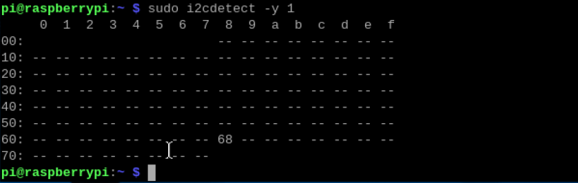

## 4.1 Hardware Control Environment Setup

### 4.1.1 GPIO Brief Introduction

GPIO (General Purpose Input/Output) port on Raspberry Pi is a set of pins used for connecting and controlling external electronic components. It is provided with multiple functions and can be used as digital and analog inputs and outputs.

### 4.1.2 GPIO Port Introduction

Raspberry Pi 5 features a 40-pin GPIO header with a voltage of 3.3v. Therefore, you should avoid connecting any voltage level higher than 3.3v to the GPIO pins on the Raspberry Pi 5 without using a voltage level converter. The functions of GPIO pins are shown in the following diagram:


### 4.1.3 GPIO Library Installation

Raspberry Pi GPIOD library is a user-space library used to control the GPIO (General Purpose Input/Output) pins. It is based on the GPIOLIB abstract layer of the GPIO character device interface in the Linux kernel with a simple and flexible API. This allows developers to easily use C language and other programming languages to configure and control GPIO. Here is a demonstration of how to install the GPIOD library.

(1) Press “Ctrl+Alt+T” to open the command line terminal, then enter “pinout” and press “Enter” to view the pin numbers.


(2) Enter the “sudo apt-get update -y && sudo apt-get upgrade -y” command to update the operation system and software packages.

```py
sudo apt-get update -y && sudo apt-get upgrade -y
```

(3) Enter the “sudo apt-get autoremove -y && sudo apt-get autoclean -y && sudo apt-get clean -y” command to clean the unnecessary software packages and cache files in the system.

```py
sudo apt-get autoremove -y && sudo apt-get autoclean -y && sudo apt-get clean -y
```

(4) Enter the “sudo apt-get remove --purge --auto-remove firefox geany -y” command to clean “Firefox” and “Geany” software packages in the system.

```py
sudo apt-get remove --purge --auto-remove firefox geany -y
```

(5) Enter the “sudo apt-get install -y vim git terminator htop curl python3-opencv gedit libjpeg-dev xclip wl-clipboard” command to install multiple software packages.


(6) Enter the “mkdir ~/.pip” command to create a directory named “.pip” in home directory.


(7) Enter the “vim ~/.pip/pip.conf” command to open the “pip.conf” file.


(8) Press the “i” key to enter the editable mode and enter the following code.


(9) After that, press “Esc” key to enter the “:wq”, then press “Enter” to save the file and exit.


(10) Enter the “pip3 install gpiod” command to install the “gpiod” Library.


(11) After the installation is complete, enter the “gpiodetect” to scan the GPIO port in the system. If the installation is successful, you can see the corresponding information about the GPIO controller and the port.


## 4.2 GPIO Pin Input Reading

### 4.2.1 GPIO Pin Introduction

GPIO (General Purpose Input/Output) port is a set of pins on the master of electronic devices used to send and receive electronic signals. You can connect these pins to external hardware devices to achieve functions for external communication, external hardware control, or external hardware data collection.

### 4.2.2 Input Introduction

GPIO input detects each pin’s voltage level status, which is classified as either high or low. A high level represents the presence of voltage represented by the numerical symbol “1”, and a low level typically refers to GND represented by the numerical symbol “0”.

### 4.2.3 Raspberry Pi 5 GPIO Pin Introduction

Raspberry Pi 5 features a 40-pin header that allows for easy use with a variety of expansion boards. GPIOD library can control these GPIO pins to read, write, interrupt, PWM, etc.

The distribution diagram of the GPIO pins is as follows:


### 4.2.4 Input Reading

(1) Import the program file “GPIO_IN.py” into the home directory of the Raspberry Pi 5 system.


(2) Press “Ctrl+Alt+T” to open the command line terminal and enter the “sudo python3 GPIO_IN.py” command, then press “Enter” to execute the program.

```py
sudo python3 GPIO_IN.py
```

(3) After executing the program, it prints the input data of pin17. A voltage input will be represented as “1”, while no voltage input will be represented as “0”. Press “Ctrl+C” to stop running the program.


### 4.2.5 Program Analysis


(1) Import the necessary modules.

(2) Initialize the GPIO controller and set the required GPIO port.

(3) Use the “line.get_value()” method to read the status of GPIO pin17.

(4) Release the GPIO port and close the GPIO controller at the end.

## 4.3 GPIO Pin Output Setting

### 4.3.1 GPIO Pin Introduction

GPIO (General Purpose Input/Output) port is a set of pins on the master of electronic devices used to send and receive electronic signals. You can connect these pins to external hardware devices to achieve functions for external communication, external hardware control, or external hardware data collection.

### 4.3.2 Input Introduction

GPIO output is a required function for controlling the high or low voltage level of the GPIO pins. The high and low voltage levels can be represented respectively by “1” and “0”. Take controlling an LED as an example. You need to set the pin connected to the LED to a high voltage level, which creates a voltage difference with the low voltage level side to generate a current and make the LED light up.

### 4.3.3 Raspberry Pi 5 GPIO Pin Introduction

Raspberry Pi 5 features a 40-pin header that allows for easy use with a variety of expansion boards. GPIOD library can control these GPIO pins to read, write, interrupt, PWM, etc.

The distribution diagram of the GPIO pins is as follows:


### 4.3.4 Output Setting

(1) Import the program file “GPIO_OUT.py” into the home directory of the Raspberry Pi 5 system, as the diagram shown below:


(2) Press “Ctrl+Alt+T” to open the command line terminal and enter the “sudo python3 GPIO_OUT.py” command, then press “Enter” to execute the program.

```py
sudo python3 GPIO_OUT.py
```

(3) After running the program, use a multimeter to measure if the pin17 is switching constantly between the high and low voltage levels. For example, if you connect a 3.3v voltage to the pin, you can view the voltage changing between 3.3v and 0v.

### 4.3.5 Program Analysis


(1) Import the necessary modules.


(2) Initialize the GPIO controller and set the required GPIO port. Use the “line.get_value()” method to set the output status of GPIO pin17.


(3) Use the “line.set_value() ” method to set the status of the GPIO port. Set it to a high voltage level, delay for one second, restore it to a low voltage level, then release the GPIO line and close the GPIO controller.


## 4.4 GPIO Pin Pull-up and Pull-down Setting

### 4.4.1 GPIO Pin Introduction

GPIO (General Purpose Input/Output) port is a set of pins on the master of electronic devices used to send and receive electronic signals. You can connect these pins to external hardware devices to achieve functions for external communication, external hardware control, or external hardware data collection.

### 4.4.2 Pull-up and Pull-down Resistors Introduction

There are three statuses of pull-up, pull-down, and no pull in each GPIO. If the GPIO is in output mode, it is usually set to no pull status, while pull-up and pull-down settings are mainly used in input mode.

The purpose of a pull-up resistor is to ensure that the voltage level of the input port is high when there is no signal input. When the input signal is low voltage level, the voltage level of the input port is also low.

Without a pull-up resistor, the input port is floating and its voltage level is unknown when there is no external input signal. The purpose of setting a pull-up resistor is to ensure that the voltage of the input port is high level when there is no input signal.

The purpose of a pull-down resistor is to ensure that the voltage of the input port is low level when there is no input signal.

### 4.4.3 Raspberry Pi 5 GPIO Pin Introduction

Raspberry Pi 5 features a 40-pin header that allows for easy use with a variety of expansion boards. GPIOD library can control these GPIO pins to read, write, interrupt, PWM, etc.

The distribution diagram of the GPIO pins is as follows:


### 4.4.4 Input Reading

(1) Import the program file “PULL_UP_DOWN.py” into the home directory of the Raspberry Pi 5 system, as the diagram shown below:


(2) Press “Ctrl+Alt+T” to open the command line terminal and enter the “sudo python3 PULL_UP_DOWN.py” command, then press “Enter” to execute the program.

```py
sudo python3 PULL_UP_DOWN.py
```

(3) After executing the program, pin17 will be set to input mode with a pull-up resistor, and measured with a multimeter, showing a voltage value of 3.33v, representing the high voltage level.

### 4.4.5 Program Analysis


(1) Import the necessary modules.


(2) Initialize the GPIO controller and set the required GPIO port.


(3) Set the pin17 to output mode, and use the “set_flags()” method to set the pin17 to pull-up mode.


The “gpiod.LINE_REQUEST_FLAG_BIAS_PULL_UP” is the pull-up mode, and the “gpiod.LINE_REQUEST_FLAG_BIAS_PULL_DOWN” is the pull-down mode.

## 4.5 UART Communication Configuration and Programming

### 4.5.1 UART Communication Introduction

Communication protocols play a crucial role in facilitating communication between devices. They are designed in different ways to meet distinctive system requirements and feature specific rules for devices to successfully communicate with each other.

In embedded systems, microcontrollers, and computers, UART is widely used as a hardware communication protocol between devices. Among the applicable communication protocols, UART only uses two wires as its sender and receiver.

Despite being a widely used hardware communication protocol, UART has not always been fully optimized. When used in microcontrollers, it often overlooks the correct implementation of the frame protocol.

According to its definition, UART is a hardware communication protocol that uses asynchronous serial communication with configurable speed. Asynchronous means that UART has no shared clock signal to synchronize the output data bits transmitted from the sender to the receiver.

The two signals of each UART device are named as:

- Transmitter (Tx)

- Receiver (Rx)

The primary purpose of the transmitter and receiver wires of each device is to send and receive the serial data for serial communication.


UART TX is connected to the control data bus for sending data in parallel form. As a result, the data is transmitted bit by bit serially to UART RX with the transmission wire. Conversely, this action converts serial data into parallel data of the receiving device.

UART wires are used as communication media to send and receive data. Please note that UART devices have dedicated transmitting and receiving pins for sending or obtaining data.

For UART and most serial communication, it is necessary to set the same baud rate on both the sending and receiving devices. Baud rate refers to the rate at which information is transmitted to the communication channel. In the context of the serial port, the set baud rate will serve as the maximum number of bits transmitted per second.

In UART, data is transmitted in the form of data packets. The part connecting the transmitter and receiver includes creating serial data packets and controlling the physical hardware lines. Data packets consist of a start bit, data frame, parity bit, and stop bit.


- **Start Bit**

UART data transmission wires usually remain at a high voltage level when no data is being transmitted. To initiate data transmission, UART TX pulls the transmission wires low for one clock cycle. When the voltage transition from high to low is detected by UART RX, it starts to read the bits in the data frame at the baud rate frequency.


- **Data Box**

A data frame contains the actual data being transmitted. If parity bits are used, the data frame can be 5 to 8 bits long. If parity bits are not used, the data frame can be 9 bits long. In most cases, the least significant bit is transmitted first.


- **Par Value**

Parity describes whether a number is even or odd. The parity bit is a method that UART RX can determine if the data has changed during the process of transmission, which can be caused by electromagnetic radiation, mismatched baud rates, or long-distance data transmission.

After the UART RX reads the data frame, it calculates the number of bits with a value of “1”, and checks whether the total is even or odd. If the parity bit is “0” (even parity), the total number of bit 1 or logical high bits in the data frame should be even. If the parity bit is “1” (odd parity), the total number of bit 1 or logical high bits in the data frame should be odd.

When the parity bit matches the data, UART knows that the transmission is error-free. However, if the parity bit is “0” and the total is odd, or if the parity bit is “1” and the total is oven, UART knows that there is a change in the bits of the data frame.


- **Stop Bit**

To send a signal at the end of a data packet, UART TX drives the data transmission wire from a low voltage level to a high voltage level for a duration of 1 to 2 bits.


### 4.5.2 Getting Ready

* **Serial Port Utility Installation**

In this section, Serial Port Utility is used as an example to explain the process.

Double-click to open the “serial5.2.3.exe” installation program in this directory. Then, refer to the steps shown in the diagram below to complete the installation.


Suggest to select other path required installation.


* **Hardware Wiring**

According to the Raspberry Pi pin diagram, you will use the following pins:


Use a USB to TTL module to connect the Raspberry Pi 5 to the PC with female-to-female DuPont wires, as shown in the following wiring program:

```py
Pin8 on the Raspberry Pi 5（TXD） \<--\> USB to TTL module RXD
Pin10 on the Raspberry Pi 5（RXD） \<--\> USB to TTL module TXD
Pin6 on the Raspberry Pi 5（GND） \<--\> USB to TTL module GND
```

### 4.5.3 Raspberry Pi 5 Preparation

* **Library File Installation**

(1) Power the Raspberry Pi 5 on, and press “Ctrl+Alt+T” to open the command line terminal. Then enter the command “sudo apt-get install python3-serial” to install the serial function library.

```py
sudo apt-get install python3-serial
```

(2) Next, enter the command “sudo chmod 777 /dev/ttyAMA0” to grant the serial access permission.

```py
sudo chmod 777 /dev/ttyAMA0
```

* **Open UART Interface**

(1) Configure the Raspberry Pi to enable the UART interface and open the Serial Port after booting up. Click on the the Raspberry Pi logo at the top left corner of the screen, and select “Preferences” and then “Raspberry Pi Configuration”.


(2) Select “Interfaces” to start “Serial Port” and close “Serial Console”, then click “OK”.


(3) Click “Yes” to restart the Raspberry Pi. Upon the restart is complete, Raspberry Pi will point the main serial port to the hardware serial port. (If the restarting fails, unplug the USB converter before attempting to restart the Raspberry Pi again.)


(4) Press “Ctrl+Alt+T” to open the command line terminal, and enter “sudo nano /boot/config.txt” to open the configuration file.

```py
sudo nano /boot/config.txt
```

(5) Scroll to the end of the text to enter the provided code below.

```py
dtoverlay=pi3-miniuart-bt

Force_turbo=1
```


(6) Press “Ctrl+S” to save it and “Ctrl+X” to return, then enter “sudo reboot” to restart the Raspberry Pi.

```py
sudo reboot
```

(7) Enter “ls /dev -al” to check the serial port assignment.

```py
ls /dev -al
```

(8)  Scroll down to locate the content highlighted in the red box shown in the following image. This confirms that the modification is successful.


### 4.5.4 Example Program - Sending and Receiving

This section provides an example of using the serial port utility to display the instruction character string sent by Raspberry Pi 5 on a PC.

The character on the PC sent by the serial port utility can also be displayed on the Raspberry Pi 5 terminal.

* **Starting Serial Port Utility**

Plug the USB to TTL converter tool into any USB port on the PC, then open the device manager to view if the port is recognized, as below:


If the port with the CH340 label does not appear, you can check if your PC has installed the CH340 driver (the drive packet is located in this section’s directory). if the driver is installed but the port cannot be recognized, try changing the USB port to troubleshoot the issue.

Double-click the installed “Serial Port Utility”.


After opening the utility, select the port with the CH340 label and set the attributes such as baud rate and data bit according to the diagram below. Then, click the button within the red box to proceed.


* **Import Example Program**

(1) Click the floating box located at the top of the system desktop to select the file transmission icon.


(2) Click “Send files” in the popup window, then select “UART.py” in the same path as this document in the next pop-up window. Next, click “Open” to import the file into the Raspberry Pi system desktop.


(3) Input the command “chmod a+x /home/pi/Desktop/UART.py” to grant the executing permission for the program.

```py
chmod a+x /home/pi/Desktop/UART.py
```

“pi” is just an example created by this PC, you need to rewrite the command above according to the actual execution.

* **Program Execution**

(1) Start the Raspberry Pi, and connect it to the remote control soft VNC.

(2) Press "Ctrl+Alt+t" to open the command line terminal, and enter the command "cd Desktop/" to switch to the desktop.

```py
cd Desktop/
```

(3) Input the “python3 UART.py” command to run the program.

```py
python3 UART.py
```

* **Program Display**

(1) **Serial Port Utility**

The message sent by Raspberry Pi 5 can be received in the Serial Port Utility. Make sure to edit the baud rate to “115200” as follows:


For example, you can enter text “nihao” in the field below, then click “Send”.


(2) **Raspberry Pi 5**

On the command line interface of the Raspberry Pi 5, you can receive the message sent from the PC side.


## 4.6 I2C Communication Tutorial

### 4.6.1 I2C Communication Introduction

“IIC” is also known as “I2C” (Inter-Integrated Circuit), and it is an abbreviation for “IICBus”. Therefore, its full name is “I<span class="mark">ntegrated Circuit Bus”.</span>

<span class="mark">It is a type of serial communication bus that consists of a Date wire (SDA) and a clock wire (SCL), allowing for bidirectional communication betw</span>een a CPU (microcontroller) and an I2C module or between multiple I2C modules for data transmission and reception.

I2C’s characteristic is that it is a half-duplex, rather than a full-duplex.

I2C is a true multi-master bus (Unlike SPI which requires the determination of a master before each communication, I2C allows for changing of the master during the communication process). If two or more masters request access to the I2C simultaneously, it can detect conflicts and arbitrate to avoid damaging the I2C data.

Start and stop signals are sent by the master connected to devices on the I2C bus. If a device features the I2C hardware interface, it can easily detect the start and stop signals.

A 7-bit slave address and a 1-bit direction byte must be sent by the master after the start signal. Use “0” to represent data sent from the master and “1” to indicate data received by the master.

Whenever the master sends a byte of data to the slave, it always needs to wait for an acknowledgment signal sent from the slave to confirm if the data is successfully received.

While the start signal is necessary, the stop and acknowledgment signals can be omitted depending on the actual situation.

- **I2C Physical Connection**

I2C communication is widely used in I2C devices such as the gyro-accelerometer MPU6050 and the EEPROM storage chip AT24C02, which can transmit data with microcontrollers via I2C bus.

I2C only consists of two wires for communication. The high and low voltage level of the data wire SDA transmits binary data, and the clock wire SCL uses a square wave signal to provide a clock pulse.

Multiple I2C devices can be connected in parallel on the I2C. Each device has its specific address for time-divisional sharing of the I2C. In actual use, the I2C also needs to be connected to a power supply and a common GND.


- **I2C Sequence**

  

- **I2C Start and Stop Signals**

  

Start: When the clock wire SCL is high, the data wire SDA is from high to low.

Stop: When the clock wire SCL is high, the data wire SDA is from low to high.

:::{Note}

 When SCL and SDA are both high, the I2C is in an inactive state.

:::

- **I2C Acknowledgment**

  

The waveform below: SCL, the clock pulse generated by the master.

The waveform above: SDA, the 8-bit data sent from the master.

The waveform in the middle: SDA, the slave responses at the ninth clock signal pulling down the SDA wire, which indicates that the data sent from the master has been received. If the response is pulled up, it means that the slave is not acknowledging the data.

:::{Note}

 Actually, the waveform above and the waveform in the middle are the same SDA wire shown separately in the diagram for clarity. This is because I2C acknowledgment is an interrelation. The microcontroller sends data to the I2C device which must acknowledge the data is received. Similarly, if the microcontroller receives data sent from the I2C device, it must also give an acknowledgment of receiving the data to the I2C device.

:::

If they both need each other’s acknowledgment after sending data, then when is it appropriate to not acknowledge each other’s message? That is after reading the current data and there is no need for further reading, the one receiving and reading the data sends a no-acknowledgment signal to the other who sends the data, and it assumes no receiving of the data to stop sending data.

- **I2C Complete Transmission Sequence**

  

After the start sign (S) is sent, the master sends a 7-bit slave address, followed by an eighth bit named as Read or Write (R/W) bit.

The R/W bit represents whether the master is receiving the data from the slave or writing data to it.

After that, the master releases the SDA wire to wait for the acknowledgment signal (ACK) sent from the slave. An ACK bit follows the transmission of each byte.

Upon the ACK being generated, the slave pulls down the SDA voltage level and remains low while the SCL has a high voltage level.

The data transmission ends with a stop signal (P) to release the I2C. However, the master can also generate repetitive start signals to operate another slave without sending an end signal.

All SDA signal changes must occur when the clock wire SCL is at a low voltage level, except the start and end signals.

### 4.6.2 Hardware Wiring

According to the Raspberry Pi 5 pin diagram, you will use the following pins:


Use an accelerometer sensor with an I2C interface as an example. (If you have a different module with the I2C interface, you can also refer to this wiring method.) Connect the accelerometer sensor to Raspberry Pi 5 with female-to-female DuPont wires, as shown in the diagram below:

:::{Note}

The Raspberry Pi 5 is powered by 5V 3A. Therefore, there is no need to connect VCC.

:::

```py
Pin3 on the Raspberry Pi 5（SDA） \<--\> Accelerometer (SDA)
Pin5 on the Raspberry Pi 5（SCL） \<--\> Accelerometer (SCL)
Pin6 on the Raspberry Pi 5（GND） \<--\> Accelerometer (GND)
```


### 4.6.3 I2C Library File Installation

Start Raspberry Pi 5 and press “Ctrl+Alt+T” to open the command line terminal. Then enter the two commands shown below in turn to install the I2C library.

```py
sudo apt-get update
```

```py
sudo apt-get install -y i2c-tools
```

### 4.6.4 I2C Interface Configuration

(1) Configure the Raspberry Pi to enable the I2C interface and open I2C after booting up. Click on the the Raspberry Pi logo at the top left corner of the screen to select “Preferences”, and then “Raspberry Pi Configuration”.


(2) Select “Interfaces” to start “Serial Port” and close “Serial Console”, then click “OK”.


(3) Click “Yes” to start the I2C.


### 4.6.5 I2C-Tools 

* **i2cdetect**

Press “Ctrl+Alt+T” to open the command line terminal, and enter “sudo i2cdetect -l” to list all installed buses.


Enter the command “sudo i2cdetect -y l” to scan the device loaded on the bus. Such as the No.1 bus.

Where there is a device, there is a list of the device address. For example, there is a 0x68 device connected to the No.1 bus (refer to “<u>[4.6.2 Hardware Wiring]()</u>”).



* **i2cdump**

The i2cdump is used to view the register value of the device. Such as the used accelerometer MPU6050, the diagram of its register is as follows:


In the command line terminal, enter the command “i2cdump -y 1 0x68” to check all the register values of No.1 bus 0x68.


* **i2cget**

The “i2ccget” is used to check to single register values of the device and can be applied to single-byte registers. In the command line terminal, enter the command “i2cget -y 1 0x68 0x6b” to read the values of register 0x6b in the device with the address 0x68.


* **i2ctransfer**

The “i2ctransfer” is used to read and write register values of a device, and can be applicable to double-byte registers. Generally, registers have an 8-bit address. And “i2cdump”, “i2cget”, and “i2cset” are all set to read the addresses with 8 bits. If an address exceeds 8 bits, the “i2ctransfer” should be used. In the command line terminal, enter the command “i2ctransfer -f -y 1 w2@0x68 0x01 0x6b r16” to read and write the data with 16 bytes starting from the register address 0x016b on the device with address 0x68 on No.1 bus.

