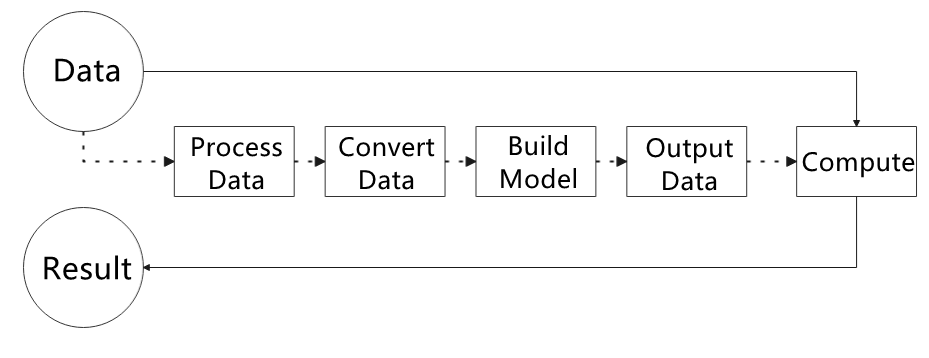
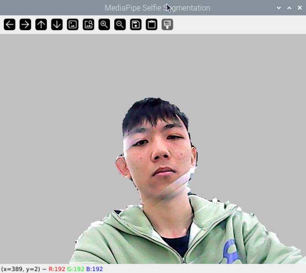
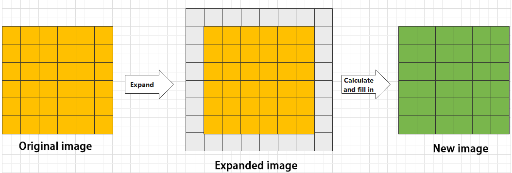
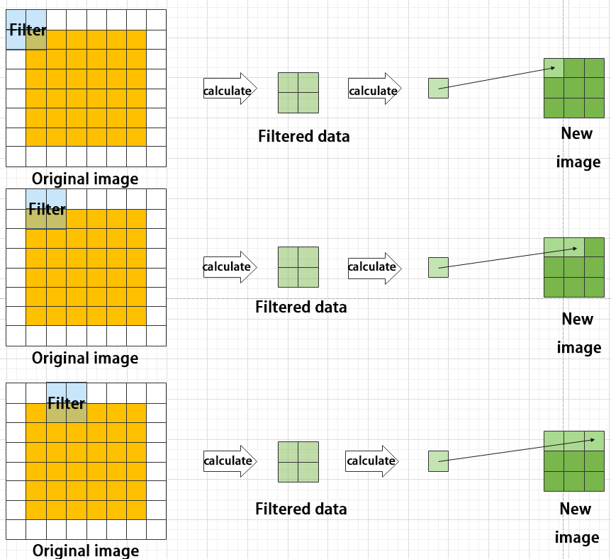
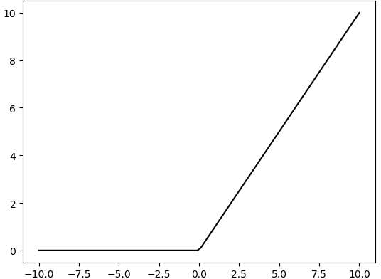
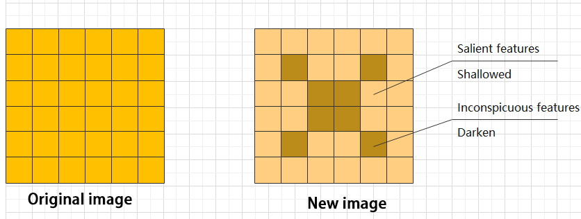

# 6. Machine Learning Course

## 6.1 Advanced Course

### 6.1.1 Image Collecting & Labeling

Given that training the Yolov5 model necessitates a substantial volume of data, our initial step involves collecting and labeling the requisite data in preparation for subsequent model training.

To begin, you can assemble the images that require collection. As an illustration, let's consider the collection of traffic signs.

To get detailed instructions about the file transfer method, please refer to the tutorial provided in '**[2. Raspberry Pi 5 Basic Operation and Configuration\>2.2 Remote Access and Remote File Transfer](2_Raspberry_Pi_5_Basic_Operation_and_Configuration.md#remote-access-and-remote-file-transfer)**'.

* **Image Collecting**

(1) Start the robot, and access the robot system desktop using VNC.

(2) Connect the USB camera to the Raspberry Pi 5.

(3) Move the file 'data_gather.py' from the current directory to the Raspberry Pi.

(4) Press the short-cut **Ctrl+Alt+T** to open the command-line terminal, and run the command 'python3 data_gather.py'.

```bash
python3 data_gather.py
```

If the live camera feed window occurs, it means that the data is collected successfully.


> [!Note]
> 
> * **Press the 'S' key to save the current picture. Long-press 'S' to save multiple continuous pictures.**
> * **Press 'Q' to exit the program.**
> * **For enhanced model reliability, capture target recognition content from varying distances, angles of rotation, and tilts.**
> 

After initiating data collection, a folder named '**my_data**' will be created at the '**/home/pi**' path. This folder comprises three subfolders: Annotations, imageSets, and JPEGImages. 'JPEGImages' stores the images, 'Annotations' stores the annotation files, and 'imageSets' contains paths used for storing the images.

* **Image Collecting**

> [!Note]
> 
> **The input command should be case sensitive, and keywords can be complemented using Tab key.**

(1) Move the file '**labelImg.zip**' from the current directory to the Raspberry Pi.

(2) Double-click  to open the command-line terminal.

(3) Execute the command '**unzip labelImg.zip -d ./**' to extract to the main directory.

```bash
unzip labelImg.zip -d ./
```

(4) Run the command '**cd labelImg/**' to navigate to the labelImg folder.

```bash
cd labelImg/
```

(5) Run the command '**python3 labelImg.py** ' to open the image labeling software.

```bash
python3 labelImg.py
```


(6) The table below outlines the function of each icon:

|                           **Icon**                           | **Short-cut** |                       **Function**                        |
| :----------------------------------------------------------: | :-----------: | :-------------------------------------------------------: |
|  |    Ctrl+U     |     Select the directory where the picture is saved.      |
|  |    Ctrl+R     | Select the directory where the calibration data is saved. |
|  |       W       |                   Create annotation box                   |
|  |    Ctrl+S     |                      Save annotation                      |
|  |       A       |               Switch to the previous image                |
|  |       D       |                 Switch to the next image                  |

(7) Press '**Ctrl+U**' and select the folder '**/home/pi/my_data/JPEGImages/**' , then click-on 'Choose' button.


(8) Press '**Ctrl+R**' to select the directory where the calibration data is saved as '**/home/pi/my_data/Annotations/**'. Then click-on 'Choose' button.


(9) Press the "**W**" key on the keyboard to initiate the creation of the label box. Position the mouse cursor appropriately, then press and hold the left mouse button while dragging it to encompass the entire target recognition content within the label box. Release the left mouse button to finalize the selection of the target recognition content.

> [!Note]
> 
> **The objects depicted in the image below are solely for demonstration purposes and are not part of the material package you received. You may select any object for labeling and assign any label name accordingly.**
> 


(10) In the pop-up window, assign a category name to the target recognition content; for instance, "right." Once you've named it, either click the "OK" button or press the "Enter" key to save this category.

> [!Note]
> 
> **Tags can be customized with any name of your choosing.**
> 


(11) Press the shortcut 'Ctrl+S' to save the labeling data for the current picture.

(12) Label other pictures following steps 4-6.

(13) Click-on  to open the file manager, then navigate to the folder '**/home/pi/my_data/Annotations**' where the labeled picture files are saved.


### 6.1.2 Data Format Conversion

> [!Note]
> 
> **Note: The input command should be case sensitive, and keywords can be complemented using Tab key.**
> 

(1) Start the Raspberry Pi, and access the system desktop using VNC.

(2) Transfer the file '**xml2yolo.py**' to the Raspberry Pi.

(3) Use short-cut '**Ctrl+Alt+T**' to open the command-line terminal. Then run the command '**cp xml2yolo.py my_data/**', and hit Enter key.

```bash
cp xml2yolo.py my_data/
```

(4) Run the command '**cd my_data/**', and press Enter key to navigate to the designated path.

```bash
cd my_data/
```

(5) Execute the command '**sudo vim classes.names**', and hit Enter key to create a file.

```bash
sudo vim classes.names
```

(6) Press the '**I**' key to enter editing mode and add the class name for the target recognition content. If adding multiple class names, use one class name per line. ('label' represents the class name)


> [!Note]
> 
> **The class names added here must be consistent with the naming convention used in the image annotation software 'labelImg'.**
> 

(7) Having finished the input, press 'Esc', and input ':wq' to save and close the file.

```bash
:wq
```

(8) Execute the command '**pip3 install PyYAML**', and hit Enter to download yaml module.

```bash
pip3 install PyYAML
```

(9) Run the command '**python3 /home/pi/my_data/xml2yolo.py --data /home/pi/my_data --yaml /home/pi/my_data/data.yaml**', and hit Enter to convert the data format.

```bash
python3 /home/pi/my_data/xml2yolo.py --data /home/pi/my_data --yaml /home/pi/my_data/data.yaml
```

If the below prompt occurs, it means the data conversion is successful.

> [!Note]
> 
> **The conversion content shown in the image below is for reference purposes only. Due to differences in the number and names of tag settings, adjustments may be necessary. The modified content will depend on the specific tag settings.**
> 


### 6.1.3 Model Training

> [!Note]
> 
> **The input command should be case sensitive, and keywords can be complemented using Tab key.**
> 

* **Setup Environment**

(1) Start the Raspberry Pi, and access the system desktop using the remote control software VNC.

(2) Use short-cut 'Ctrl+Alt+T' to open the command-line terminal, and execute the command '**git clone <https://github.com/ultralytics/yolov5.git'>** to download the Yolov5 installation package.

```bash
git clone <https://github.com/ultralytics/yolov5.git
```

We have provided the '**yolov5.zip**' package which can be directly transferred to the Raspberry Pi. Execute the command '**ubzip yolov5.zip .d ./**', and hit Enter key to extract the package.

```bash
ubzip yolov5.zip .d ./
```

(3) Run the command '**cd yolov5/**', and hit Enter key to navigate to the designated directory.

```bash
cd yolov5/
```

(4) Type the command '**pip3 install -r requirements.txt**' and press Enter to initiate the installation of the script's environment. This process may take some time, so please be patient.

```bash
pip3 install -r requirements.txt
```

* **Train Model**

(1) Press '**Ctrl+Alt+T**' to open the command-line terminal, and run the command '**cd yolov5/**', then hit Enter key to navigate to the designated directory.

```bash
cd yolov5/
```

(2) Execute the following command to train the model '**python3 train.py --img 320 --batch 4 --epochs 5 --data /home/pi/my_data/data.yaml --weights ./yolov5s.pt**', and hit Enter key.

```bash
python3 train.py --img 320 --batch 4 --epochs 5 --data /home/pi/my_data/data.yaml --weights ./yolov5s.pt
```

In the command, "**--img**" represents the image size; "**--batch**" indicates the number of single input images; "**--epochs**" denotes the number of training iterations; "**--data**" specifies the dataset path; "**--weights**" points to the weight file for the pretrained model. If provided, the script will commence training from these pretrained weights; otherwise, it will start from scratch.

Users can adjust these parameters based on their specific requirements. To enhance model reliability, increasing the number of training iterations is advisable, although it will extend training time. For optimal model recognition, it's recommended to have a dataset size of over 150 images for each category.

> [!Note]
> 
> **The dataset used here should be collected following the instructions provided in 'Lesson 5 Image Collecting & Labeling'.**
> 

(3) If you see the content shown in the picture below, it indicates that training is currently underway.


When you see the following content, it signifies that the training has been completed. The red box indicates the storage location of the model after training, with 'best.pt' being the model file.


* **Model Usage**

(1) Start the Raspberry Pi, and access the robot system desktop using VNC.

(2) Use short-cut '**Ctrl+Alt+T**' to open the command-line terminal. Then run the command '**cd yolov5/**', and hit Enter to navigate to the designated directory.

```bash
cd yolov5/
```

(3) Execute the command '**python3 detect.py --weights runs/train/exp10/weights/best.pt --source 0**' to initiate Yolov5 recognition

--weights runs/train/exp10/weights/best.pt': Specifies the file path for the trained model's weights as 'runs/train/exp10/weights/best.pt

--source 0': Specifies the input source as 0, which typically denotes using the camera (webcam) as the input source.

```bash
python3 detect.py --weights runs/train/exp10/weights/best.pt --source 0
```

After a waiting period, the box displayed on the return screen below confirms successful activation.

"class_name" refers to the category name of the recognized target content.

"box" indicates the start coordinate (upper left corner) and end coordinate (lower right corner) of the identification box.

"score" represents the confidence level of detection and recognition.

Press "ctrl+c" to exit.


## 6.2 Application Course

### 6.2.1 Introduction to MediaPipe

* **MediaPipe Description**

MediaPipe is an open-source framework of multi-media machine learning models. Cross-platform MediaPipe can run on mobile devices, workspace and servers, as well as support mobile GPU acceleration. It is also compatible with TensorFlow and TF Lite Inference Engine, and all kinds of TensorFlow and TF Lite models can be applied on it. Besides, MediaPipe supports GPU acceleration of mobile and embedded platform.


* **MediaPipe Pros and Cons**

(1) MediaPipe Pros

① MediaPipe supports various platforms and languages, including iOS, Android, C++, Python, JAVAScript, Coral, etc.

② Swift running. Models can run in real-time.

③ Models and codes are with high reuse rate.

(2) MediaPipe Cons

① For mobile devices, MediaPipe will occupy 10M or above.

② As it greatly depends on Tensorflow, you need to alter large amount of codes if you want to change it to other machine learning frameworks, which is not friendly to machine learning developer.

③ It adopts static image which can improve efficiency, but make it difficult to find out the errors.

* **How to use MediaPipe**

The figure below shows how to use MediaPipe. The solid line represents the part to coded, and the dotted line indicates the part not to coded. MediaPipe can offer the result and the function realization framework quickly.



(1) Dependency

MediaPipe utilizes OpenCV to process video, and uses [FFMPEG](https://www.ffmpeg.org/) to process audio data. Furthermore, it incorporates other essential dependencies, including OpenGL/Metal, Tensorflow, and Eigen.

For seamless usage of MediaPipe, we suggest gaining a basic understanding of OpenCV. To delve into OpenCV, you can find detailed information in '**[5. OpenCV Computer Vision Course](5_OpenCV_Computer_Vision_Course.md)**'.

(2) MediaPipe Solutions

Solutions is based on the open-source pre-constructed sample of TensorFlow or TFLite. MediaPipe Solutions is built upon a framework, which provides 16 Solutions, including face detection, Face Mesh, iris, hand, posture, human body and so on.

The Solutions are developed using open-source pre-constructed samples from TensorFlow or TFLite. MediaPipe Solutions are built upon a versatile framework that offers 16 different components, like face detection, Face Mesh, iris tracking, hand tracking, posture estimation, human body tracking, and more.

* **MediaPipe Learning Resources**

MediaPipe website：<https://developers.google.com/mediapipe>

MediaPipe Wiki：<http://i.bnu.edu.cn/wiki/index.php?title=Mediapipe>

MediaPipe github：<https://github.com/google/mediapipe>

Dlib website: <http://dlib.net/>

dlib github: <https://github.com/davisking/dlib>

* **Install MediaPipe**

(1) Start the Raspberry Pi, and access the robot system desktop using VNC. Use short-cut '**CTRL+ALT+T**' to open the command-line terminal, and execute the command '**sudo apt update**' to install and update APT download lists.

```bash
sudo apt update
```

(2) Run the command '**sudo apt install python3-pip**' to install pip.

> [!Note]
> 
> **Failure to update pip may cause the installation to fail.**
> 

```bash
sudo apt install python3-pip
```

(3) Execute the command '**pip3 install --upgrade pip**' to update pip.

```bash
pip3 install --upgrade pip
```

(4) Type the command '**pip3 install dataclasses**' to install the dependency package.

```bash
pip3 install dataclasses
```

(5) Run the command '**pip3 install mediapipe**' to install MediaPiPe, which will takes a certain period of time. Please be patient!

```bash
pip3 install mediapipe
```

### 6.2.2 Image Background Segmentation

This lesson provides instructions on utilizing MediaPipe's selfie segmentation model to accurately segment trained models, such as human faces and hands, from their backgrounds. Once separated, you can easily add virtual backgrounds to these models.

* **Program Logic**

To begin, import the selfie segmentation model from MediaPipe and subscribe to the corresponding topic to access the live camera feed.

Next, flip the image and apply the segmentation to the background image. For improved boundary segmentation, implement dual-border segmentation.

Finally, complete the process by replacing the background with a virtual background.

* **Operation Steps**

> [!Note]
> 
> **the input command should be case sensitive, and keywords can be complemented using Tab key.**
> 

(1) Transfer the file '**self_segmentation.py**' saved in the same directory to the Raspberry Pi.

(2) Start the Raspberry Pi and access the robot system desktop using VNC. Press the short-cut '**CTRL+ALT+T**' to open the command-line terminal, then execute the command '**cd Mediapipe/**', and hit Enter key to navigate to the directory containing the game programs.

```bash
cd Mediapipe/
```

(3) Run the command '**python3 self_segmentation.py**', and hit Enter key to initiate the background segmentation detection program.

```bash
python3 self_segmentation.py
```

(4) If you need to terminate the program, use short-cut '**Ctrl+C**'.

* **Program Outcome**

Once the game starts, the screen will transition to a gray virtual background. As soon as a human figure appears, the program will automatically execute background removal, effectively separating the human from the virtual background.



* **Program Analysis**

The source code of this program locates in:

**/home/pi/Mediapipe/self_segmentation.py**


* **Basic Configuration**

(1) Build Selfie Segmentation Model

Import the selfie segmentation model from MediaPipe toolkit.

```py
with mp_selfie_segmentation.SelfieSegmentation(
        model_selection=1) as selfie_segmentation:
```

The first parameter, 'model_selection', determines the choice of model. MediaPipe offers two models: the universal model and the landscape model. Both models are based on MobileNetV3 and have been optimized for efficiency. The universal model operates on 256x256x3 (HWC) tensors and produces a 256x256x1 tensor representing the segmentation mask.

The landscape model is similar to the universal model but operates on 144x256x3 (HWC) tensors. It requires fewer FLOPs (computational effort) than the universal model, resulting in faster performance. It's important to note that MediaPipe Selfie Segmentation automatically resizes the input image to the required tensor dimensions before passing it to the ML model.

(2) Access Live Camera Feed

Call `VideoCapture()` function in cv2 library to obtain the live camera feed.

```py
cap = cv2.VideoCapture("/dev/depth_cam")
```

The parameter inside the brackets corresponds to the camera port, and you can utilize "**0**" to access the live camera feed.

When the robot is connected to a single camera, you have the option to use either "**0**" or "**-1**" as the camera ID. In case the robot is connected to multiple cameras, "**0**" denotes the first camera, "**1**" represents the second camera, and so forth.

* **Convert Color Space**

```py
image = cv2.cvtColor(cv2.flip(image, 1), cv2.COLOR_BGR2RGB)
```

Employ `cvtColor()` function in cv2 library to convert the color space.

Before segmenting the image, you need to convert the image into RGB color space.

* **Segment and Change Background**

(1) Draw Segmented Images

Utilizing the previously constructed selfie segmentation model, generate a segmentation map for both the person and the background in the image.

```py
results = selfie_segmentation.process(image)
```

(2) Boundary Filtering

To refine segmentation around edges, bilateral filtering can be applied to the 'results.segmentation_mask' array.

```py
condition = np.stack(
            (results.segmentation_mask[:,:,0],) * 3, axis=-1) > 0.1
```

Use the expression `np.stack((results.segmentation_mask,) * 3, axis=-1) > 0.1`. Decreasing the final parameter value enhances edge inclusion.

(3) Change Background

Eliminate the background from the segmented image and replace it with a virtual background.

```py
if bg_image is None:
            bg_image = np.zeros(image.shape, dtype=np.uint8)
            bg_image[:] = BG_COLOR
        output_image = np.where(condition, image, bg_image)
```

Utilize `np.zeros(image.shape, dtype=np.uint8)` to remove the background and replace it with `BG_COLOR`. `BG_COLOR` can be a color or an image. For colors, provide the RGB value, ensuring image size consistency with the camera size.

```py
BG_COLOR = (192, 192, 192)  # gray
```

(4) Obtain Live Camera Feed

By invoking the `imshow()` function from the 'cv2' library, the camera image is displayed in the specified window.

```py
cv2.imshow('MediaPipe Selfie Segmentation', result_image)
```

The first parameter within the function brackets, **MediaPipe Selfie Segmentation**, represents the window name, while the second parameter, `result_image`, denotes the image to be displayed.

### 6.2.3 3D Object Detection

The 3D target detection model of MediaPipe will be employed to display 3D boundary of the target object.

* **Program Logic**

To get started, import the 3D Objectron module from MediaPipe, and subscribe to the topic message to receive the real-time camera image.

Next, flip the image to ensure proper alignment for 3D object detection.

Finally, draw the 3D boundary frame on the image.

* **Operation Steps**

> [!Note]
> 
> **the input command should be case sensitive, and keywords can be complemented using Tab key.**
> 

(1) Transfer the file '**self_segmentation.py**' saved in the same directory to the Raspberry Pi.

(2) Start the Raspberry Pi and access the robot system desktop using VNC. Press the short-cut '**CTRL+ALT+T**' to open the command-line terminal, then execute the command '**cd Mediapipe/**', and hit Enter key to navigate to the directory containing the game programs.

```bash
cd Mediapipe/
```

(3) Run the command '**python3 objectron.py**', and hit Enter key to initiate the 3D object detection program.

```bash
python3 objectron.py
```

(4) If you need to terminate the program, use short-cut '**Ctrl+C**'.

* **Program Outcome**

Once the game starts, the 3D frame will be drawn around the boundary of the recognized object. The system can identify several objects, including a cup (with handle), shoe, chair, and camera.


* **Program Analysis**

The source code of this program locates in: **/home/pi/Mediapipe/objectron.py**


* **Basic Configuration**

(1) Create 3D Detection Model

Import Objectron (3D ObjectDetection) model from MediaPipe.

```py
with mp_objectron.Objectron(static_image_mode=False,
                                max_num_objects=1,
                                min_detection_confidence=0.4,
                                min_tracking_confidence=0.5,
                                model_name='Cup') as objectron:
```

The first parameter, 'static_image_mode=False', controls the static image mode. When set to false, the input image is treated as a video stream. If set to true, object detection runs on each input image, making it ideal for processing batches of static, potentially unrelated images. The default value is false.

The second parameter, 'max_num_objects=1', specifies the maximum number of detected objects. The default is 5.

The third parameter, 'min_detection_confidence=0.4', represents the minimum detection confidence. This value, ranging from 0.0 to 1.0, indicates the minimum confidence level required for a successful detection by the object detection model. The default is 0.5.

The fourth parameter, 'min_tracking_confidence=0.4', determines the minimum confidence level for object tracking. Setting this value higher enhances solution robustness but may increase latency.

The fifth parameter, 'model_name='Cup'', designates the 3D bounding box model name. This specifies the model used to display 3D bounding box landmarks. Currently supported options include {'Shoe', 'Chair', 'Cup', 'Camera'}. The default is 'Shoe'.

(2) Access Live Camera Feed

Call `VideoCapture()` function in cv2 library to access the live camera feed.

```py
cap = cv2.VideoCapture("/dev/depth_cam")
```

The parameter inside the brackets corresponds to the camera port, and you can utilize "**0**" to access the live camera feed.

When the robot is connected to a single camera, you have the option to use either "**0**" or "**-1**" as the camera ID. In case the robot is connected to multiple cameras, "**0**" denotes the first camera, "**1**" represents the second camera, and so forth.

* **Convert Color Space**

```py
image = cv2.cvtColor(cv2.flip(image, 1), cv2.COLOR_BGR2RGB)
```

Convert the color space using the cvtColor() function from the cv2 library.

Before proceeding with picture detection, it's essential to convert the image to the RGB color space.

* **3D Object Detection**

(1) Detection

Utilizing the previously constructed Objectron (3D Object Detection) model, detect the 3D shape of the object.

```py
results = objectron.process(image)
```

(2) Draw 3D Border

Traverse the recognized objects and utilize `mp_drawing.draw_landmarks()` and `mp_drawing.draw_axis()` to draw the 3D bounding box of the object.

```py
for detected_object in results.detected_objects:
                    mp_drawing.draw_landmarks(
                      image, detected_object.landmarks_2d, mp_objectron.BOX_CONNECTIONS)
                    mp_drawing.draw_axis(image, detected_object.rotation,
                                         detected_object.translation)
```

(3) Obtain Live Camera Feed

By calling the imshow() function in the cv2 library, the camera image is displayed in the specified window.

```py
cv2.imshow('MediaPipe Selfie Segmentation', result_image)
```

The first parameter within the function brackets, **MediaPipe Objectron**, represents the window name, while the second parameter, `result_image`, denotes the image to be displayed.

### 6.2.4 Face Detection

MediaPipe's face detection model will be utilized to detect human faces on the screen.

MediaPipe's face detection offers rapid detection with six markers and supports multi-face recognition. This model is built on BlazeFace, a lightweight and high-performance human face detector optimized for GPU inference.

* **Program Logic**

Begin by importing the MediaPipe human face detection model and subscribing to the topic message to access the live camera feed.

Next, perform image manipulation tasks such as flipping the image, converting color space, and any other necessary operations using OpenCV.

To evaluate the effectiveness of face detection, compare the minimum confidence level provided by the face detection model. When a face is detected, a collection of faces is identified. Each face in this collection is represented by the original image detection, including a bounding box and six key points: the right eye, left eye, nose tip, mouth center, right ear region, and left ear region.

Finally, frame the human face and mark the six key points.

* **Operation Steps**

> [!Note]
> 
> **The input command should be case sensitive, and keywords can be complemented using Tab key.**

(1) Transfer the file '**mp_face_detect.py**' saved in the same folder as this document to the Raspberry Pi.

(2) Start the Raspberry Pi and access the Raspberry Pi system desktop using VNC. Press the short-cut '**CTRL+ALT+T**' to open the command-line terminal. Then execute the command '**cd Mediapipe/**', and hit Enter to navigate to the directory containing the game programs.

```bash
cd Mediapipe/
```

(3) Run the command '**python3 face_detect.py**' to run the face detection program.

```bash
python3 face_detect.py
```

* **Program Outcome**

After starting the game, the system will recognize the human face on the screen and mark its key feature points.


* **Program Analysis**

The program source code locates in: **/home/pi/Mediapipe/face_detect.py**


* **Basic Configuration**

(1) Create 3D Detection Model

Import the FaceDetection model from MediaPipe toolkit.

```py
with mp_face_detection.FaceDetection(
    min_detection_confidence=0.5) as face_detection:
  while cap.isOpened():
    success, image = cap.read()
```

This parameter represents that a face will be marked as detected only if the confidence level of the detection is at least 0.5.

while cap.isOpened(): Initiates a loop that continues until either the video stream ends or an error occurs. The function cap.isOpened() verifies whether the video capture object (represented by 'cap') is open and accessible for reading. Within the loop, this line retrieves a frame from the video stream. If the retrieval is successful, the variable 'success' will be True, and 'image' will hold the retrieved image data.

(2) Access Live Camera Feed

Retrieve the camera image by invoking the VideoCapture() function from the cv2 library.

```py
cap = cv2.VideoCapture("/dev/depth_cam")
```

The parameters within the function parentheses specify the camera interface. "**0**" can be used as a default option for reading.

If the current device is connected to a single camera, either "**0**" or "**-1**" can be used as the camera ID. If the device has multiple cameras, "**0**" denotes the first camera, "**1**" the second camera, and so forth for additional camera IDs.

* **Convert Color Space**

```py
image = cv2.cvtColor(cv2.flip(image,1), cv2.COLOR_BGR2RGB)
```

Use the `cvtColor()` function from the cv2 library to convert the color space.

Prior to image detection, convert the image to the RGB color space.

* **Face Detection**

(1) Detection

Using the previously constructed FaceDetection model, identify faces in the image.

```py
results = face_detection.process(image)
```

(2) Draw 3D Border

Utilize `mp_drawing.draw_detection(image, detection)` to outline the face and mark its key features.

```py
if results.detections:
      for detection in results.detections:
        mp_drawing.draw_detection(image, detection)
    # Flip the image horizontally for a selfie-view display.
    image = show_fps(cv2.flip(image, 1))
```

(3) Display Live Camera Feed

Invoke the imshow() function from cv2 library to display the live camera feed on the designated window.

```py
cv2.imshow('MediaPipe Selfie Segmentation', result_image)
```

`MediaPipe Objectron` represents the name of the window.

`result_image` denotes the image to be displayed.

### 6.2.5 3D Face Detection

This lesson utilizes MediaPipe's face mesh model for facial detection in images.

MediaPipe's Face Mesh model is designed to estimate 468 3D facial features in real-time, even on mobile devices. Powered by machine learning (ML), it accurately infers 3D facial structures. Leveraging a lightweight model architecture and GPU acceleration, it ensures efficient real-time performance.

Moreover, the solution includes a facial transformation module that facilitates the integration of facial landmark estimation with real-time augmented reality (AR) applications. By constructing a metric 3D space and utilizing facial landmark screen locations, it estimates facial transformations within that space. The facial transformation data encompasses various 3D primitives, such as facial pose transformation matrices and triangular facial meshes.

* **Program Logic**

First, it's essential to understand that the machine learning pipeline here (a linear model, which can be viewed as a pipeline) comprises two real-time deep neural network models working in tandem: a detector that operates on the entire image, determining the face's position, and another detector that manipulates these locations. Subsequently, a 3D facial landmark model predicts the approximate 3D surface via regression.

For 3D facial landmarks, we utilize transfer learning and train a network with multiple objectives: predicting 3D landmark coordinates on synthetic rendering data and annotating 2D semantic contours on real-world data simultaneously. This approach yields reasonable 3D landmark predictions based not only on synthetic data but also on real-world data.

The 3D landmark network takes cropped video frames as input without additional depth input. It outputs the location of a 3D point and the probability that a face is present in the input and properly aligned.

After importing the face mesh model, we acquire real-time images from the camera. We perform image manipulations such as flipping the image, converting the color space, etc., and then assess the minimum confidence of the face detection model to determine successful face detection.

Finally, the faces in the detected image are rendered into a three-dimensional grid and displayed.

* **Operation Steps**

> [!Note]
> 
> **The input command should be case sensitive, and keywords can be complemented using Tab key.**

(1) Transfer the file '**mp_face_detect.py**' saved in the same folder as this document to the Raspberry Pi.

(2) Start the Raspberry Pi and access the Raspberry Pi system desktop using VNC. Press the short-cut '**CTRL+ALT+T**' to open the command-line terminal. Then execute the command '**cd Mediapipe/**', and hit Enter to navigate to the directory containing the game programs.

```bash
cd Mediapipe/
```

(3) Run the command '**python3 face_mesh.py**' and hit Enter key to initiate the game program.

```bash
python3 face_mesh.py
```


(4) If you need to terminate this program, use short-cut '**Ctrl+C**'.

* **Program Outcome**

After initiating game, the camera detects a human face and projects its three-dimensional outline onto the live camera feed.


* **Program Analysis**

The program source code locates in: **/home/pi/Mediapipe/face_mesh.py**


* **Basic Configuration**

(1) Construct a face mesh model

Import the face mesh model from the MediaPipe toolkit.

```py
with mp_face_mesh.FaceMesh(
    max_num_faces=1,
    min_detection_confidence=0.5,
    min_tracking_confidence=0.5) as face_mesh:
```

The first parameter, 'max_num_faces,' determines the maximum number of faces to detect, with a default value of 1.

The second parameter, 'min_detection_confidence,' sets the minimum confidence level for face detection, with a default of 0.5. The range is between 0.0 and 1.0.

The third parameter, 'min_tracking_confidence,' sets the minimum confidence value for face tracking. Increasing this value enhances solution robustness but may increase latency.

(2) Access Live Camera Feed

Retrieve the camera image by invoking the VideoCapture() function from the cv2 library.

```py
cap = cv2.VideoCapture("/dev/usb_cam")
```

The parameters within the function parentheses specify the camera interface. "**0**" can be used as a default option for reading.

If the current device is connected to a single camera, either "**0**" or "**-1**" can be used as the camera ID. If the device has multiple cameras, "**0**" denotes the first camera, "**1**" the second camera, and so forth for additional camera IDs.

* **Convert Color Space**

```py
image = cv2.cvtColor(image, cv2.COLOR_BGR2RGB)
```

Use the `cvtColor()` function from the cv2 library to convert the color space.

Prior to image detection, convert the image to the RGB color space.

* **Face Detection**

(1) Face Detection

Using the previously constructed FaceDetection model, identify faces in the image.

```py
 results = face_detection.process(image)
```

(2) Draw Face Mesh

Use the `mp_drawing.draw_landmarks()` function to draw the face grid detected in the picture.

```py
if results.multi_face_landmarks:
      for face_landmarks in results.multi_face_landmarks:
         mp_drawing.draw_landmarks(
            image=image,
            landmark_list=face_landmarks,
            landmark_drawing_spec=drawing_spec)
```

(3) Display Live Camera Feed

Invoke the `imshow()` function from cv2 library to display the live camera feed on the designated window.

```py
 cv2.imshow('MediaPipe Face Mesh', result_image)
```

The initial parameter, "**MediaPipe Face Mesh**" inside the function brackets, signifies the window name, while the subsequent parameter, `result_image` denotes the displayed image.

### 6.2.6 Hand Key Point Detection

This tutorial utilizes MediaPipe's hand detection model to showcase the pivotal points of the hand and the interconnections between these points on the output screen.

MediaPipe Hands is an advanced model for detecting hands and fingers with high accuracy. It leverages machine learning (ML) techniques to identify 21 3D landmarks of the hand from a single frame.

* **Program Logic**

Firstly, it's important to understand that MediaPipe's palm detection model employs a machine learning pipeline, consisting of multiple models, such as a linear model. This pipeline operates on the entire image and outputs an oriented hand bounding box. Subsequently, a hand landmark model processes cropped image regions defined by the palm detector, delivering precise 3D hand keypoints.

Upon importing the palm detection model, the real-time camera image is acquired. The image is then flipped and its color space is converted, minimizing the need for data augmentation in the subsequent hand landmark model.

Furthermore, in our pipeline, crops can be generated based on hand landmarks recognized in the previous frame. Palm detection is invoked to reposition the hand only if the landmark model fails to detect the hand.

Next, the minimum confidence threshold of the hand detection model is compared to determine the success of palm detection. Finally, the hand keypoints are detected and visualized on the output screen.

* **Operation Steps**

> [!Note]
> 
> **The input command should be case sensitive, and keywords can be complemented using Tab key.**
> 

(1) Start the Raspberry Pi and access the system desktop using VNC, then transfer the file '**hand.py**' saved in the same folder as this document to the Raspberry Pi.

(2) After navigating to the system desktop, press '**CTRL+ALT+T**' to open the command-line terminal. Then execute the command '**cd Mediapipe/**', and hit Enter key to navigate to the directory containing game programs.

```bash
cd Mediapipe/
```

(3) Run the command '**python3 hand.py**', and hit Enter key to initiate the game program.

```bash
python3 hand.py
```

* **Program Outcome**

Once the game begins, the camera's output screen will display the hand's keypoints and the connections between them when the hand is detected.


* **Program Analysis**

The program source code is saved in: **/home/pi/Mediapipe/hand.py**


* **Basic Configuration**

(1) Create Hand Detection Model

Import the hand detection model from the MediaPipe library.

```py
with mp_hands.Hands(
    min_detection_confidence=0.5,
    min_tracking_confidence=0.5) as hands:
```

The initial parameter, `min_detection_confidence`, denotes the minimum confidence required for hand detection, with a default value of 0.5. This parameter falls within the range of \[0.0, 1.0\].

The second parameter, `min_tracking_confidence`, represents the minimum confidence level for hand tracking. Setting this parameter to a higher value enhances the robustness of the solution, albeit at the expense of increased latency.

(2) Access Live Camera Feed

Retrieve the camera image by invoking the VideoCapture() function from the cv2 library.

```py
cap = cv2.VideoCapture("/dev/usb_cam")
```

The parameters within the function parentheses specify the camera interface. "0" can be used as a default option for reading.

If the current device is connected to a single camera, either "0" or "-1" can be used as the camera ID. If the device has multiple cameras, "0" denotes the first camera, "1" the second camera, and so forth for additional camera IDs.

* **Convert Color Space**

```py
image = cv2.cvtColor(image, cv2.COLOR_BGR2RGB)
```

Use the `cvtColor()` function from the cv2 library to convert the color space.

Prior to image detection, convert the image to the RGB color space.

* **Hand Detection**

(1) Detection

Utilizing the previously imported hand detection model, detect the presence of hands within the image.

```py
 results = hands.process(image)
```

(2) Draw Hand Key Point

Utilize the `mp_drawing.draw_landmarks()` function to visualize the detected hand joints within the image.

```py
for hand_landmarks in results.multi_hand_landmarks:
        mp_drawing.draw_landmarks(
            image,
            hand_landmarks,
            mp_hands.HAND_CONNECTIONS)
```

(3) Display Live Camera Feed

Invoke the `imshow()` function from cv2 library to display the live camera feed on the designated window.

```py
cv2.imshow('MediaPipe Hands', result_image)
```

The initial parameter, "**MediaPipe Hands**" inside the function brackets, signifies the window name, while the subsequent parameter, `result_image`, denotes the displayed image.

### 6.2.7 Body Keypoint Detection

This tutorial employs MediaPipe's limb detection model to identify key points of the limbs and render them on the output screen.

MediaPipe Pose is a sophisticated model designed for precise body pose tracking. It utilizes BlazePose to infer 33 3D keypoints across the body from RGB color space. Additionally, this research offers support for the ML Kit Pose detection API, enhancing accessibility and usability.


* **Program Logic**

First, we import the limb detection model.

Next, the image is flipped and the color space is converted. Then, we compare the minimum confidence of the human detection model to determine if the human body is successfully detected.

Following that, we define the pose to be used for successful tracking by comparing the minimum tracking confidence. If there is no match, human detection is automatically called on the next input image.

Using the detector, the pipeline locates the region of interest (ROI) of the human pose within the frame. The tracker then predicts pose landmarks and segmentation masks within the ROI using the ROI crop frame as input. For the video use case, the detector is called only when necessary, such as for the first frame or when the tracker fails to recognize the body pose in the previous frame. For subsequent frames, the pipeline derives the ROI from the pose landmarks of the previous frame.

After importing MediaPipe's limb detection model, we obtain the real-time picture from the camera. Finally, based on the key points of the human limbs in the picture, we draw them.

* **Operation Steps**

> [!Note]
> 
> **The input command should be case sensitive, and keywords can be complemented using Tab key.**
> 

(1) Transfer the file '**pose.py**' saved in the same folder as this document to the Raspberry Pi.

(2) Start the Raspberry Pi, and access the system desktop using VNC. Then hit '**CTRL+ALT+T**' to open the command-line terminal, and execute the command '**cd Mediapipe/**' and hit Enter key to navigate to the directory containing game programs.

```bash
cd Mediapipe/
```

(3) Run the command '**python3 hand.py**', and hit Enter key to initiate the game program.

```bash
python3 hand.py
```

(4) To terminate this game, simply press "**Ctrl+C**" within the terminal interface. If the termination process fails, please attempt again.

* **Program Outcome**

Upon initiating the game, the camera captures the human body posture, showcasing the key points of the limbs and the connections between them on the output screen.


* **Program Analysis**

The program source code is saved in: **/home/pi/Mediapipe/pose.py**


* **Basic Configuration**

(1) Create Body Detection Model

Import the pose detection model from the MediaPipe library.

```py
with mp_pose.Pose(
    min_detection_confidence=0.5,
    min_tracking_confidence=0.5) as pose:
```

The initial parameter, `min_detection_confidence`, denotes the minimum confidence required for hand detection, with a default value of 0.5. This parameter falls within the range of \[0.0, 1.0\].

The second parameter, `min_tracking_confidence`, represents the minimum confidence level for hand tracking. Setting this parameter to a higher value enhances the robustness of the solution, albeit at the expense of increased latency.

(2) Access Live Camera Feed

Retrieve the camera image by invoking the VideoCapture() function from the cv2 library.

```py
cap = cv2.VideoCapture("/dev/usb_cam")
```

The parameters within the function parentheses specify the camera interface. "**0**" can be used as a default option for reading.

If the current device is connected to a single camera, either "**0**" or "**-1**" can be used as the camera ID. If the device has multiple cameras, "**0**" denotes the first camera, "**1**" the second camera, and so forth for additional camera IDs.

* **Convert Color Space**

```python
image = cv2.cvtColor(image, cv2.COLOR_BGR2RGB)
```

Use the `cvtColor()` function from the cv2 library to convert the color space.

Prior to image detection, convert the image to the RGB color space.

* **Body Detection**

(1) Detection

Utilizing the limb detection model previously imported, detect the limbs within the image.

```py
 results = pose.process(image)
```

(2) Draw Key Points

Utilize the `mp_drawing.draw_landmarks()` function to visualize the detected key points of the limbs within the image, along with the connecting lines between them.

```py
mp_drawing.draw_landmarks(
        image,
        results.pose_landmarks,
        mp_pose.POSE_CONNECTIONS)
```

(3) Display Live Camera Feed

Invoke the `imshow()` function from cv2 library to display the live camera feed on the designated window.

```py
cv2.imshow('MediaPipe Pose', result_image)
```

The initial parameter, "MediaPipe Pose" inside the function brackets, signifies the window name, while the subsequent parameter, `result_image` denotes the displayed image.

## 6.3 Basic Course

### 6.3.1 Introduction to Machine Learning

* **Machine Learning Introduction**

(1) What “Machine Learning” is

Machine Learning forms the cornerstone of artificial intelligence, serving as the fundamental approach to endow machines with intelligence. It spans multiple interdisciplinary fields such as probability theory, statistics, approximation theory, convex analysis, and algorithm complexity theory.


In essence, machine learning explores how computers can acquire new knowledge or skills by mimicking human learning behaviors and continuously enhancing their performance by reorganizing existing knowledge structures. Practically, it entails utilizing data to train models and leveraging these models for predictions.

For instance, consider AlphaGo, the pioneering artificial intelligence system that triumphed over human professional Go players and even world champions. AlphaGo operates on the principles of deep learning, wherein it discerns the intrinsic laws and representation layers within sample data to extract meaningful insights.

(2) Types of Machine Learning

Machine learning can be broadly categorized into two types: supervised learning and unsupervised learning. The key distinction between these two types lies in whether the machine learning algorithm has prior knowledge of the classification and structure of the dataset.

① Supervised Learning

Supervised learning involves providing a labeled dataset to the algorithm, where the correct answers are known. The machine learning algorithm uses this dataset to learn how to compute the correct answers. It is the most commonly used type of machine learning.

For instance, in image recognition, a large dataset of dog pictures can be provided, with each picture labeled as "dog". This labeled dataset serves as the "**correct answer**". By learning from this dataset, the machine can develop the ability to recognize dogs in new images.

Model Selection: In supervised learning, selecting the right model to represent the data relationship is crucial. Common supervised learning models encompass linear regression, logistic regression, decision trees, support vector machines (SVM), and deep neural networks. The choice of model hinges on the data's characteristics and the problem's nature.

Feature Engineering: Feature engineering involves preprocessing and transforming raw data to extract valuable features. This encompasses tasks like data cleaning, handling missing values, normalization or standardization, feature selection, and feature transformation. Effective feature engineering can significantly enhance model performance and generalization capabilities.

Training and Optimization: Leveraging labeled training data, we can train the model to capture the data relationship. Training typically involves defining a loss function, selecting an appropriate optimization algorithm, and iteratively adjusting model parameters to minimize the loss function. Common optimization algorithms include gradient descent and stochastic gradient descent.

Model Evaluation: Upon completing training, evaluating the model's performance on new data is essential. Standard evaluation metrics include accuracy, precision, recall, F1 score, and ROC curve. Assessing a model's performance enables us to gauge its suitability for practical applications.

In summary, supervised learning entails utilizing labeled training data to train a model for predicting or classifying new unlabeled data. Key steps encompass selecting an appropriate model, conducting feature engineering, training and optimizing the model, and evaluating its performance. Together, these components constitute the foundational elements of supervised learning.

② Unsupervised Learning

Unsupervised learning involves providing an unlabeled dataset to the algorithm, where the correct answers are unknown. In this type of machine learning, the machine must mine potential structural relationships within the dataset.

For instance, in image classification, a large dataset of cat and dog pictures can be provided without any labels. Through unsupervised learning, the machine can learn to divide the pictures into two categories: cat pictures and dog pictures.


### 6.3.2 Introduction to Machine Learning Library

* **Common Type of Machine Learning Framework**

There are a large variety of machine learning frameworks. Among them, PyTorch, Tensorflow, MXNet and paddlepaddle are common.

(1) PyTorch

PyTorch is a powerful open-source machine learning framework, originally based on the BSD License Torch framework. It supports advanced multidimensional array operations and is widely used in the field of machine learning. PyTorch, built on top of Torch, offers even greater flexibility and functionality. One of its most distinguishing features is its support for dynamic computational graphs and its Python interface.

In contrast to TensorFlow's static computation graph, PyTorch's computation graph is dynamic. This allows for real-time modifications to the graph as computational needs change. Additionally, PyTorch enables developers to accelerate tensor calculations using GPUs, create dynamic computational graphs, and automatically calculate gradients. This makes PyTorch an ideal choice for machine learning tasks that require flexibility, speed, and powerful computing capabilities.

(2) Tensorflow

TensorFlow is a powerful open-source machine learning framework that allows users to quickly construct neural networks and train, evaluate, and save them. It provides an easy and efficient way to implement machine learning and deep learning concepts. TensorFlow combines computational algebra with optimization techniques to make the calculation of many mathematical expressions easier.

One of TensorFlow's key strengths is its ability to run on machines of varying sizes and types, including supercomputers, embedded systems, and everything in between. TensorFlow can also utilize both CPU and GPU computing resources, making it an extremely versatile platform. When it comes to industrial deployment, TensorFlow is often the most suitable machine learning framework due to its robustness and reliability. In other words, TensorFlow is an excellent choice for deploying machine learning applications in a production environment.

(3) PaddlePaddle

PaddlePaddle is a cutting-edge deep learning framework developed by Baidu, which integrates years of research and practical experience in deep learning. PaddlePaddle offers a comprehensive set of features, including training and inference frameworks, model libraries, end-to-end development kits, and a variety of useful tool components. It is the first open-source, industry-level deep learning platform to be developed in China, offering rich and powerful features to developers worldwide.

Deep learning has proven to be a powerful tool in many machine learning applications in recent years. From image recognition and speech recognition to natural language processing, robotics, online advertising, automatic medical diagnosis, and finance, deep learning has revolutionized the way we approach these fields. With PaddlePaddle, developers can harness the power of deep learning to create innovative and cutting-edge applications that meet the needs of users and businesses alike.

(4) MXNet

MXNet is a top-tier deep learning framework that supports multiple programming languages, including Python, C++, Scala, R, and more. It features a dataflow graph similar to other leading frameworks like TensorFlow and Theano, as well as advanced features such as robust multi-GPU support and high-level model building blocks comparable to Lasagne and Blocks. MXNet can run on virtually any hardware, including mobile phones, making it a versatile choice for developers.

MXNet is specifically designed for efficiency and flexibility, with accelerated libraries that enable developers to leverage the full power of GPUs and cloud computing. It also supports distributed computing across dynamic cloud architectures via distributed parameter servers, achieving near-linear scaling with multiple GPUs/CPUs. Whether you're working on a small-scale project or a large-scale deep learning application, MXNet provides the tools and support you need to succeed.

### 6.3.3 Yolov5 Model

* **Introduction to Yolo Model Series**

(1) YOLO Series

YOLO (You Only Look Once) is an one-stage regression algorithm based on deep learning.

R-CNN series algorithm dominates target detection domain before YOLOv1 is released. It has higher detection accuracy, but cannot achieve real-time detection due to its limited detection speed engendered by its two-stage network structure.

To tackle this problem, YOLO is released. Its core idea is to redefine target detection as a regression problem, use the entire image as network input, and directly return position and category of Bounding Box at output layer. Compared with traditional methods for target detection, it distinguishes itself in high detection speed and high average accuracy.

(2) YOLOv5

YOLOv5 is an optimized version based on previous YOLO models, whose detection speed and accuracy is greatly improved.

In general, a target detection algorithm is divided into 4 modules, namely input end, reference network, Neck network and Head output end. The following analysis of improvements in YOLOv5 rests on these four modules.

* Input end: YOLOv5 employs Mosaic data enhancement method to increase model training speed and network accuracy at the stage of model training. Meanwhile, adaptive anchor box calculation and adaptive image scaling methods are proposed.

* Reference network: Focus structure and CPS structure are introduced in YOLOv5.

* Neck network: same as YOLOv4, Neck network of YOLOv5 adopts FPN+PAN structure, but they differ in implementation details.

* Head output layer: YOLOv5 inherits anchor box mechanism of output layer from YOLOv4. The main improvement is that loss function GIOU_Loss, and DIOU_nms for prediction box screening are adopted.

* **YOLOv5 Model Structure**

(1) Component

① Convolution layer: extract features of the image

Convolution refers to the effect of a phenomenon, action or process that occurs repeatedly over time, impacting the current state of things. Convolution can be divided into two components: "volume" and "accumulation". "Volume" involves data flipping, while "accumulation" refers to the accumulation of the influence of past data on current data. Flipping the data helps to establish the relationships between data points, providing a reference for calculating the influence of past data on the current data.

In YOLOv5, the data being processed is typically an image, which is two-dimensional in computer vision. Therefore, the convolution applied is also a two-dimensional convolution, with the aim of extracting features from the image. The convolution kernel is an unit area used for each calculation, typically in pixels. The kernel slides over the image, with the size of the kernel being manually set.

During convolution, the periphery of the image may remain unchanged or be expanded as needed, and the convolution result is then placed back into the corresponding position in the image. For instance, if an image has a resolution of 6×6, it may be first expanded to a 7×7 image, and then substituted into the convolution kernel for calculation. The resulting data is then refilled into a blank image with a resolution of 6×6.




② Pooling layer: enlarge the features of image

The pooling layer is an essential part of a convolutional neural network and is commonly used for downsampling image features. It is typically used in combination with the convolutional layer. The purpose of the pooling layer is to reduce the spatial dimension of the feature map and extract the most important features.

There are different types of pooling techniques available, including global pooling, average pooling, maximum pooling, and more. Each technique has its unique effect on the features extracted from the image.


Maximum pooling can extract the most distinctive features from an image, while discarding the remaining ones. For example, if we take an image with a resolution of 6×6 pixels, we can use a 2×2 filter to downsample the image and obtain a new image with reduced dimensions.



③ Upsampling layer: restore the size of an image

This process is sometimes referred to as "anti-pooling". While upsampling restores the size of the image, it does not fully recover the features that were lost during pooling. Instead, it tries to interpolate the missing information based on the available information.

For example, let's consider an image with a resolution of 6×6 pixels. Before upsampling, use 3X3 filter to calculate the original image so as to get the new image.


④ Batch normalization layer: organize data

It aims to reduce the computational complexity of the model and to ensure that the data is better mapped to the activation function.

Batch normalization works by standardizing the data within each mini-batch, which reduces the loss of information during the calculation process. By retaining more features in each calculation, batch normalization can improve the sensitivity of the model to the data.


⑤ RELU layer: activate function

The activation function is a crucial component in the process of building a neural network, as it helps to increase the nonlinearity of the model. Without an activation function, each layer of the network would be equivalent to a matrix multiplication, and the output of each layer would be a linear function of the input from the layer above. This would result in a neural network that is unable to learn complex relationships between the input and output.

There are many different types of activation functions. Some of the most common activation functions include the ReLU, Tanh, and Sigmoid. For example, ReLU is a piecewise function that replaces all values less than zero with zero, while leaving positive values unchanged.



⑥ ADD layer: add tensor

In a typical neural network, the features can be divided into two categories: salient features and inconspicuous features.



⑦ Concat layer: splice tensor

It is used to splice together tensors of features, allowing for the combination of features that have been extracted in different ways. This can help to increase the richness and complexity of the feature set.


(2) Compound Element

When building a model, using only the layers mentioned above to construct functions can lead to lengthy, disorganized, and poorly structured code. By assembling basic elements into various units and calling them accordingly, the efficiency of writing the model can be effectively improved.

① Convolutional unit:

A convolutional unit consists of a convolutional layer, a batch normalization layer, and an activation function. The convolution is performed first, followed by batch normalization, and finally activated using an activation function.


② Focus module

The Focus module for interleaved sampling and concatenation first divides the input image into multiple large regions and then concatenates the small images at the same position within each region to break down the input image into several smaller images. Finally, the images are preliminarily sampled using convolutional units.

As shown in the figure below, taking an image with a resolution of 6×6 as an example, if we set a large region as 2×2, then the image can be divided into 9 large regions, each containing 4 small images.

By concatenating the small images at position 1 in each large region, a 3×3 image can be obtained. The small images at other positions are similarly concatenated, and the original 6×6 image will be broken down into four 3×3 images.


③ Residual unit

The function of the residual unit is to enable the model to learn small changes in the image. Its structure is relatively simple and is achieved by combining data from two paths.

The first path uses two convolutional units to sample the image, while the second path does not use convolutional units for sampling but directly uses the original image. Finally, the data from the first path is added to the second path.


④ Composite Convolution Unit

In YOLOv5, the composite convolution unit is characterized by the ability to customize the convolution unit according to requirements. The composite convolution unit is also realized by superimposing data obtained from two paths.

The first path only has one convolutional layer for sampling, while the second path has 2x+1 convolutional units and one convolutional layer for sampling. After sampling and splicing, the data is organized through batch normalization and then activated by an activation function. Finally, a convolutional layer is used for sampling.'


⑤ Compound Residual Convolutional Unit

The compound residual convolutional unit replaces the 2x convolutional layers in the compound convolutional unit with x residual units. In YOLOv5, the feature of the compound residual unit is mainly that the residual units can be customized according to the needs.


⑥ Composite Pooling Unit

The output data of the convolutional unit is fed into three max pooling layers and an additional copy is kept without processing. Then, the data from the four paths are concatenated and input into a convolutional unit. Using the composite pooling unit to process the data can significantly enhance the features of the original data.


(3) Structure

Composed of three parts, YOLOv5 can output three sizes of data. Data of each size is processed in different way. The below picture is the output structure of YOLOv5.


Below is the output structures of data of three sizes.


### 6.3.4 YOLOv5 Running Procedure

In this section, we provide an explanation of the model workflow using the anchor boxes, prediction boxes, and prior boxes employed in YOLOv5.

* **Prior Bounding Box**

When an image is input into model, object detection area requires us to offer, while prior bounding box is that box used to mark the object detection area on image before detection.


* **Prediction Box**

The prediction box is not required to set manually, which is the output result of the model. When the first batch of training data is input into model, the prediction box will be automatically generated with it. The position in which the object of same type appear more frequently are set as the center of the prediction box.


* **Anchor Box**

After the prediction box is generated, deviation may occur in its size and position. At this time, the anchor box serves to calibrate the size and position of the prediction box.

The generation position of anchor box is determined by prediction box. In order to influence the position of the next generation of the prediction box, the anchor box is generated at the relative center of the existing prediction box.


* **Realization Process**

After the data is calibrated, a prior bounding box appears on image. Then, the image data is input to the model, the model generates a prediction box based on the position of the prior bounding box. Having generated the prediction box, an anchor box will appear automatically. Lastly, the weights from this training are updated into model.

Each newly generated prediction will be influenced by the last generated anchor box. Repeating the operations above continuously, the deviation of the size and position of the prediction box will be gradually erased until it coincides with the priori box.

