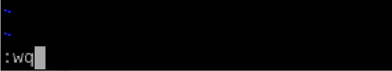
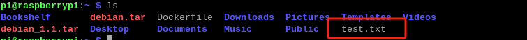

# 7. Docker Container Course

## 7.1 Docker Introduction and Installation

Docker is an open-source application container engine based on the Go language and licensed under Apache License 2.0.

Docker enables developers to package their applications and dependencies into lightweight and portable containers, which can be deployed to popular Linux machines and virtualized environments.

Containers are fully isolated using sandboxing mechanisms, ensuring that there are no interfaces between them (similar to apps on an iPhone), and a more important aspect is that the containers have extremely low-performance overhead.


Docker Logo

Docker Official Website: <http://www.docker.com>

Docker Chinese Website: <https://www.docker-cn.com>

Docker Hub (Repository) Official Website: <https://hub.docker.com>

### 7.1.1Docker Introduction

* **Docker Introduction**

(1) Docker is a world-leading software container platform.

(2) Docker uses the Go language deployed by Google to achieve the development, based on Linux Kernel technologies such as "**cgroup**", "**namespace**", and "**UnionFS (AUFS)**" to encapsulate and isolate progress, which belongs to virtualized technology at the operating system level. Because the processes of isolation are independent of the processes of the host and other isolation, Docker is also called a container. Its initial implementation is based on LXC.

(3) Docker automates repetitive tasks, such as the setup and configuration of the development environments, allowing developers to focus on the truly important thing: to build excellent software.

(4) You can create and use containers easily to run your applications. The containers can also manage, replicate, share, and modify versions, just like managing normal codes.


* **Docker Philosophy**


The image shown above is the logo of Docker, which features a while fully carrying containers on its back. The containers are isolated from each other, representing the core concept of Docker.

For example, multiple applications run on the same server, which may cause conflicts in software port occupation. However, with Docker's isolation feature, each application can run independently. Additionally, Docker can maximize the utilization of server resources.

* **Docker Container Characteristics**

(1) Lightweight

Multiple Docker containers running on a single machine can share the same operating system kernel, enabling them to quickly start and occupy minimal computing and memory resources. Images are constructed using file system layers and share some common files, which can greatly reduce disc usage and speed up image downloads.

(2) Standard

Docker containers based on open standards can run on all mainstream Linux versions, Microsoft Windows, and any infrastructure, including VMs, bare-metal servers, and cloud platforms.

(3) Secure

Docker endows application isolation that is not only between applications but also independent of the underlying infrastructure. It provides the most powerful isolation by default. Therefore, if there is a problem in an application, it only affects a single container, rather than the entire machine.

* **Virtual Machines VS Docker**


(1) The Docker daemon can directly communicate with the host operating system to distribute resources for each Docker container. It can also isolate the containers from the host operating system and each other. Virtual machines take several minutes to start, while the Docker containers can start within a few milliseconds. Since Docker has no overstaffed slave operating system, it can save a significant amount of disk space and other system resources.

(2) Virtual machines are more specialized in thoroughly isolating entire running environments. For example, cloud service providers usually adopt virtual machine technology to isolate different users, instead, Docker is widely used to isolate different applications such as front-end, back-end, and database.

(3) Docker containers are more resource-efficient and faster (in starting, closing, creating, and deleting) than virtual machines.

* **Docker Significance**

(1) Consistent Running Environment

Docker images provide a complete runtime environment excluding the kernel, which ensures consistency in the application runtime environment to avoid questions such as "**This code works fine on my machine**".

(2) Faster Start Time

Docker can start within seconds or milliseconds, greatly saving the time of developing, testing, and deploying.

(3) Isolation

Docker's isolation prevents resources from being affected by other users on shared servers.

(4) Elastic Scaling and Rapid Expansion

Docker is adept at dealing with concentrated usage pressure on servers.

(5) Transfer Convenience

Docker can easily transfer applications running on one platform to another without worrying about the application malfunction caused by the changes in the runtime environment.

(6) Continuous Delivery and Deployment

Docker can use customized application images to realize continuous integration, delivery, and deployment.

* Docker Architecture

Docker adopts a client-server architecture, where the Docker client communicates with its daemon responsible for building, operating, and distributing Docker containers. They can run on the same system, or the Docker client can be connected to a remote Docker daemon. They communicate with REST API over UNIX sockets or network interfaces. Another Docker client is Docker Compose, which enables you to manage applications composed of a set of containers.


* **Three Basic Concepts of Docker** 

(1) Image --- A Special File System

An operating system consists of a kernel and a user space. As for Linux, after the kernel is started, it mounts a root file system to provide support for the user space. A Docker image is essentially a root file system.

A Docker image is a special file system, and it not only provides necessary files, such as programs, libraries, resources, and configurations, for container operation, but also includes some configuration parameters (such as anonymous volumes, environment variables, and users) to prepare for the runtime. The image does not contain any dynamic data, and its content remains unchanged after construction.

When designing Docker, the Union FS technology is fully utilized to design a layered storage architecture. The image is composed of multiple layers of file systems united together.

The Docker image is constructed layer by layer with the former layer serving as the basis for the latter layer. Once a layer is constructed, it remains unchanged, and any changes made in subsequent layers only affect that specific layer itself. For example, when a file from a previous layer is deleted in a later layer, the file is not deleted, but instead marked as deleted in the current layer. When the container finally runs, the file is not visible, however, it is still present in the image. Therefore, when constructing a Docker image, please operate with caution, each layer should only include the necessary files and configurations. Any unnecessary files should be cleared before the layer construction is completed.

The layered storage design makes it easier to reuse and customize images. You can use a previously constructed image as a base layer to add new layers to customize the content and construct a new image according to your specific needs.

(2) Container --- Entity of Image Runtime 

The relationship between images and containers is similar to that between classes and instances in object-oriented programming. An image is a static definition, and a container is the entity that runs the image and can be created, started, stopped, deleted, paused, and more.

The essence of a container is a process, but it is different from a process executed directly on the host. The container process runs in its independent namespace. As mentioned earlier, images and containers both use hierarchical storage.

The lifecycle of a container storage layer is the same as that of the container itself. When a container is deleted, its storage layer is also deleted, resulting in the loss of any information stored in the storage layer.

According to the best practice requirement of Docker, containers should not write any data to their storage layer which should remain stateless. All file-writing operations should use data volumes or assign a host directory. This approach skips the storage layer to directly read and write to the host (or network storage), resulting in higher performance and stability. Data volumes have an independent lifecycle from containers. The data will not be lost even if the container is deleted. Therefore, using data volumes allows containers to be deleted and re-run without losing any data.

(3) Repository --- The Place for Centralized Storage of Image File

Once an image is constructed, it can easily run on the current host. However, if the image needs to be used on other servers, a centralized storage and image distribution is required, such as Docker Registry.

A Docker Registry can contain multiple repositories. Each repository contains multiple tags and each tag corresponds to an image. Therefore, an Image Repository is the place for Docker to centrally store image files, which is similar to the commonly used code repository.

Generally, a repository includes images of different versions of the same software, and tags are usually used to correspond to each version. The "\<Repository Name\>: \<Tag\>" format can be used to specify which version of the software's image to use. If a tag is not provided, the "latest" will be used as the default tag.

* **Docker Operating Mechanism**

Docker utilizes the common CS (Client-Server) architecture, where the Docker client is responsible for processing various commands input by users. Such as "**docker build**" and "**docker run**". The real executor is the Docker daemon which acts as the server. It's worth noting that the Docker client can run on the same machine as the Docker daemon.

Next, let's use a few commands to explain Docker's workflow:

(1) docker build

This command is used when the "**dockerfile**" is written and handed over to Docker for "**compilation**". The client forwards the request to the Docker daemon, which then creates an "**executable program**" image based on the "**dockerfile**".


(2) docker run

The "**executable program**" image can be run after obtained with the "**docker run**" command. The Docker daemon receives the command and locates the specific image, which is then loaded into memory and executed. The running instance of the image is called a container.


(3) docker pull

Users send a command using the Docker client, and the Docker daemon receives the command to send a request to the Docker Registry to download the image. Once downloaded, the image is stored locally and can be used.

### 7.1.2 Docker Installation

Official Installation Reference Manual: [<u>Install Docker Engine on Debian \| Docker Docs</u>](https://docs.docker.com/engine/install/debian/)

>[!Note]
>
>**Raspberry Pi's image already has installed Docker when you receive the package. The following steps are for learning and reference only.**
>

Let's use the Aliyun source for downloading.

(1) Press "**Ctrl+Alt+T**" to open the command line terminal, type "**sudo apt-get update**", and press "**Enter**" to update the apt package list.

```bash
sudo apt-get update
```

(2) Type the command "**sudo apt-get install ca-certificates curl gnupg**" to install the necessary certificates, tools, and GPG (GnuPG) key management tool.

```bash
sudo apt-get install ca-certificates curl gnupg
```

(3) Enter the command "**sudo install -m 0755 -d /etc/apt/keyrings**" to create a directory for storing the GPG keyring.

```bash
sudo install -m 0755 -d /etc/apt/keyrings
```

(4) Type the command "**curl -fsSL https://download.docker.com/linux /debian/gpg \| sudo gpg --dearmor -o /etc/apt/keyrings/docker.gpg**" to obtain the GPG key from Docker official and save it to the keyring.

```bash
curl -fsSL https://download.docker.com/linux /debian/gpg \| sudo gpg --dearmor -o /etc/apt/keyrings/docker.gpg
```

```bash
sudo chmod a+r /etc/apt/keyrings/docker.gpg
```

(5) Enter the command "**echo \\deb \[arch=\$(dpkg --print-architecture) signed-by=/etc/apt/keyrings/docker.gpg\] https://download.docker.com/linux/debian \\(. /etc/os-release && echo "\$VERSION_CODENAME") stable" \| \sudo tee /etc/apt/sources.list.d /docker.list \> /dev/null**" to add Docker storage library into Apt software package source list.

```bash
echo \\deb \[arch=\$(dpkg --print-architecture) signed-by=/etc/apt/keyrings/docker.gpg\] https://download.docker.com/linux/debian \\(. /etc/os-release && echo "\$VERSION_CODENAME") stable" \| \sudo tee /etc/apt/sources.list.d /docker.list \> /dev/null
```

(6) Enter "**sudo apt-get update**" to update the apt software package list.

```bash
sudo apt-get update
```

(7) Enter "**sudo apt-get install docker-ce docker-ce-cli containerd.io docker-buildx-plugin docker-compose-plugin**" to install Docker and related components.

```bash
sudo apt-get install docker-ce docker-ce-cli containerd.io docker-buildx-plugin docker-compose-plugin
```

(8) Enter "**sudo groupadd docker**" to create a Docker user group.

```bash
sudo groupadd docker
```

(9) Enter "**sudo gpasswd -a \$USER docker**" to add the current user to the Docker user group, which avoids having to enter "**sudo**" every time you run a Docker command.

```bash
sudo gpasswd -a \$USER docker
```

(10) Enter "sudo reboot" to reboot Raspberry Pi.

```bash
sudo reboot
```

(11) After the download is complete, enter "**docker version**" to check the Docker version.

```bash
docker version
```

(12) Enter "**docker run hello-world**", if the message shown below appears, it means that the Docker is installed successfully.

```bash
docker run hello-world
```

## 7.2 Docker 'hello-world'

The "**hello-world**" provided by Docker is a lightweight container, which is designed to test the successful installation and operation of Docker. It is very small in size and primarily used to demonstrate Docker's basic usage and verify the correctness of the Docker operating environment.

(1) Press "**Ctrl+Alt+T**" to open the command line terminal. Then enter "**docker run hello-world**" to download the "**hello-world**" image (if it is not present on your local machine).

```bash
docker run hello-world
```

(2) Enter "docker images" in the terminal to list all images on the local master.

```bash
docker images
```

The relevant information of "**Hello_World**" can be checked, corresponding to the parameters:

REPOSITORY: image's repository source.

TAG: image's tag.

IMAGE ID: image's ID.

CREATED: image's creation time.

SIZE: image's size.

(3) Enter "**docker run -it hello-world**" in the terminal to run the "**hello-world**" image. The terminal will print relevant prompt information.

```bash
docker run -it hello-world
```

(4) Enter "**docker inspect ee30efe9**" in the terminal to output JSON data including detailed information about the "**hello-world**" image.

```bash
docker inspect ee30efe9
```

## 7.3 Docker Container Usage

### 7.3.1 Help Command

"**docker info**" is used to display information about the Docker system, including its configuration and current status. It provides a detailed summary of Docker images, the number of containers, the Docker daemon, storage drivers, networks, and other relevant information.

"**docker --help**" is used to obtain help information for Docker commands. If it is executed, all available Docker commands and their options will be listed for reference.

### 7.3.2 Image Command

(1) "docker images" lists all images on the local master.

```bash
docker images
```

Corresponding Parameters:

REPOSITORY: the repository source of the image.

TAG: the tag of the image.

IMAGE ID: the ID of the image.

CREATED: the creation time of the image.

SIZE: the size of the image.

(The same repository source can have multiple tags representing different versions of the repository source. You can define different images using REPOSITORY: TAG. If a tag version for an image is not defined, Docker will use the "**lastest**" image by default.)

"**docker images**" also provides some options:

-a: list all local images

-q: display image id only

--digests: display the image's digest information

(2) "**docker pull**" is used to download images from a selected repository.

```bash
docker pull
```

Usage:

"**docker pull**" image repository address/image name: version

Demonstration (it cannot be downloaded, for reference only): "**docker pull**" hiwonder/ros-foxy:1.0.0

For example, download the "**debian**" image: Press "**Ctrl+Alt+T**" to open the command line terminal. Then enter "**docker pull debian**" and press "**Enter**".

```bash
docker pull debian
```

Enter "**docker images**" to view the images on the master, and you can see a "**debian**" image has been added to the list of images.


(3) "**docker search**" is used to search the image corresponding to the "**DockerHub**" repository.

Take researching the "**ROS**" image for an example. Press "**Ctrl+Alt+T**" to open the command line terminal. Then enter "**docker search ros**" and press "**Enter**".

```bash
docker search ros
```

"**docker search**" also provides some options.

```bash
docker search
```

-f, --filter filter: Filter output based on conditions provided

--format string: Pretty-print search using a Go template

--limit int: Max number of research results

--no-trunc: Do not truncate output

(4) "**docker rmi**" is used to delete images.

docker rmi -f \[image id\]: delete a single image

docker rmi -f \[image name: tag\] \[image name: tag\]：delete multiple images

docker rmi -f \$(docker images -qa) ：delete all images

### 7.3.3 Container Command

The containers can be created only if there are images. Use "debian" to test. Press "**Ctrl+Alt+T**" to open the command line terminal. Then enter "**docker pull debian**" and press "**Enter**".

```bash
docker pull debian
```

* **"docker run" Image Running and Container Starting** 

Command Parameters: docker run \[OPTIONS\] IMAGE \[COMMAND\] \[ARG...\]

Commonly Used Parameters:

--name="`Name`"： assign a name to the container

-d：to run the container in the background and print its id

-i：to run the container in interactive mode and be used with -t

-t：to redistribute a terminal for the container and be used with -i

-P：to map random ports (uppercase)

-p：to map appointed ports (lowercase), generally, with four writing methods

ip:hostPort:containerPort

ip::containerPort

hostPort:containerPort (commonly used)

Take the running "**debian**" image as an example. In the command line terminal, enter "**docker run -it debian /bin/bash**" and press "**Enter**".

"**pi@raspberry**" is the master system interface，and "**root@9aeb4cc 795e6**" is in the interface inside the "**docker**" container.

```bash
docker run -it debian /bin/bash
```

Parameters:

-i: interactive mode

-t: terminal

debian : "**debian**" image

"**/bin/bash**" is the command shown after the image name, indicating the hope that there is an interactive "**Shell**". Therefore, "**/bin/bash**" is used.

To exit the terminal, enter "**exit**" in the terminal and press "**Enter**".

```bash
exit
```

* **"docker ps" Listing All Running Containers** 

Command Parameters: docker ps \[OPTIONS\]

Commonly Used Parameters:

-a：list all running and previously run containers

-l：display the latest created container

-n=?：display multiple (n) recently created containers

-q：Default mode, only display container IDs

Enter "**docker ps -a**" in the command line terminal and press "**Enter**". The running and run containers are displayed. "**container id**" is the container ID, "**image**" is the image name used by the container, "**created**" is the creation time of the container, and "**status**" is the current status of the container.

```bash
docker ps -a
```

* **Exit Container**

There are two commands for exiting containers:

(1) Enter "**exit**" directly in the terminal and press "**Enter**". This action will stop the container from running and exit it.

```bash
exit
```

(2) Use "**crtl+P+Q**". The container exits directly but keeps running. You can enter the command "**docker ps**" in the terminal to view the running containers.

```bash
docker ps
```

* **Multiple Terminals Enter Running Container**

You can enter a running container from another terminal with two commands:

"**docker attach**" is used to enter the terminal of the container start command without starting a new process. Exiting from this container may cause the container to stop running.

"**docker exec**" is used to open a new terminal in the container and start a new process. Exiting from the container will not affect the container's running status. This method is generally preferred for entering a container.

(1) **docker attach**

① Press "Ctrl+Alt+T" to open the command line terminal and enter "docker ps". It displays the running containers.

```bash
docker ps
```

② Enter "**docker attach 004c**" in the terminal (The container ID can be shortened as long as it is a unique identifier for the container.) to get into the running container.

```bash
docker attach 004c
```

③ Enter "**exit**" in the terminal and press "**Enter**". The container stops running and exits.

```bash
exit
```

④ Enter "**docker ps**" in the terminal. It displays the running container, and you can see the earlier exited container is also closed.

```bash
docker ps
```

(2) **docker exec**

① Press "**Ctrl+Alt+T**" to open the command line terminal and enter "**docker ps**". It displays the running containers.

```bash
docker ps
```

② Enter "**docker exec -it efe9 /bin/bash**" in the terminal (The container ID can be shortened as long as it is a unique identifier for the container.) to enter the running container.

```bash
docker exec -it efe9 /bin/bash
```

③ Enter "**exit**" in the terminal and press "**Enter**". The container will exit.

```bash
exit
```

④ Enter "**docker ps**" in the terminal. It displays the running container, and you can see the exited container is not closed.

```bash
docker ps
```

* **Start and Stop Container**

docker start \[ container id or container name \]：to start a container

docker restart \[ container id or container name \]：to restart a container

docker stop \[ container id or container name \]：to stop a running container

docker kill \[ container id or container name \]：to forcefully stop a running container

* Delete Container

docker rm \[container id\]：Delete specified container

docker rm -f \$(docker ps -a -q)：Delete all containers

docker ps -a -q\|xargs docker rm：Delete all containers

### 7.3.4 Other Commonly-Used Other Commands

* **View Process Information Running in Container**

(1) Press "**Ctrl+Alt+T**" to open the command line terminal and enter "**docker ps**". It displays the running containers.

```bash
docker ps
```

(2) Enter "**docker top efe9**" in the terminal. It displays the process information running in the container.

```bash
docker top efe9
```

Corresponding Parameters:

UID: User ID.

PID: Process ID.

PPID: Parent Process ID.

C: CPU utilization of the process.

STIME: Start time of the process.

TTY: Terminal associated with the process.

TIME: Total CPU time used by the process.

CMD: Command line used to start the process.

* **View Metadata of Container or Image**

(1) Press "**Ctrl+Alt+T**" to open the command line terminal and enter "**docker ps**". It displays the running containers.

```bash
docker ps
```

(2) Enter "**docker inspect efe9**" in the terminal to output the JSON data including detailed information about the container or image.

```bash
docker inspect efe9
```

## 7.4 Understanding and Creating Docker Image in Depth

### 7.4.1 Image Understanding

(1) An image is a lightweight, executable, and self-sufficient software package, including all the necessary components for running software. The application and configurations are packaged into a complete, deliverable, and deployable running environment that contains code, runtime, required libraries, environment variables, configuration files, etc, which is the image file.

(2) The docker containers can only be instantiated from image files.

### 7.4.2 UnionFS (Union File System)

(1) UnionFS is a layered, lightweight, and high-performance file system that serves as the basis of the docker image. It allows for modifications to the file system to be added layer by layer and also enables different directories to be mounted onto the same virtual file system.

(2) Images can be built through layering based on a base image to create various specific application images.

The characteristic of UnionFS is that it can simultaneously load multiple file systems, while appearing to the outside as a single file system. Union loading will overlay each file system to ensure that the final file system includes all layered files and directories.

### 7.4.3 Image Layering

When an image is downloaded, please observe the downloaded log output. You can see it is downloaded layer by layer.

```bash
docker pull mysql
```


Enter the command "**docker image inspect mysql**" in the terminal to check the image layering.

```bash
docker image inspect mysql
```


* **Layering Understanding**

All docker images start at a base image layer. When a modification or new component is added, a new image layer is created on top of the current image layer.

Illustrate by a simple example. If a new image is created based on "**debian**", it will be the first layer of the new image. If a Python package is added to the image, the second image layer will be created on the top of the base image layer. If a security patch is added, the third image layer will be created on the top of the second layer. The image will be built like this layer by layer.

All docker images are read-only. When a container is started, a new writable layer is mounted on the top of the image layers, which is commonly referred to as the container layer. The layers below it are called image layers.

* **Advantage of Layering in Docker Image**

The advantage of layering is resource sharing. For example, if there are multiple images created from the same base image, the host only needs to keep one copy of the base image on its disk and in its memory. This allows the base image to be shared among all containers, and each layer of the image can be shared.

### 7.4.4 Image Creating

When the downloaded images from the docker image repository cannot meet your requirements, there are two ways to modify them.

① Use "**docker commit**" to update an image from the created container and commit the image.

② Use the "**Dockerfile**" command to create a new image.

* **Commit an Image from Container**

Command explanation: docker commit -m= "`commit message`" -a= "`author`" container ID target_image_name:\[Tag\] 【"**-m**" and "**-a**" parameters can be omitted】

(1) Press "Ctrl+Alt+T" to open the command line terminal and enter "**docker ps -a**". It displays all previously run containers, and you need to locate the container ID to be committed.

```bash
docker ps -a
```


(2) Enter "**docker commit 9aeb4cc795e6 debain:1.0**" in the terminal to commit the image of container "**9aeb4cc795e6**" and name it "**debian**". The tag name is 1.0.

```bash
docker commit 9aeb4cc795e6 debain:1.0
```

(3) Enter "**docker images**" in the terminal to view the images on the master. You can see a "**debain**" has been added to the list of images.

```py
docker images
```


* "**dockerfile**" Image Creating

Command explanation: docker build "**-f dockerfile**" means file path and "**-t**" is the name of the new image: TAG . \# docker build. The final "**.**" in the command indicates the current directory.

Use the command "**docker build**" to create a new image from scratch. As a result, a "Dockerfile" file needs to be created, including a set of commands for Docker on how to build the image.

About the compiling of "**dockerfile**", please refer to "**https://docs.docker.com/develop/develop images/dockerfile_best-practices/**".

(1) Press "**Ctrl+Alt+T**" to open the command line terminal. Enter "**vim Dockerfile**" in the terminal to create and open the file.

```bash
vim Dockerfile
```

(2) Type the content shown below in the terminal and press "**ESC**". **Enter** "`：wq`" to exit and save the file.




(3) Enter "**docker build -f dockerfile -t debain:1.1 .**" in the terminal to build a new image.

```bash
docker build -f dockerfile -t debain:1.1 .
```

(4) Enter "**docker images**" in the terminal, then you can see the newly built image.

```bash
docker images
```


## 7.5 Docker Hardware Interaction and Data Processing

### 7.5.1 Hardware Mounting (Port Binding)

Connect the device to be mounted to the master, and create a udev rule in the host (/etc/udev/rules.d/).  

Here is an example of mounting a USB camera. Please note that the example is for reference only and you should create your own udev rule based on your specific device.

(1) Press "**Ctrl+Alt+T**" to open the command line terminal, and enter "**docker run -it --device=/dev/video0 debian: latest /bin/bash**" in the terminal to start the "**debian**" container and mount the USB camera.

```bash
docker run -it --device=/dev/video0 debian: latest /bin/bash
```

(2) Enter "**ls /dev/**" in the terminal and press "**Enter**" to check the device currently mounted in the container. You can see that the USB camera "**video0**" has been successfully mounted.

```bash
ls /dev/
```


### 7.5.2 GUI Displaying in Docker

Install in the host:

(1) Press "**Ctrl+Alt+T**" to open the command line terminal, and enter "**sudo apt-get install tigervnc-standalone-server tigervnc-viewer**" in the terminal. Press "**Enter**" and enter "**y**" to download.

```bash
sudo apt-get install tigervnc-standalone-server tigervnc-viewer
```

(2) Enter "**sudo apt-get install x11-xserver-utils**" in the terminal and press "**Enter**" to download.

```bash
sudo apt-get install x11-xserver-utils
```

(3) Enter "**xhost +**" in the terminal and press "**Enter**" to download.

```bash
xhost +
```

(4) Enter "**docker run -it --env="DISPLAY" --env="QT_X11_NO_MITSHM =1**" -v /tmp/.X11-unix:/tmp/.X11-unix debian:latest /bin/bash" in the terminal and press "**Enter**" to get into the container.

```bash
docker run -it --env="DISPLAY" --env="QT_X11_NO_MITSHM =1" -v /tmp/.X11-unix:/tmp/.X11-unix debian:latest /bin/bash
```

(5) Enter "**apt-get update**" in the terminal and press "**Enter**" to update the software list.

```bash
apt-get update
```

(6) Enter "**apt-get install -y x11-apps**" in the terminal and press "**Enter**" to install the X11 image interface.

```bash
apt-get install -y x11-apps
```

(7) Enter "**xeyes**" in the terminal and press "**Enter**". A pair of eyes will appear, following the movement of the mouse.

```bash
xeyes
```


### 7.5.3 File Transmission between Docker Container and Host 

* **Copy File with "cp" Command**

(1) **Copy File from Container to Host**

Command: docker cp \[container id: container path\] \[target host path\]

① Enter "**docker run -it debian /bin/bash**" in the terminal to get into the container.

```bash
docker run -it debian /bin/bash
```

② Enter "**cd**" in the terminal to switch to the user's home directory.

```bash
cd
```

③ Enter "**ls**" in the terminal to check the directory in the current path. You can see that it is an empty directory.

```bash
ls
```

④ Enter "**touch test.txt**" in the terminal to create a "txt" file.

```bash
touch test.txt
```

⑤ Enter "**pwd**" in the terminal to check the current path.

```bash
pwd
```

⑥ Press "**crtl+P+Q**" to exit the container without stopping it.

⑦ Enter "**docker cp d2d0e43b41eb:/root/test.txt ~/**" in the terminal to copy the "**test.txt**" file created earlier to the host.

```bash
docker cp d2d0e43b41eb:/root/test.txt ~/
```

⑧ Enter "**cd /home/pi**" in the terminal to access the file path.

```bash
cd /home/pi
```

⑨ Enter "**ls**" in the terminal to see that "**test.txt**" is already in the path.

```bash
ls
```



(2) **Copy File from Host to Container**

Command: docker cp \[host file path\] \[container id: container path\]

① Enter "**touch test_1.txt**" in the terminal to create a "**test_1.txt**" file.

```bash
touch test_1.txt
```

② Enter "**docker cp test_1.txt d2d0e43b41eb:/root/**" in the terminal to copy the "**test_1.txt**" file to the "**/root/**" path of the container "**d2d0e43b41eb**" 

>[!Note]
>
>**the container "d2d0e43b41eb" needs to keep running).**

```bash
docker cp test_1.txt d2d0e43b41eb:/root/
```

③ Enter "**docker exec -it d2d0e43b41eb /bin/bash**" in the terminal to enter the container.

```bash
docker exec -it d2d0e43b41eb /bin/bash
```

④ Enter "**cd**" in the terminal to switch to the user's home directory.

```bash
cd
```

⑤ Enter "**ls**" in the terminal to check the directory in the current path. You can see that the file has been copied from the host to the container.


### 7.5.4 Data Volume Usage

* **Data Volume Introduction**

When an application and its running environment are packaged into a container, the container can run along with the application. However, the requirement for the data is that it can be persistent. For example, if a "mysql" is installed in a container which is then deleted, the database would be lost. Therefore, we want containers to be able to share data. If the docker commit is not used to generate a new image and save the data as a part of the image, the data generated by the container will be lost when the container is deleted.

To solve this problem, data volumes can be used to share data between containers and persist the data even after the container is deleted.

Features:

(1) Data volumes can be shared or reused between containers.

(2) Changes to data volumes take effect immediately.

(3) Changes to data volumes are not included in image updates.

(4) The life cycle of a data volume continues until no container is using it.

* **Data Volume Usage**

Command: docker run -it -v \[host absolute path directory: container directory\] \[image name\]

(1) Enter "**docker run -it -v /home/pi/temp:/root/temp debian:latest /bin/bash" in the terminal to share the "/home/pi/temp**" directory on the host with the "**/root/temp**" directory in the container.

```bash
docker run -it -v /home/pi/temp:/root/temp debian:latest /bin/bash
```

(2) Enter "**cd root/temp/**" in the terminal to enter the specified directory.

```bash
cd root/temp/
```

(3) Enter "**touch text_2.txt**" in the terminal to create a file named "**touch text_2.txt**".

```bash
touch text_2.txt
```

(4) Enter "**exit**" in the terminal to exit the container.

```bash
exit
```

(5) Enter "**cd /home/pi/temp/**" in the terminal to enter the specified directory.

```bash
cd /home/pi/temp/
```

(6) Enter "**ls**" in the terminal to see that the file created in the container has been shared to the specified directory.

```bash
ls
```

## 7.6 Container Daily Management

Nowadays, Docker has become one of the core tools for developing and deploying applications. However, to ensure the stability and reliability of the container environment, daily maintenance and troubleshooting are indispensable tasks. This text will introduce some key Docker container maintenance and troubleshooting skills to help you tackle various common issues.

### 7.6.1 Unnecessary Container and Image Regular Cleaning

Over time, Docker master's valuable disk space may be occupied by a large number of unnecessary containers and images. Regularly cleaning up them is the first step in maintaining a healthy container environment.

Press "**Ctrl+Alt+T**" to open the command line terminal, and enter "**docker container prune**". Press "**Enter**" and input "**y**" to start removing unnecessary stopped containers.

```bash
docker container prune
```

Press "**Ctrl+Alt+T**" to open the command line terminal, and enter "**docker image prune**". Press "**Enter" and** input "**y**" to start removing unnecessary images.

```bash
docker image prune
```

### 7.6.2 Monitor Container Performance

It is important to monitor the performance of the containers to ensure their normal operation. The real-time CPU, memory, network and disk usage of containers can be checked with Docker's built-in "stats" command.

Press "**Ctrl+Alt+T**" to open the command line terminal, and enter "**docker stats 0cfc6a98a68c**". Press "**Enter**" to check the real-time performance of the container.

```bash
docker stats 0cfc6a98a68c
```


### 7.6.3 Check Container Log 

Logging container activities is extremely important for troubleshooting and diagnosing issues. Use the command "**docker logs**" to check the standard output logs of containers.

Press "**Ctrl+Alt+T**" to open the command line terminal, and enter "**docker logs 0cfc6a98a68c**". Press "**Enter**" to check the standard output log of the container "**0cfc6a98a68c**".

```bash
docker logs 0cfc6a98a68c
```

### 7.6.4 Restart Container

Containers may encounter various issues during runtime, including application collapsing and resource depletion. In such cases, restarting the container can be an effective way to resolve the problem.

Press "**Ctrl+Alt+T**" to open the command line terminal, and enter "**docker restart 0cfc6a98a68c**". Press "**Enter**" to restart the container.

```bash
docker restart 0cfc6a98a68c
```

### 7.6.5 Process Container Network Problem

The network problem between containers may cause communication failure among applications. Use the "**docker network**" command to manage the container network to check the containers' IP addresses and port mappings.

Press "**Ctrl+Alt+T**" to open the command line terminal, and enter "**docker inspect -f '{{range .NetworkSettings.Networks}}{{.IPAddress}}{{end}}' 0cfc6a98a68c**". Press "**Enter**" to check the network information of the container.

```bash
docker inspect -f '{{range .NetworkSettings.Networks}}{{.IPAddress}}{{end}}' 0cfc6a98a68c
```

### 7.6.6 Process Container Storage Problem

Storage problems in containers may involve disk space exhaustion and data loss. Use data volumes and store drivers to better manage container storage.

Press "**Ctrl+Alt+T**" to open the command line terminal, and enter "**docker volume create my-data**". Press "**Enter**" to create a data volume.

```bash
docker volume create my-data
```

After successfully creating the data volume, you can mount it to a container to enable data sharing.

```bash
docker run -v my-data:/path/in/container debian
```

### 7.6.7 Summary

It is crucial to maintain and troubleshoot Docker containers to ensure the stability and reliability of the container environment. Regularly cleaning up unnecessary resources, monitoring container performance, checking container logs, accessing running containers, restarting containers, building custom images, backing up and restoring container data, addressing container network and storage issues, and utilizing container arrangement tools are all essential skills for better managing and maintaining containerized applications.