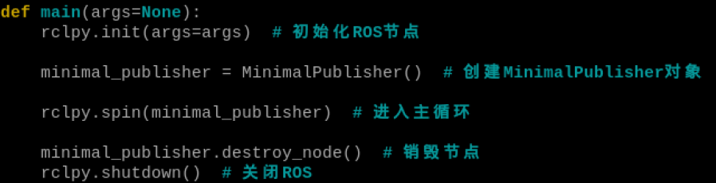
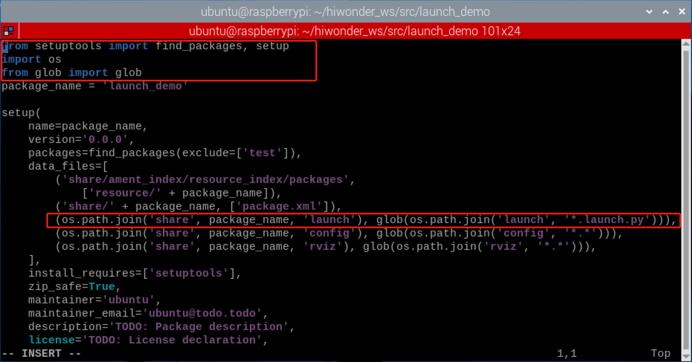

# 8. ROS2 Basic Course

## 8.1 Introduction to ROS2 and Comparison with ROS1

### 8.1.1 ROS2 Overview

ROS2 is the second generation of Robot Operating System, an upgraded version of ROS1, which addressing some of the issues present in ROS1. The earliest version of ROS2, Arden, was introduced in 2017. With iterative updates and optimizations, it has now released the stable versions. Similar to ROS1, the choice between Linux version and ROS2 version is also correlated. The corresponding versions for both are as follows:

| **ROS2 version** | **Ubuntu version** |
| :--------------: | :----------------: |
|       Foxy       |    Ubuntu20.04     |
|     Galactic     |    Ubuntu20.04     |
|      Humble      |    Ubuntu22.04     |

### 8.1.2 ROS2 Features

(1) Distributed architecture: ROS2 adopts a distributed architecture, allowing different nodes to run on multiple computers. This enables ROS2 to operate in larger-scale robotic systems and support higher-level parallel processing and communication.

(2) Multi-language Support: ROS5 supports various programming language, encompassing C++, Python, Java, and others. This allows developers to write ROS applications in their preferred language, enhancing development efficiency and flexibility.

(3) Enhanced Communication Mechanism: ROS2 introduces a refresh communication system called Distribution Service (DDS). It is a high-performance and real-time messaging protocol that enables implement reliable data communication with ROS2.

(4) System-level Tools: ROS2 comes with a set of system-level tools for managing and monitoring ROS2. The tools include management tools (such as Colcon), logging tools (such as Rosout), diagnostic tools (such as Rqt) and others, making it easier for developers to build, test, and debug robotic systems.

(5) Real-time Performance: The design of ROS2 takes into account the real-time performance. It provides several real-time performance tools and libraries, such as Real-Time Executor(RTE), Real-Time Publisher(RTPS), and etc. This allows ROS2 to be used in application scenarios where real-time performance requirements are high.

(6) Ease of Extensibility and Integration: ROS2 supports a modular architecture, allowing developers to easily add new functions and extend ROS2. Furthermore, ROS2 integrates with other commonly uses roboti software and libraries, such as Gazebo simulator and MoveIt robot motion planning library.

### 8.1.3 Difference Between RO2 and ROS1

(1) **Platform**

ROS1 currently only supports running on Linux systems, commonly set up and used on Ubuntu. Meanwhile, ROS2 can currently be set up and used on Ubuntu, Windows and even embedded development boards, making its platform more extensive.

(2) **language** 

① C++

The core of ROS1 is based on C++03, while ROS2 extensively utilizes C++11.

② Python  
ROS1 primarily uses Python 2, whereas ROS2 requires Python version 3.5 or higher, with Humble specifically requiring Python version 3.6.

(3) **Middleware** 

In ROS1, it is necessary to start roscore before initiating, which acts as master node managing communication between all nodes. However, in ROS2, there is no equivalent to roscore; instead, there is only an abstract intermediate interface for data transmission. Currently, all implements of this interface are based on the DDS (Data Distribution Service) standard. This allows ROS2 to provide various high-quality QoS service strategies, improving communication in different network environments.


(4) **Compilation Command** 

The compilation command for ROS1 is "**catkin_make**," while for ROS2, the compilation command is "**colcon build.**"

If any further development learning is required, please refer to the official tutorial via the following link.

**<https://docs.ros.org/en/rolling/index.html>**

## 8.2 ROS2 Installation

>[!Note]
>
>**The provided Raspberry Pi system image has already set up ROS2 environment. This lesson is offered for your reference only.**
>

**This lesson takes the example of humble (requires Internet connection)**

(1) Press "**Ctrl+Alt+T**" to open a command line terminal and enter the command "**docker pull ros:humble**" to download ROS2 image. The download needs to take a while. Please wait patiently.

```bash
docker pull ros:humble
```

(1) After the image is downloaded, enter the command "**docker run -it --network=host -d -v=/dev:/dev -v /tmp/.X11-unix:/tmp/.X11-unix --name humble -e DISPLAY=\${DISPLAY} --restart=always ros:humble /bin/bash**" in the terminal to run the container and specify the name as "humble".

```bash
docker run -it --network=host -d -v=/dev:/dev -v /tmp/.X11-unix:/tmp/.X11-unix --name humble -e DISPLAY=\${DISPLAY} --restart=always ros:humble /bin/bash
```

(1) Enter "**xhost +**" to start the access control for X Sever.

```bash
xhost +
```

(2) Enter "**docker ps**" to view the ID of the newly created container.

```bash
docker ps
```


(3) Enter the command "**docker exec -it 55ce /bin/bash**" to enter the container (the container's ID can be abbreviated as long as it uniquely identifies the container).

```bash
docker exec -it 55ce /bin/bash
```

(4) Enter the command "**useradd -m -s /bin/bash ubuntu**" to create a new user.

```bash
useradd -m -s /bin/bash ubuntu
```

(5) In the terminal, enter "**passwd ubuntu**" to set the password for "ubuntu". Here, "ubuntu" is set as the password, you will prompted to re-enter the password.

```bash
passwd ubuntu
```

(6) Enter "**usermod -aG sudo ubuntu**" to add the new user "ubuntu" to the sudo group, granting it the superuser permission.

```bash
usermod -aG sudo ubuntu
```

(7) Enter "**sudo apt-get update -y && sudo apt-get upgrade -y**" to update the list of available software packages and upgrade the installed software packages on the system.

```bash
sudo apt-get update -y && sudo apt-get upgrade -y
```

(8) Enter "**sudo apt-get install vim -y**" to install Vim text editor.

```bash
sudo apt-get install vim -y
```

(9) Enter "**sudo apt-get install ros-humble-desktop-full -y**"to install the complete desktop environment of ROS Humble version.

```bash
sudo apt-get install ros-humble-desktop-full -y
```

### 8.2.1 Test ROS2 Environment

(1) Enter "**docker exec -it -u ubuntu -w /home/ubuntu 55ce /bin/bash**" to enter the container. 

>[!Note]
>
>**55ce is the container ID with the ROS2 environment installed.**
```bash
docker exec -it -u ubuntu -w /home/ubuntu 55ce /bin/bash
```

(2) Enter "**source /opt/ros/humble/setup.bash**" to manually set up ROS2 environment.

```bash
source /opt/ros/humble/setup.bash
```


(3) The step 2 needs to be executed every time to load the workspace when you open the terminal, you can enter "**echo "source /opt/ros/humble/setup.bash" \>\> ~/.bashrc**" to write this command into the .bashrc file.

```bash
echo "source /opt/ros/humble/setup.bash" \>\> ~/.bashrc
```

(4) Enter "**source ~/.bashrc**" to make the **.bashrc** file take effect. In this way, there is no need to load the workspace environment for each operation.

```bash
source ~/.bashrc
```

(5) Enter "**ros2 run turtlesim turtlesim_node**" to start the TurtleSim GUI interface. If it launches successfully, it indicates that ROS2 has been installed successfully.

```bash
ros2 run turtlesim turtlesim_node
```


## 8.3 ROS2 Command-Line Operation

### 8.3.1 Component of ROS2 File System 

The ROS2 file consists of Packages and Manifests.

Packages are the basic organizational unit in ROS2 software, consisting of a collection of related files and directories used to organize and manage ROS2 nodes, libraries, and resources. These packages contain source code for nodes, configuration files, message and service definition.

Manifests (package.xml) is a description file for the packages used to define the relevant metadata and dependencies of the package. In ROS2, packages typically contain a file named package.xml, which contains metadata information information about the package, such as name, version, maintainer, license agreement, and dependencies.

Manifest file (package.xml) plays a crucial role in ROS2, providing descriptions and management for packages. This enables the ROS2 to properly handle dependencies between packages and perform appropriate building and performance.

### 8.3.2 Get to Know ROS2 Basic Terms

The following table will introduce you some basic terms in ROS2:

<table class="docutils-nobg" border="1">
<colgroup>
<col style="width: 30%" />
<col style="width: 69%" />
</colgroup>
<tbody>
<tr>
<td style="text-align: center;"><strong>Term</strong></td>
<td style="text-align: center;"><strong>Instruction</strong></td>
</tr>
<tr>
<td style="text-align: center;">Underlying communication layer (DDS)</td>
<td style="text-align: left;">It provides high-performance, reliable, real-time data communication and integration capabilities, thereby establishing fundamental support for messaging and service invocation between nodes in ROS2.</td>
</tr>
<tr>
<td style="text-align: center;">Node</td>
<td style="text-align: left;">Node is the smallest unit of processing running in ROS. It is typically an executable file. Each node can use topics or services to communicate with other nodes.</td>
</tr>
<tr>
<td style="text-align: center;">Message</td>
<td style="text-align: left;">The variables of data types such as int, float and boolean.</td>
</tr>
<tr>
<td style="text-align: center;">Topic</td>
<td style="text-align: left;">A one-way asynchronous communication mechanism. By publishing messages to topics or subscribing to topics, the data transmission between nodes can be realized. The topic type is determined by the type of corresponding message.</td>
</tr>
<tr>
<td style="text-align: center;">Publishing</td>
<td style="text-align: left;">Send data with a message type corresponding to the topic content.</td>
</tr>
<tr>
<td style="text-align: center;">Publishers</td>
<td style="text-align: left;">For publishing to take place,the publisher node registers various information such as its topics on the master node, and transmits messages to subscribing nodes that wish to subscribe.</td>
</tr>
<tr>
<td style="text-align: center;">Subscribing</td>
<td style="text-align: left;">Receive data with a message type corresponding topic content.</td>
</tr>
<tr>
<td style="text-align: center;">Subscribers</td>
<td style="text-align: left;">For subscription to take place, the subscribing node registers various information such as its topics on the master node. Subsequently, it receives all messages from publisher nodes that have published topics of interest to this node, via the master node.</td>
</tr>
<tr>
<td style="text-align: center;">Services</td>
<td style="text-align: left;"><p>A bidirectional synchronous communication mechanism where the service is provided to the client request corresponding to a specific task and service servers gives the service response.</p></td>
</tr>
<tr>
<td style="text-align: center;">Service Servers</td>
<td style="text-align: left;">A node taking requests as input, and providing responses as output.</td>
</tr>
<tr>
<td style="text-align: center;">Service Clients</td>
<td style="text-align: left;">A node taking responding as input, and providing requests as output.</td>
</tr>
</tbody>
</table>

### 8.3.3 Get to Know ROS2 Commonly File

The following table will provide explanations for the commonly used files in ROS:

|    **Term**    |                       **Instruction**                        |
| :------------: | :----------------------------------------------------------: |
|   Urdf file    | A model file describing robot's entire elements, including link, joint, kinematics parameters, dynamics parameters, visual models and collision detection models. |
|    Srv file    | It is stored in the srv folder used to define ROS service messages, consisting of two parts: request and respond. The request and respond are separated by the "---" symbol. |
|    Msg file    | It is stored in the msg folder used to define ROS topic messages. |
|  package.xml   | Description of the package attributes, including the package name, version number, authorship and other information. |
| CmakeLists.txt |         Compile the configuration file using Cmake.          |
|     launch     | Launch files contain system-wide instructions for launching nodes and services required for the robot to operate. |

### 8.3.4 Get to Know Commonly Used Command

* **Package Management Tool**

The ros2 pkg has a total of five commands: create, executables, list, prefix, xml.

|     **Command**      |                       **Instruction**                        |
| :------------------: | :----------------------------------------------------------: |
|   ros2 pkg create    | Create packages, specify package name, build type, dependencies, node names, etc. |
|    ros2 pkg list     |           View the list of packages in the system.           |
| ros2 pkg executables |   View a list of executable files within packages in ROS2.   |
|   ros2 pkg prefix    | View the the installation path prefix of a specific package in ROS2. |
|     ros2 pkg xml     | View the contents of the .xml file for the specific package. |

* **Node Running Tool** 

The function of ros2 run is allow you to run nodes within ROS2 package. The basic syntax is "**ros2 run <package_name> <node_name>" as pictured.**


* **Command-line Tool**

The ro2 node command is used to view node messages.

|  **Command**   |                       **Instruction**                        |
| :------------: | :----------------------------------------------------------: |
| ros2 node list | View the list of active nodes within the current domain ( nodes grouped by the same ROS_DOMAIN_ID ) |
| ros2 node info | View the detailed information about a specific node in ROS2, including its subscriptions, publications, publishing, services and actions, etc. |

* **Topic Operation Tool**

The ros2 topic command in ROS2 is used to perform operations related to topics.

| **Command**      |                       **Instruction**                        |
| ---------------- | :----------------------------------------------------------: |
| ros2 topic list  |          List all active topics within the domain.           |
| ros2 topic info  | Provide information about a specific topic, including its type, and publishers/subscribers. |
| ros2 topic type  |               View the type of topic messages.               |
| ros2 topic find  | Find the topics related to a specific message type in ROS2.  |
| ros2 topic hz    | Display the average publishing frequency of a topic in ROS2. |
| ros2 topic bw    |      Calculate the bandwidth usage of a specific topic.      |
| ros2 topic delay | Calculate the message delay using the timestamp in the message header in ROS2. |
| ros2 topic echo  |            Display the topic message in console.             |
| ros2 topic pub   | Publish a message to a specific topic through command-line.  |

* **Interface Operation Tool** 

The ros2 interface command is used to perform operations related to the interfaces in ROS2.

|       **Command**       |                       **Instruction**                        |
| :---------------------: | :----------------------------------------------------------: |
|   ros2 interface list   | List all available interfaces in the system, including Messages, Services, and Actions. |
| ros2 interface package  |    List the child interfaces within the specific package.    |
| ros2 interface packages |             List packages containing interfaces.             |
|   ros2 interface show   |  Display the detailed contents of the specified interface.   |
|  ros2 interface proto   |                   Display message module.                    |

## 8.4 ROS2 Development Environment Configuration

>[!Note]
>
>**The provided Raspberry Pi image comes pre-installed and pre-configured with the development environment. This lesson is only provided for learning and reference purpose only.**
>

During the subsequent learning and development processes, users can improve their efficiency by optimizing development environment and installing plugins.

### 8.4.1 Adjust Resolution

(1) Press "**Ctrl+Alt+T**" to open a command-line terminal and input the command "**sudo raspi-config**", then press Enter.

```bash
sudo raspi-config
```

(2) Select "2. Display Options" using "↑↓" keys and press "Enter" to confirm. "**Esc**" key can be used to go back to the previous level.


(3) Select "**D3 VNC Resolution**", and then press "**Enter**" to confirm.


(4) Select "**1920\*1080**" and "**\<Select\>**" in sequence, then press "Enter" to confirm.


(5) When the modification is completed, Raspberry will restart.

### 8.4.2 Tool Usage

During the subsequent ROS development, it is necessary to open multiple terminals. In this point, terminator tool will be utilized.

(1) Click  in the upper-left corner, and select System Tools and Terminator in sequence.


(2) Enter "**docker exec -it -u ubuntu -w /home/ubuntu 1318 /bin/bash**" to enter the container.

```bash
docker exec -it -u ubuntu -w /home/ubuntu 1318 /bin/bash
```

Every time before entering the container, it is inconvenient to enter command in the terminator terminal. You can set the command to enter the container in the terminator tool.

(3) Right-click on the terminator window, and then select "Preference".


(4) Select **Profiles→Command** in sequence.


(5) Check the "Run a custom command instead of my deal" option, and then enter the accessible command of container "**docker exec -it -u ubuntu -w /home/ubuntu 1318 /bin/bash**". 

>[!Note]
>
>**1318 is the container ID containing ROS2 environment.**


(6) Click "Close". This way, every time you open the terminal, you can directly enter the container with ROS2 environment.


### 8.4.3 Tree Tool Installation

The Tree is a command-line tool, used to list the hierarchical structure of directories and files in a tree-like format. It helps users visualize the directory structure of the file system in a clear manner, including files and sub-directories.

(1) Click  in the upper-left corner, select **System Tools** and **Terminator** in sequence.


(2) Enter "**sudo apt-get install tree**" to install Tree tool.

```bash
sudo apt-get install tree
```

(3) After installation, enter "**tree -L 1**" to display the first-level directories structure of the current folder.

```bash
tree -L 1
```

### 8.4.4 pip Package Installation

Python-pip is a package for Python3's package management tool "pip". pip is the official package management tool for Python, used to install, upgrade and manage Python package .

Enter the command "**sudo apt-get install python3-pip**" to install pip.

```bash
sudo apt-get install python3-pip
```

### 8.4.5 transforms3d Library Installation

Transforms3d is a Python library used for 3D transformations and rotation matrices. It provides a set of functions and classes for performing various transformation operations in three-dimensional space, such as rotation, translation and scaling. The traforms3d library has a simple and user-friendly interface that can be used for handling 3D graphics, robot kinematics, computer vision, and other fields. It supports various common presentation of rotations, such as Euler angles, quaternions, and rotation matrices, and provides conversion functions for converting between these representations.

Enter the command "**sudo pip3 install transforms3d**" to install Python library.

```bash
sudo pip3 install transforms3d
```

>[!Note]
>
>**Prior to the installation of transforms3d library, you need to first install pip package.**
>

### 8.4.6 turtle-tf2-py& tf2-tools Libraries Installation

turtle-tf2-py and tf2-tools are two packages in ROS, used to perform coordinate transformation-related functionalities in Python using TF2 (Transform Library).

turtle-tf2-py provides a lightweight TF2 client library for Python, enabling easy coordinate transformation operations in ROS. By using ros-humble-turtle-tf2-py, you can listen for coordinate transformations, query coordinate transformation, perform coordinate transformations, and more.

tf2-tools provides some TF-related practical tools. It includes commonly used functionalities such as interpolation of coordinate transformations, publishing and listening to coordinate transformations, and visualization of coordinate frames.

Enter "**sudo apt install ros-humble-turtle-tf2-py ros-humble-tf2-tools**" to install turtle-tf2-py and tf2-tools libraries (humble is a version number for ROS2.)

```bash
sudo apt install ros-humble-turtle-tf2-py ros-humble-tf2-tools
```

### 8.4.7 Gazebo Installation

Gazebo is a powerful open-source 3D robot simulation software that helps us quickly create and test various real-world scenarios on a computer. It comes with a built-in precise physics engine to simulate the interactions of dynamic objects in the scene, such as gravitational forces and friction. It also provides excellent 3D visualization effects, allowing us to clearly see the simulation process through a visual client. Most importantly, Gazebo integrates seamlessly with ROS, allowing us to develop and test ROS nodes directly within it. This enables us to easily transfer simulation code to physical robots.

Enter "**sudo apt-get install ros-humble-ros-gz**" to install Gazebo (humble is a ROS number for ROS2.)

```bash
sudo apt-get install ros-humble-ros-gz
```

## 8.5 ROS2 Workspace

### 8.5.1 Introduction to Workspace

In ROS robot development, when we develop specific functionalities for robots, various code, parameters, scripts, and other files need to be placed in a folder for management. This folder is called a workspace in the ROS system. Therefore, a workspace is a folder where project-related files are stored, serving as the main location for storing all data during the development process.

### 8.5.2 Create & Compile Workspace

(1) Click  in the upper left corner, then select **System Tools and Terminator** in sequence.


(2) Enter "**docker ps**" to list the currently running containers

```bash
docker ps
```


(3) Enter "**docker exec -it -u ubuntu -w /home/ubuntu 55ce /bin/bash**" (the container ID can be abbreviated as long as it uniquely identifies the container) to enter the contain with ROS2 installed.

```bash
docker exec -it -u ubuntu -w /home/ubuntu 55ce /bin/bash
```


(4) Enter "**mkdir -p ~/hiwonder_ws/src**" to create a workspace called "**mkdir -p ~/hiwonder_ws/src**".

```bash
mkdir -p ~/hiwonder_ws/src
```


(5) Enter "**cd hiwonder_ws**" to switch to the workspace named "**hiwonder_ws**".

```bash
cd hiwonder_ws
```


(6) Enter "**colcon build**" to compile the workspace.

```bash
colcon build
```


(7) Enter "**source ~/hiwonder_ws/install/setup.bash**" to load the workspace environment in ROS2.

```bash
source ~/hiwonder_ws/install/setup.bash
```


(8) Every time yon open a nrew terminal, step 7) will be executed to load the workspace. However, you can enter the command "**echo "source ~/hiwonder_ws/install/setup.bash" >> ~/.bashrc**" to append the specified command to the .bashrc file.

```bash
echo "source ~/hiwonder_ws/install/setup.bash" >> ~/.bashrc
```

(9) Then enter "**source ~/.bashrc**" to make the .bashrc file take effect, thereby there is no need to load the workspace environment for each operation.

```bash
source ~/.bashrc
```

### 8.5.3 Introduction to Workspace

After compilation, enter the command "**tree -L 1**" to view the root directory of the workspace.

```bash
tree -L 1
```


A typical workspace structure in ROS system is shown as above. The "**hiwonder_ws**" is the root directory of the workspace, which contains four sub-directories, or sub-spaces.

| **Name** |      **Meaning**       |                       **Instruction**                        |
| :------: | :--------------------: | :----------------------------------------------------------: |
|  build   | Compilation workspace  | Save intermediate files generated during the compilation process. |
| install  | Installation workspace |       Store the compiled executable files and scripts.       |
|   log    |     Log workspace      | Save various logs including warnings, errors, and information during the compilation and execution processes |
|   src    |     Code workspace     | The subsequent code and scripts need to be manually placed here. |

All in all,most of operations are performed within the "**src**" folder among these four spaces. After successful compilation, the results will be executed from the "**install**" folder. The "**build**" and "folder" are rarely used.

Moreover, the name of the workspace can be customized, and there can be multiple workspaces. For example:

Workspace 1：hiwonder_ws_a, used for development of robot A.

Workspace2：hiwonder_ws_b, used for development of robot B.

Workspace3：hiwonder_ws_c, used for development of robot C.

The above situations are all permitted, similar to create multiple new projects in an integrated development environment, they all exists in parallel.

## 8.6 ROS2 Package

### 8.6.1 Package Introduction

Each robot may have may functionalities, such as motion control, visual perception, autonomous navigation, etc. It's possible to put the source code of these functions together, what if we want to share some of these functions with others? It can be found that the code is all mixed up and difficult to separate.

The principle of packages addresses this issue. The code of different function is divided into different packages, aiming to reduce their coupling as much as possible. When we need to share some functions with others in the ROS community, we only need to explain how to use the package, and others can quickly use it. Therefore, the mechanism of packages is one of the important methods to improve software reusability in ROS.

### 8.6.2 Create and Compile Package

(1) Click  in the upper-left corner, then select "**System Tools and Terminator**" in sequence.


(2) Enter the command "**cd hiwonder_ws/src/**" to switch to the src folder within the workspace named **hiwonder_ws**.

```bash
cd hiwonder_ws/src/
```

(3) Enter "**ros2 pkg create hello_world_demo --build-type ament_python --dependencies rclpy --node-name hello_world**" and press Enter to create a package named **hello_world_demo**. Add the dependency "rclpy" and generate an executable program named "**hello_world**".

```bash
ros2 pkg create hello_world_demo --build-type ament_python --dependencies rclpy --node-name hello_world
```

(4) Enter "**cd ~/hiwonder_ws**" to switch to the root directory of the workspace.

```bash
cd ~/hiwonder_ws
```

(5) Enter "**colcon build**" to compile packages in workspace.

```bash
colcon build
```

(6) After successful compilation, enter "**cd src/hello_world_demo/**" to enter the directory where the package is located, and press Enter to verify whether the package is created successfully.

```bash
cd src/hello_world_demo/
```

### 8.6.3 Package Instruction

After compilation, enter the command "**tree -L 1**" to view the root directory of the workspace.

```bash
tree -L 1
```


In ROS system, the structure of a typical package is shown above. The "hello_world_demo" is the root directory of the package, there will be 6 files or subdirectories inside.

|     **Name**     |                       **Instruction**                        |
| :--------------: | :----------------------------------------------------------: |
| hello_world_demo |       Package directory: Python source file directory        |
|   package.xml    | Package information, such as package name, version, author, dependencies. |
|     resource     |                      Resource directory                      |
|    setup.cfg     |               Package basic configuration file               |
|     setup.py     |       Similar to CMakeLists.txt file for C++ packages        |
|       test       |                   Store test-related files                   |

## 8.7 ROS2 Node

### 8.7.1 Node Introduction

During communication, regardless of the method used, the construction of communication entities relies on nodes. In ROS2, each node typically corresponds to a single function module. For example, a lidar driver node may be responsible for publishing lidar messages, while a camera driver node may be responsible for publishing image messages. A complete robotic system may consist of many collaborating nodes. A single executable file in ROS 2 (either a C++ program or a Python program) can contain one or more nodes.

### 8.7.2 Create Node

(1) Click  in the upper left corner, and then select "**System Tools and Terminator**" in sequence.


(2) Enter the command "**cd hiwonder_ws/src/hello_world_demo/hello_world_demo**" and press Enter to switch to the path of the "**hello_world_demo**" package.

```bash
cd hiwonder_ws/src/hello_world_demo/hello_world_demo
```

(3) Enter command "**package**" to edit program. Copy the below program. You can press "**i**" to edit the program. After modification, press "**Esc**" and enter "**:wq**" to save and exit the program.

```bash
vim hello_world.py
```

```bash
import rclpy
from rclpy.node import Node
import time
class HelloWorldNode(Node):
def __init__(self):
# Call the constructor if the based class Node to set the node name.
super().__init__('hello_world_demo')
def run(self):
# Execute a loop when the ROS2 system is running normally.
while rclpy.ok():
# Print "Hello World" to the node's log.
self.get_logger().info('Hello World')
# Sleep for 0.5s to control the loop time.
time.sleep(0.5)
def main(args=None):
# Initialize ROS2 Python interface
rclpy.init(args=args)
# Create an instance of HelloWorldNode
node = HelloWorldNode()
try:
# Run the main loop of the node.
node.run()
except KeyboardInterrupt:
pass
finally:
# Destroy the node object
node.destroy_node()
# Shut down ROS2 Python interface
rclpy.shutdown()
if __name__ == '__main__':
# Execute the main function
main()
```

```bash
:wq
```

(4) Enter the command "**chmod +x hello_world.py**" and press Enter to grant the executable permission to the saved hello_world.py file.

```bash
chmod +x hello_world.py
```

### 8.7.3 Compilation and Execution

(1) After granting the executable permission, enter the command "**cd ~/hiwonder_ws/**" to switch to the directory of the workspace.

```bash
cd ~/hiwonder_ws/
```

(2) Enter the command "**colcon build**" and press Enter to compile the package within the workspace.

```bash
colcon build
```

(3) Enter the command "**colcon build**" and press Enter to make the environment variables take effect.


(4) Enter command "**ros2 run hello_world_demo hello_world**" and press Enter to start hello_world node.

```bash
ros2 run hello_world_demo hello_world
```


### 8.7.4 Program Analysis

According to the realization result, the logic progress for the program is shown as pictured:


Create a node named HelloWorldNode, and print "**Hello World**" to the node's log every 0.5 seconds in the main loop of the node. During program execution, the ROS2 Python interface is initialized first, then a node instance is created and its main loop is run. When the program is interrupted, the node object is destroyed, and the ROS2 Python interface is shut down.

(1) **Main function**


First, invoke the rclpy.init() function to initialize ROS2 Python interface. Then instantiate the HelloWorkdNode file. Finally, execute the node.run() function.

(2) **HelloWorldNode Class**


First, create a node named HelloWorldNode, then print "Hello World" to the node's log at intervals of 0.5 seconds in the node's main loop.

## 8.8 ROS2 Topic

### 8.8.1 Topic Communication Introduction

Topic communication is the most common way of communication in ROS2. Publishers publish data on specific topics, and subscribers who subscribe to those topics can receive the data.

Topic communication is based on publish and subscribe models as pictured:


The characteristic of the topic data transmission is from one node to another. The object sending data is called the publisher, while the object receiving data is called the subscriber. Each topic requires a name, and the transmitted data also requires a fixed data type.

### 8.8.2 Create Topic

* **Create Publisher**

(1) Click  and select "System Tools -\>Terminator" in sequence.


(2) Enter the command "**cd hiwonder_ws/src/**" to switch to the src folder within hiwonder_ws workspace.

```bash
cd hiwonder_ws/src/
```

(3) Enter the command "**ros2 pkg create topic_demo --build-type ament_python --dependencies rclpy**" and press Enter to create a package named "**topic_demo**" with rclpy dependency.

```bash
ros2 pkg create topic_demo --build-type ament_python --dependencies rclpy
```

(4) Enter the command "**rclpy dependency**" to switch to the "topic_demo" package.

```bash
rclpy dependency
```

```bash
cd topic_demo/topic_demo
```

(5) Enter the command "**vim topic_pub.py**" to edit the program, copy the following program. If modification is required, you can press "**i**" to modify the program. After modification, press "**Esc**" and eneter "**:wq**" to save and exit.

```bash
vim topic_pub.py
```

```py
import rclpy
from rclpy.node import Node
from std_msgs.msg import String
# Define a NinimalPublisher class inhering from the Node.
class MinimalPublisher(Node):
# The initialization method of the Class
def \_\_init\_\_(self):
# Call the initialize method of the Node class to set the node name as "minimal_publisher".
super().\_\_init\_\_('minimal_publisher')
# Create a publisher to publish messages of String type to "topic", with a queue size of 10.
self.publisher\_ = self.create_publisher(String, 'topic', 10)
# Create a timer to trigger the time_callback method every 0.5 seconds.
timer_period = 0.5 \# second
self.timer = self.create_timer(timer_period, self.timer_callback)
# Counter, used to generate numbers in the message
self.i = 0
# Define timer callback function
def timer_callback(self):
# Create a message of type String
msg = String()
# Set the message data as "Hello World: number"
msg.data = 'Hello World: %d' % self.i
# Publish message
self.publisher\_.publish(msg)
# Increment the counter
self.i += 1
# Main function
def main(args=None):
# Initialize ROS2 node
rclpy.init(args=args)
# Create MinimalPublisher object
minimal_publisher = MinimalPublisher()
# Enter the event loop of ROS2 node
rclpy.spin(minimal_publisher)
# Destroy node object
minimal_publisher.destroy_node()
# Shut down ROS2 node
rclpy.shutdown()
# If this script is the main program, main function is executed.
if \_\_name\_\_ == '\_\_main\_\_':
main()
```

```bash
:wq
```

(6) Enter the command "**chmod +x topic_pub.py**" and press Enter to grant the executable permission to the saved topic_pub.py file.

```bash
chmod +x topic_pub.py
```

* **Create Subscriber**

(1) Enter the command "**vim topic_sub.py**" to edit the program. Copy the following program. If modification is required, you can press "**i**" to modify the program. After modification, press "**Esc**" and eneter "**:wq**" to save and exit.

```bash
vim topic_sub.py
```

```py
import rclpy
from rclpy.node import Node
from std_msgs.msg import String
# Define a NinimalPublisher class inhering from the Node.
class MinimalSubscriber(Node):
# The initialization method of the Class
def \_\_init\_\_(self):
# Call the initialization method of the Node class
super().\_\_init\_\_('minimal_subscriber')
# Create a subscriber to subscribe to the messages of String type on the "topic", Set the callback function to listener_callback and the queue size to 10.
self.subscription = self.create_subscription(String, 'topic', self.listener_callback, 10)
# Define message callback function
def listener_callback(self, msg):
# Get the logger and print the received message.
self.get_logger().info('I heard: "%s"' % msg.data)
# Main function
def main(args=None):
# Initialize ROS2 node
rclpy.init(args=args)
# Create MinimalSubscriber object
minimal_subscriber = MinimalSubscriber()
# Enter the event loop of ROS2 node
rclpy.spin(minimal_subscriber)
# Destroy node object
minimal_subscriber.destroy_node()
# Shut down ROS2 node
rclpy.shutdown()
# If this script is the main program, the main function is executed.
if \_\_name\_\_ == '\_\_main\_\_':
main()
```

```bash
:wq
```

(7) Enter the command "**chmod +x topic_sub.py**" and press Enter to grant the executable permission to the saved topic_sub.py file.

```bash
chmod +x topic_sub.py
```

### 8.8.3 setup.py File Settings

The setup.py file defines the metadata and build configuration for a ROS2 package, providing information such as package metadata, dependencies, build configuration, and installation logic. It helps developers correctly build, install, and use ROS2 packages. It is necessary to write the program entry points for topic_pub.py and topic_sub.py into the setup.py file.

(1) Enter the command "**cd ..**" to switch to the parent directory.

```bash
cd ..
```

(2) Enter the command "**vim setup.py**" and press Enter to open the setup.py file.

```bash
vim setup.py
```

(3) Press "**i**" to enter the editing mode, and then enter the following code to the corresponding position.

'topic_pub = topic_demo.topic_pub:main',

'topic_sub = topic_demo.topic_sub:main'


(4) Enter "**:wq**" to save and exit the file.


### 8.8.4 Compilation and Execution

(1) After granting the executable permission, enter the command "**cd ~/hiwonder_ws/**" to switch to the directory of the workspace.

```bash
cd ~/hiwonder_ws/
```

(2) Enter the command "**colcon build**" and press Enter to compile the packages within the workspace.

```bash
colcon build
```

(3) Enter the command "**source ./install/setup.bash**" and press Enter to make the environment variables take effect.

```bash
source ./install/setup.bash
```

(4) Enter the command "**ros2 run topic_demo topic_pub**" and press Enter to start topic_pub topic publishing node.

```bash
ros2 run topic_demo topic_pub
```

(5) Right click to select "**Split Vertically**" to create a new terminal window.


(6) Enter the command "**ros2 run topic_demo topic_sub**" and press Enter to start the topic_sub topic publishing node.

```bash
ros2 run topic_demo topic_sub
```

### 8.8.5 Program Analysis

(1) **Publish Topic**

According to the realization result, the logic progress for the program is shown as pictured:


Create a publisher named as minimal_publisher. This publisher publishes a message with an incremental number every to the "**topic**" topic every 0.5 seconds. During program execution, ROS 2 node is initialized first. Then, a MinimalPublisher object is created, and the program enters the ROS 2 node's event loop. When the program is interrupted, the node object is destroyed, and the ROS 2 node is shut down.

① **Main Function**


First, invoke the rclpy.init() function to initialize ROS2 Python interface. Then instantiate the MinimalPublisher() file. Finally, execute the minimal_publisher within the event loop of the ROS2 node.

② MinimalPublisher Class


First, create a node named minimal_publisher, then create a publisher named "**publisher\_**". The timier_callback() callback function prints a message with an incremental number to the node's log at intervals of 0.5 second.

(2) **Subscribe to Topic**

According to the realization result, the logic progress for the program is shown as pictured:


Create a subscriber named as minimal_sublisher. This subscriber prints the subscribed messages to logger. During program execution, ROS 2 node is initialized first. Then, a MinimalPublisher object is created, and the program enters the ROS 2 node's event loop. When the program is interrupted, the node object is destroyed, and the ROS 2 node is shut down.

① **Main Function**


First, invoke the rclpy.init() function to initialize ROS2 Python interface. Then instantiate the MinimalPublisher() file. Finally, execute the minimal_publisher within the event loop of the ROS2 node.

② MinimalSublisher Class


First create a node named minimal_sublisher. Then create a subscriber named subscription. In the listener_callback() callback function, the received message content is printed to the logger.

### 8.8.6 Customize Interface 

Both topic_pub.py and topic_pub.py utilizes ROS official interfaces.


Though it is a way good practice to use a pre-defined interfaces, it may necessary to define custom messages and services. The following will demonstrate how to create custom interface definitions.

(1) Enter the command "**cd ~/hiwonder_ws/src/**" to switch to the src folder wthin the **hiwonder_ws** workspace.

```bash
cd ~/hiwonder_ws/src/
```

(2) Enter the command "**ros2 pkg create demo_interfaces --build-type ament_cmake --dependencies rclcpp**" and press Enter to create a package named "**demo_interfaces**".

```bash
ros2 pkg create demo_interfaces --build-type ament_cmake --dependencies rclcpp
```

(3) Enter the command "**demo_interfaces**" to enter the custom interface package.

```bash
cd demo_interfaces
```

(4) Enter the command "**mkdir msg**" to create a folder.

```bash
mkdir msg
```

(5) Enter the command "**cd msg**" to enter the msg folder.

```bash
cd msg
```

(6) Enter the command "**vim String.msg**" to edit the program. Enter "**string data**". If you need to make modifications, you can press "**i**". After modification, enter "**:wq**" to save and exit.


```bash
:wq
```

(7) Enter "**cd .."** to navigate back to the parent directory, then enter "**vim CMakeLists.txt**" to open the file using the Vim text editor. Copy the following program and paste it into the specific location as pictured.If you need to make modifications, press "**i**" to enter insert mode. Once you've finished editing, press "**Esc**", then type "**:wq**" to save and exit.

```py
find_package(rosidl_default_generators REQUIRED)
rosidl_generate_interfaces( \${PROJECT_NAME}
"msg/String.msg"
)
```


(8) Enter the command "**vim package.xml**" again to open the file using the Vim text editor. If you need to make modifications, press "**i**" to enter insert mode. Once you've finished editing, press "**Esc**", then type "**:wq**" to save and exit.

```xml
\<build_depend\>rosidl_default_generators\</build_depend\>
\<exec_depend\>rosidl_default_runtime\</exec_depend\>
\<member_of_group\>rosidl_interface_packages\</member_of_group\>
```


(9) Reference the step 1), 2) and 3) in "**[9.8.4 Compilation and Execution]()**" to compile the workspace.

(10) Modify the code inside the red box below, replace it with the statement "**from demo_interfaces.msg import String**". This change enables the use of custom messages and maintains the same functionality as before.


## 8.9 ROS2 Service Instruction

### 8.9.1 Introduction to Service Communication 

Service communication is a communication model based on request and respond. During the mutual communication, the client sends request data to the server, and the server responds with results to the client.


From the perspective of service implementation, the request- respond form is called the client/server model, abbreviated as CS mode. In this model, when the client requires certain data, aiming at a specified service, a request message targeting a specific service will be sent. Upon receiving the request, the server processes it and provides a respond.

This communication mechanism is common in our daily life. For example, when we browse various web pages, your computer browser acts as the client, it sends requests to the website using domain names or other operations. The server returns the necessary page data to be displayed upon receiving these requests.

### 8.9.2 Create Interface 

(1) Click  and select "**System Tools -\>Terminator**" in sequence.


(2) Enter the command "**cd hiwonder_ws/src/**" to switch to the **demo_interfaces** package.

```bash
cd hiwonder_ws/src/demo_interfaces
```

(3) Enter the command "**demo_interfaces**" to create the srv folder.

```bash
demo_interfaces
mkdir src
```

(4) Enter the command "**cd srv**" to enter the srv folder.

```bash
cd src
```

(5) Enter the command "**vim AddInts.srv**" to edit the program. Enter the code below. If you need to make modifications, press "**i**" to enter insert mode. Once you've finished editing, press "**Esc**", then type "**:wq**" to save and exit.

```bash
vim AddInts.srv
vim String.msg
```

```bash
int32 num1
int32 num2
---
int32 sum
```


```bash
:wq
```

(6) Enter "**cd .."** to navigate back to the parent directory, then enter "**vim CMakeLists.txt**" to open the file using the Vim text editor. Copy the following program and paste it into the specific location as pictured.If you need to make modifications, press "**i**" to enter insert mode. Once you've finished editing, press "**Esc**", then type "**:wq**" to save and exit.

```bash
find_package(rosidl_default_generators REQUIRED)
rosidl_generate_interfaces( \${PROJECT_NAME}
"msg/String.msg"
"srv/AddInts.srv"
)
```


### 8.9.3 Create Service 

* **Create Server**

(1) Click  and select "**System Tools -\>Terminator**" in sequence.


(2) Enter the command "**cd hiwonder_ws/src/**" to switch to the src folder within hiwonder_ws workspace.


(3) Enter the command "**ros2 pkg create service_demo --build-type ament_python --dependencies rclpy**" and press Enter to create a package named "**service_demo**" with rclpy dependency.

```bash
ros2 pkg create service_demo --build-type ament_python --dependencies rclpy
```

(4) Enter the command "**cd service_demo/service_demo/**" to switch to the "**service_demo**" package.

```bash
cd service_demo/service_demo/
```

(5) Enter the command "**vim service_server.py**" to edit the program, copy the program below. If modification is required, you can press "**i**" to modify the program. After modification, press "**Esc**" and eneter "**:wq**" to save and exit.

```bash
vim service_server.py
```

```py
import rclpy
from rclpy.node import Node
from demo_interfaces.srv import AddInts
# Define a MinimalService class inhering from the Node.
class MinimalService(Node):
# The initialization method of the Class
def \_\_init\_\_(self):
# Call the initialize method of the Node class to set the node name as "minimal_service"
super().\_\_init\_\_('minimal_service')
# Create a service that provides a service of type AddInts. Set the service name as 'add_two_ints', and the callback function as 'add_two_ints_callback'.
self.srv = self.create_service(AddInts, 'add_two_ints', self.add_two_ints_callback)
# Define service callback function
def add_two_ints_callback(self, request, response):
# Log the received requests num1 and num2 in the logs.
self.get_logger().info('Incoming request\nnum1: %d num2: %d' % (request.num1, request.num2))
# Calculate and set the respond field 'sum'.
response.sum = request.num1 + request.num2
# Return respond
return response
# Main function
def main():
# Initialize ROS2 node
rclpy.init()
# Create MinimalService object
minimal_service = MinimalService()
# Enter the event loop of ROS2 node
rclpy.spin(minimal_service)
# Shut down ROS2 node
rclpy.shutdown()
# If this script is the main program, main function is executed.
if \_\_name\_\_ == '\_\_main\_\_':
main()
```

```bash
:wq
```

(6) Enter the command "**chmod +x service_server.py**" and press Enter to grant the executable permission to the saved **service_server.py**.

```bash
chmod +x service_server.py
```

* **Create Client**

(1) Enter the command "**vim service_client.py**" to edit the program. Copy the following program. If you need to make modifications, you can press "**i**" to modify the program. After modification, press "**Esc**" and eneter "**:wq**" to save and exit.

```bash
vim service_client.py
```

```py
import sys
import rclpy
from rclpy.node import Node
from rclpy.logging import get_logger
from demo_interfaces.srv import AddInts
# Define a MinimalClient class inhering from the Node.
class MinimalClient(Node):
# The initialization method of the Class
def \_\_init\_\_(self):
# Call the initialization method of the Node class. Set the node name as "minimal_client"
super().\_\_init\_\_('minimal_client')
# Create a server and connect to the **AddInts** service named as "add_two_ints".
self.cli = self.create_client(AddInts, 'add_two_ints')
# Wait for the service connection, with a maximum wait time of 1 second.
while not self.cli.wait_for_service(timeout_sec=1.0):
self.get_logger().info('service is connecting...')
# Send service request method
def send_request(self):
# Create an Addlnts request object.
request = AddInts.Request()
# Get two integers from the command-line arguments and set them into the request object.
request.num1 = int(sys.argv\[1\])
request.num2 = int(sys.argv\[2\])
# Asynchronously call the service and retrieve a Future object.
self.future = self.cli.call_async(request)
# Main function
def main():
# Check if the command-line augments contain two integers.
if len(sys.argv) != 3:
get_logger("rclpy").error("Please provide two integers")
return
# Initialize ROS2 node
rclpy.init()
# Create MinimalClient object
minimal_client = MinimalClient()
# Send service request
minimal_client.send_request()
# Block and wait for the service call to complete.
rclpy.spin_until_future_complete(minimal_client, minimal_client.future)
try:
# Retrieve the respond from the service call.
response = minimal_client.future.result()
# Print the respond results
minimal_client.get_logger().info("Request result：sum = %d" % response.sum)
except Exception:
# Print error message if the request fails
minimal_client.get_logger().error("Request Fail")
# Destroy node object
minimal_client.destroy_node()
# Shut down ROS2 node
rclpy.shutdown()
# If this script is the main program, the main function is executed.
if \_\_name\_\_ == '\_\_main\_\_':
main()
```

```bash
:wq
```

(2) Enter the command "**chmod +x service_client.py**" and press Enter to grant the executable permission to the saved **service_client.py** file.

```bash
chmod +x service_client.py
```

### 8.9.4 setup.py File Settings

The setup.py file defines the metadata and build configuration for a ROS2 package, providing information such as package metadata, dependencies, build configuration, and installation logic. It helps developers correctly build, install, and use ROS2 packages. It is necessary to write the program entry points for service_client.py and service_server.py into the setup.py file.

(1) Enter the command "**cd ..**" to switch to the parent directory.

```bash
cd ..
```

(2) Enter the command "**vim setup.py**" and press Enter to open the setup.py file.

```bash
vim setup.py
```

(3) Press "**i**" to enter the editing mode, and then enter the following code to the corresponding position.

```py
'service_server = service_demo.service_server:main',
'service_client = service_demo.service_client:main'
```


(4) Enter "**:wq**" to save and exit the file.

```bash
:wq
```


### 8.9.5 Compilation and Execution

(1) After granting the executing permission, enter the command "**cd ~/hiwonder_ws/**" to switch to the directory of the workspace.

```bash
cd ~/hiwonder_ws/
```

(2) Enter the command "**colcon build**" and press Enter to compile the packages within the workspace.

```bash
colcon build
```

(3) Enter the command "**source ./install/setup.bash**" and press Enter to make the environment variables take effect.

```bash
source /opt/ros/humble/setup.bash
source ./install/setup.bash
```

(4) Enter the command "**ros2 run service_demo service_server**" and press Enter to start service_server server.

```bash
ros2 run service_demo service_server
```

(5) Right click to select "**Split Vertically**" to create a new terminal window.


(6) Enter the command "**ros2 run service_demo service_client 1 2**" and press Enter to start the **service_client** client to send the calculation request for numbers 1 and 2. Once the server receives the calculation request for numbers 1 and 2, it will send back the result to the client.

```bash
ros2 run service_demo service_client 1 2
```


### 8.9.6 Program Analysis

* **Server**

According to the realization result, the logic progress for the program is shown as pictured:


Create a server named "**minimal_service**" which will receive requests, perform calculations on them, and respond with the result. During program execution, ROS 2 node is initialized first. Then, a MinimalPublisher object is created, and the program enters the ROS 2 node's event loop. When the program is interrupted, the node object is destroyed, and the ROS 2 node is shut down.

(1) **Main Function**


First, invoke the **rclpy.init()** function to initialize ROS2 Python interface. Then instantiate the **MinimalService()**. Finally, execute the **minimal_service** within the event loop of the ROS2 node.

(2) **MinimalService Class**


First, a node named minimal_service is created. Then, a service is created to provide a service of type AddInts, with the service name 'add_two_ints'. Inside the add_two_ints_callback() callback function, the two data from the request are received, processed for calculation, and the result of the calculation is responded back.

* **Client**

According to the realization result, the logic progress for the program is shown as pictured:


A client named "**minimal_client**" is created, which connects to the AddInts service named '**add_two_ints**'. It sends the two requested data. During program execution, it initializes the ROS2 node, creates a MinimalClient object, sends the service request, prints the response result, and upon interruption, it destroys the node object and closes the ROS 2 node.

(1) **Main Function**


First, invoke the rclpy.init() function to initialize ROS2 Python interface. Then instantiate the MinimalClient() file and send the service request. Finally, process the respond data.

(2) **MinimalClient Class**


First, a node named "**minimal_client**" is created. Then, a service client is created to connect to the AddInts service named "**add_two_ints**". In the send_request() function, the two command-line augments are used as the data for the request object, and the request is sent.

## 8.10 ROS2 Action

### 8.10.1 Introduction to Action Communication

The action communication is a communication with continuous feedback. In this model, the client sends request data to the server, and the server responds with results to the client. However, during the process from receiving the request on the server to generating the final response, continuous feedback messages are sent to the client.

The action communication client/server model is as follow:


### 8.10.2 Create Interface 

(1) Click  and select "**System Tools -\>Terminator**" in sequence.


(2) Enter the command "**cd hiwonder_ws/src/demo_interfaces/**" to switch to the "**demo_interfaces**" package.

```bash
cd hiwonder_ws/src/demo_interfaces/
```

(3) Enter the command "**mkdir action**" to create an **action** folder.

```bash
mkdir action
```

(4) Enter the command "**cd action**" to enter the action folder.

```bash
cd action
```

(5) Enter the command "**vim FileDownload.action**" to open the file with text editor, then enter the code below. If you need to make modifications, you can press "**i**" to modify. Once modifications are completed, press "**Esc**" and enter "**:wq**" to save and exit the program.

```bash
vim FileDownload.action
```

```bash
int32 file_size

---

int32 current_size

---

float32 completion_percentage
```


```bash
:wq
```

(6) Enter "**cd .."** to navigate back to the parent directory, then enter "**vim CMakeLists.txt**" to open the file using the Vim text editor. Copy the following program and paste it into the specific location as pictured.If you need to make modifications, press "**i**" to enter insert mode. Once you've finished editing, press "**Esc**", then type "**:wq**" to save and exit.

```py
find_package(rosidl_default_generators REQUIRED)
rosidl_generate_interfaces( \${PROJECT_NAME}
"msg/Student.msg"
"srv/AddInts.srv"
"action/FileDownload.action"
)
```


### 8.10.3 Create Action Communication

* **Create Server**

(1) Click  and select "**System Tools -\>Terminator**" in sequence.


(2) Enter the command "**cd hiwonder_ws/src/**" to switch to the src folder within hiwonder_ws workspace.

```bash
cd hiwonder_ws/src/
```


(3) Enter the command "**ros2 pkg create action_demo --build-type ament_python --dependencies rclpy**" and press Enter to create a package named "**action_demo**" with rclpy dependency.

```bash
ros2 pkg create action_demo --build-type ament_python --dependencies rclpy
```

(4) Enter the command "**cd action_demo/action_demo/**" to switch to the "**action_demo**" package.

```bash
cd action_demo/action_demo/
```

(5) Enter the command "**vim action_server.py**" to edit the program, copy the program below. If you need to make modifications, press "**i**" to enter insert mode. Once you've finished editing, press "**Esc**", then type "**:wq**" to save and exit.

```bash
vim action_server.py
```

```py
import rclpy # Import rclpy module
from rclpy.node import Node # Import Node class
from rclpy.action import ActionServer # Import ActionServer class
from demo_interfaces.action import FileDownload # Import FileDownload action interface
import random # Import random module
class FileDownloadActionServer(Node): # Define a FileDownloadActionServer class inhering from the Node.
def \_\_init\_\_(self):
super().\_\_init\_\_('file_download_action_server') # Invoke the constructor of the parent function to initialize node
self.\_action_server = ActionServer(
self,
FileDownload, # Use FileDownload action interface
'file_download', # Define the action name as file_download
self.execute_callback) # Set the callback function to execute_callback
def execute_callback(self, goal_handle):
# The callback function executed by the server
self.get_logger().info(f'Start file download for {goal_handle.request.file_size} bytes...') # Print the log for the start of the download file
feedback_msg = FileDownload.Feedback() # Create an object of type Feedback message
current_size = 0 # Initialize the current file size of the download to 0
while current_size \< goal_handle.request.file_size:
increment_size = random.randint(1, 10) # Simulate randomly increasing the download size.
current_size += increment_size # Update the current download file size
if current_size \> goal_handle.request.file_size:
current_size = goal_handle.request.file_size
completion_percentage = (current_size / goal_handle.request.file_size) \* 100 # Calculate the download progress percentage
feedback_msg.completion_percentage = completion_percentage # Update the download progress within Feedback message
self.get_logger().info(f'Publishing feedback: {completion_percentage:.2f}% downloaded') # Print the feedback message
goal_handle.publish_feedback(feedback_msg) # Publish a feedback message
rclpy.spin_once(self, timeout_sec=1.0) # Simulate the passage of the time.
goal_handle.succeed() # Indicates the goal is completed
result = FileDownload.Result() # Create an object of type Result message.
result.current_size = current_size # Set current file size of Result message
self.get_logger().info('File download completed！') # Print a log for the completed file download
return result # Return results
def main(args=None):
rclpy.init(args=args) # Initialize ROS node
server = FileDownloadActionServer() # Create FileDownloadActionServer object
rclpy.spin(server) # Enter a main loop
server.destroy_node() # Destroy the node
rclpy.shutdown() # ROS Shut down ROS
if \_\_name\_\_ == '\_\_main\_\_':
main()
```

```bash
:wq
```

(6) Enter the command "**chmod +x action_server.py**" and press Enter to grant the executable permission to the saved **action_server.py.**

```bash
chmod +x action_server.py
```

* **Create Client**

(1) Enter the command "**vim action_client.py**" to edit the program. Copy the following program. If you need to make modifications, press "**i**" to enter insert mode. After modification, press "**Esc**" and eneter "**:wq**" to save and exit.

```bash
vim action_client.py
```

```py
import rclpy # Import rclpy module
from rclpy.node import Node # Import Node class
from rclpy.action import ActionClient # Import ActionClient class
from demo_interfaces.action import FileDownload # Import FileDownload action interface
class FileDownloadActionClient(Node): # Define a FileDownloadActionClien class inhering for the Node class
def \_\_init\_\_(self):
super().\_\_init\_\_('file_download_action_client') # Invoke the constructor of the parent function to initialize node
self.\_action_client = ActionClient(self, FileDownload, 'file_download') # Create ActionClient object
def send_goal(self, file_size):
goal_msg = FileDownload.Goal() # Create an object of Type Goal message
goal_msg.file_size = file_size # Set file size
self.get_logger().info(f'Sending file download goal for {file_size} bytes') # Print a log indicating the target is sent
self.\_action_client.wait_for_server() # Wait for the server to be available.
self.future = self.\_action_client.send_goal_async(goal_msg, feedback_callback=self.feedback_callback) # Send an asynchronous request for a goal,
self.future.add_done_callback(self.goal_response_callback) #Add a callback function to handle the response after sending a goal request
def goal_response_callback(self,future):
goal_handle = future.result() # Get goal handle
if not goal_handle.accepted:
self.get_logger().info("Goal rejected") # Print a log indicating the goal is rejected
return
self.get_logger().info("Goal accepted") # Print a log indicating the goal is accept
self.\_get_result_future = goal_handle.get_result_async() #
Retrieve an asynchronous request for a goal,
self.\_get_result_future.add_done_callback(self.get_result_callback) # Add the callback function to retrieve the results
def get_result_callback(self,future):
self.get_logger().info("File download completed successfully.") # Print a log indicating the file download is successful.
def feedback_callback(self, feedback_msg):
self.get_logger().info(f'Received feedback: {feedback_msg.feedback.completion_percentage:.2f}% downloaded') # Print the retrieved feedback information.
def main(args=None):
rclpy.init(args=args) # Initialize ROS2 node
client = FileDownloadActionClient() # Create FileDownloadActionClient object
result = client.send_goal(100) # Send goal
rclpy.spin(client) # Enter main loop
client.destroy_node() # Destroy node
rclpy.shutdown() # Shut down ROS
if \_\_name\_\_ == '\_\_main\_\_':
main()
```

```bash
:wq
```

(2) Enter the command "**chmod +x service_client.py**" and press Enter to grant the executable permission to the saved **action_client.py** file.

```bash
chmod +x service_client.py
```

### 8.10.4 setup.py File Settings

The setup.py file defines the metadata and build configuration for a ROS2 package, providing information such as package metadata, dependencies, build configuration, and installation logic. It helps developers correctly build, install, and use ROS2 packages. It is necessary to write the program entry points for service_client.py and service_server.py into the setup.py file.

(1) Enter the command "**cd ..**" to switch to the parent directory.

```bash
cd ..
```

(2) Enter the command "**vim setup.py**" and press Enter to open the setup.py file.

```bash
vim setup.py
```

(3) Press "**i**" to enter insert mode, and then enter the code below to the corresponding location.

```bash
'action_server = action_demo.action_server:main',
'action_client = action_demo.action_client:main'
```


(4) Enter "**:wq**" to save and exit the file.


### 8.10.5 Compilation and Execution

(1) After granting the executing permission, enter the command "**cd ~/hiwonder_ws/**" to switch to the directory of the workspace.

```bash
cd ~/hiwonder_ws/
```

(2) Enter the command "**colcon build**" and press Enter to compile the packages within the workspace.

```bash
colcon build
```

(3) Enter the command "**source ./install/setup.bash**" and press Enter to make the environment variables take effect.

```bash
source ./install/setup.bash
```

(4) Enter the command "**ros2 run action_demo action_server**" and press Enter to start the action server "action_server".

```bash
ros2 run action_demo action_server
```

(5) Right click to select "**Split Vertically**" to create a new terminal window.


(6) Enter the command "**ros2 run action_demo action_client**" and press Enter to tart "**action_client**" action client. At this point, the server also receive the requests.

```bash
ros2 run action_demo action_client
```


### 8.10.6 Program Analysis

* **Server** 

According to the realization result, the logic progress for the program is shown as pictured:


First, define a node named FileDownloadActionServer to construct an ActionServer of the FileDownload action type to provide task services. This execution callback function within ActionSeriver is responsible for simulating the process of executing real download tasks. It randomly increases the download progress to simulate file download while continuously publishing download feedback to the client through the goak_handle object. After the task is completed, the task status is set to success, and the download result is returned.

(1) **Main Function**


First, invoke the **rclpy.init()** function to initialize ROS2 Python interface. Then instantiate the FileDownloadActionServer(). Finally, execute the server within the event loop of the ROS2 node.

(2) **FileDownloadActionServer Class**


This callback function is invoked to execute the file download task. Within this function, a while loop is used to simulate the real-time file download process by randomly increasing the current download amount. During the download process, it continuously publishes the current download progress as feedback information through the goal_handle object. Once the task download is completed, it uses the goal_handle to set the task status to success and returns the final download result.

* **Subscriber**

According to the realization result, the logic progress for the program is shown as pictured:


A FileDownloadActionClien class is defined, which creates an ActionClient object in the constructor and configures it for file download task type. The client provides a send_goal method to send the target file size as the action Goal. Additionally, it registers three callback functions to handle Goal status responses, task process feedback, and the final task. In the main function, an instance of the client is created, send_goal is called to send the download task, and rclpy.spin() to obtain the full process of task execution status changes.

(1) **Main Function**


First, invoke the **rclpy.init()** function to initialize ROS2 Python interface. Then instantiate the **FileDownloadActionClient()**. Finally, execute the client within the event loop of the ROS2 node.

(2) **FileDownloadActionClient Class**


A ActionClient object is created to communicate with the task service. The client provides a send_goal method to send the download target, and registers three callback functions to handle the status changes "**feedback**" at the different stages of the task. After sending the Goal, the send_goal method adds callback functions through the future object to wait for the ActionServer's response. These three callback functions are used to obtain the Goal reception result, update the task progress, and obtain the completion result, covering the entire lifecycle of the task.

## 8.11 ROS2 Communication Interface

### 8.11.1Communication Interface Introduction

In the ROS system, regardless of topics, services or actions, they all rely on an significant concept --communication interface.

Communication isn't a monologue but rather an exchange between two or more parties. What is being exchanged? To ensure mutual understanding, we can define a standardized structure for the data being transmitted, and this is what we call a communication interface.

Interfaces help reduce dependencies between programs, making it easier for us to use others' code and for others to use our code. This is the core goal of ROS, which is to reduce redundant efforts.


ROS has three commonly used communication mechanisms, namely topics, services, and actions. Through the interfaces defined by each communication mechanism, various nodes can be interconnected.

### 8.11.2 Custom Interface 

In the Lesson 8 ROS Topic, Lesson 9 Service Instruction, and Lesson 10 ROS Action, the custom interface package named demo_interfaces. Within this package, three custom interfaces are created, which are String.msg, FileDownload.action, and AddInts.srv.

(1) Click  and select "**System Tools -\>Terminator**" in sequence.


(2) Enter the command "**cd hiwonder_ws/src/demo_interfaces**" to switch to the "**demo_interfaces**" custom interface package.

```bash
cd hiwonder_ws/src/demo_interfaces
```

(3) Enter "**tree -L 1**" and press Enter to view the root directory of the package.


The demo_interfaces package has action, msg and srv folders for storing custom interface files. Following provides an explanation for each folder:

| **Folder Name** |                   **Instruction**                   |
| :-------------: | :-------------------------------------------------: |
|     action      | The .action file for storing action communication.  |
|       msg       | The .msg file file for storing topic communication. |
|       srv       | The srv file file for storing service communication |

## 8.12 ROS2 Parameter Instruction

### 8.12.1 Parameter Introduction

Similar to global variables in C++ programming, which can facilitate sharing certain data across multiple programs, parameters in the ROS robot system are globe dictionaries that allow sharing data among multiple nodes.

In the ROS system, parameters are presented in the the form of global dictionary. What is a dictionary? Just like a real dictionary, it consists of names and values, also known as keys and values, forming key-value pairs. Alternatively, it can also be understood as the parameters in programming, where there is a parameter name following by an equal sign, and then the parameter value. When using it, you can access this parameter name.

Parameters have rich features. For example, if a node shares a parameter, other nodes can access it. If a node modifies a parameter, other node can also immediately know about it, thus obtaining the latest value.

### 8.12.2 param Parameter

Let's fist get to know param parameter commands. The detailed instruction is as follow:

|            Command             |           Instruction            |
| :----------------------------: | :------------------------------: |
|        ros2 param list         | List current multiple parameters |
|       ros2 get param_key       |  List a certain parameter value  |
| ros2 set param_key param_value |  Set a certain parameter value   |
|   ros2 param dump file_name    |    Save parameters into file     |
|   ros2 param load file_name    |   Read parameters from a file    |
|  ros2 param delete param_key   |        Delete parameters         |

### 8.12.3 Create A Parameter Example

(1) Click  and select "**System Tools -\>Terminator**" in sequence.


(2) Enter the command "Enter the command "**cd hiwonder_ws/src/demo_interfaces**" to switch to the src folder within the hiwonder_was workspace.

```bash
cd hiwonder_ws/src/demo_interfaces
```


(3) Enter the command "**ros2 pkg create param_demo --build-type ament_python --dependencies rclpy**" and press Enter to create a package named "**param_demo**" with rclpy dependency.

```bash
ros2 pkg create param_demo --build-type ament_python --dependencies rclpy
```

(4) Enter the command "**cd param_demo/param_demo/**" to switch to the "**param_demo**" package.

```bash
cd param_demo/param_demo/
```

(5) Enter the command "**vim param_demo.py**" to open the file using VIM text editor. Copy the program below. If you need to make modifications, you can press "**i**" to enter the insert mode. If you've finishing the modification, press "**Esc**" and enter "**:wq**" to save and exit.

```bash
vim param_demo.py
```

```py
import rclpy # Import rclpy module
from rclpy.node import Node # Import Node class
from rclpy.parameter import Parameter # Import Parameter class
class MinimalParam(Node): # Define the MinimalParam class inhering from the Node class
def \_\_init\_\_(self):
super().\_\_init\_\_('minimal_param_node') # Call the constructor of the parent class to initialize the node.
self.declare_parameter('my_parameter', 'hiwonder') # Declare a parameter named "my_parameter" and set its default value to "hiwonder".
self.timer = self.create_timer(1, self.timer_callback) # Create a time, set the callback function as timer_callback, with an interval of 1 second.
def timer_callback(self):
my_param = self.get_parameter('my_parameter').get_parameter_value().string_value #Retrieve the value of parameter 'my_parameter', and convert it to a string.
self.get_logger().info('Hello %s!' % my_param) # Print the log message with parameter values
my_new_param = Parameter( # Create a new parameter object
'my_parameter', # The parameter name is 'my_parameter'.
rclpy.Parameter.Type.STRING, # The parameter type is string
'hiwonder' # The parameter value is 'hiwonder'
)
all_new_parameters = [my_new_param] # Place the new parameter object into the list.
self.set_parameters(all_new_parameters) # Set node's parameter value as new parameter value.
def main():
rclpy.init() # Initialize ROS node
node = MinimalParam() # Create MinimalParam object
rclpy.spin(node) \# Enter main loop
if \_\_name\_\_ == '\_\_main\_\_':
main()
```

```bash
:wq
```

(6) Enter the command "**chmod +x param_demo.py**" and press Enter to grant the executable permission to the saved **param_demo.py** file.

```bash
chmod +x param_demo.py
```

### 8.12.4 Compilation and Execution

(1) After granting the executing permission, enter the command "**cd ~/hiwonder_ws/**" to switch to the directory of the workspace.

```bash
cd ~/hiwonder_ws/
```

(2) Enter the command "**colcon build**" and press Enter to compile the packages within the workspace.

```bash
colcon build
```

(3) Enter the command "**source ./install/setup.bash**" and press Enter to make the environment variables take effect.

```bash
source ./install/setup.bash
```

(4) Enter the command "**ros2 run param_demo param_demo**" and press Enter to start the param_demo node.  

```bash
ros2 run param_demo param_demo
```

(5) Right click to select "**Split Vertically**" to create a new terminal window.


(6) Enter the command "**ros2 param set minimal_param_node my_parameter world**" and press Enter to modify the parameter my_parameter of the node minimal_param_node to "**world**".

```bash
ros2 param set minimal_param_node my_parameter world
```

At this point, you can notice that the output from the param_demo node is "**Hello world!**", indicating the parameter are modified successfully.


### 8.12.5 Program Analysis

According to the realization result, the logic progress for the program is shown as pictured:


Create a MinimalParam class, declare a string parameter "**my_parameter**" in the constructor, and create a timer with a 1-second interval. The timer callback function is called every 1 second. Inside the callback, it first retrieves the current value of the parameter, then prints a log, creates a new parameter object, sets a new value, and finally calls the set_parameters function to modify the parameter value in the parameter server.

* **Main Function**


First, invoke the **rclpy.init()** function to initialize ROS2 Python interface. Then instantiate the **MinimalParam**. Finally, execute the node.run() function**.**

* **MinimalParam Class**

  

First, a string parameter named "**my_parameter**" is declared, and a timer with a 1-second period is created. The timer callback function, timer_callback, is called every second. It first retrieves the current value of the "**my_parameter**" parameter and then prints a log output. Next, the callback function creates a new parameter object with the same name but with a value of "hiwonder". Afterward, it calls the set_parameters function to modify the parameter value.

## 8.13 Distributed Communication Instruction

### 8.13.1 Introduction

Multicomputer communication refers to the process of information transmission and exchange between multiple computers or nodes in a network.

The ROS-based intermediate piece is DDS. In the same network, the distributed communication can be implemented by using the domain DDS's ID mechanics (ROS_DOMAIN_ID). The general progress: before starting nodes, the value of domain ID can be set. If different nodes have the same domain ID, they can freely discover and communicate with each other. Conversely, if the domain ID values are different, communication cannot be established. By default, all nodes use a domain ID of 0 at startup. In other words, as long as you ensure that they are in the same network, no configuration is required, and nodes on different ROS2 devices can achieve distributed communication.

The distributed communication has extensive application scenarios such as autonomous vehicle formations, drone formations, remote control, and so on. The interaction of these data relies on distributed communication.

### 8.13.2 ROS2 Distributed Network Group

ROS2 provides a mechanism called DOMAIN, similar to grouping, where terminals within the same DOMAIN can communicate.

By default, all ROS2 nodes uses a domain ID of 0. To avoid messages confusion, devices from different groups running ROS2 within the same network should use different domain ID. It is recommended to use ID between 0-101.

(1) Click  and select "**System Tools -\>Terminator**" in sequence.


(2) Enter the command "**vim ~/.bashrc**" to open the bashrc file suing VIM text editor.

```bash
vim ~/.bashrc
```

(3) Press "**i**" to enter the insert mode, and enter "**export ROS_DOMAIN_ID=25**" in corresponding location. After you've finishing modifications, press "**Esc**" and enter "**:wq**" to save and exit.

```bash
export ROS_DOMAIN_ID=25
```


(4) Enter the command "**source ~/.bashrc**" to make the environment variables make effect.

```bash
source ~/.bashrc
```

Add the statement "**export ROS_DOMAIN_ID=25**" to the barshrc files of other terminals to assign them to the same group (i.e., domain ID 25), enabling distributed communication. If different domain IDs are assigned, communication between them will not be possible.

(5) **Comparison of ROS1 and ROS in Distributed Communication Mechanisms.**

The distributed Communication Mechanism of ROS1:

① Utilizes anonymous TCP/IP-based communication for distributed communication.

② Communication adopts publish/subscribe mode through central master

③ Nodes need to actively register with the master to obtain information about peer nodes.

④ The reliability of communication depends on the central node master.

The distributed communication mechanism of ROS2:

① Utilizing the common transmission protocols such as TCP, UDP, DDS, etc.

② Introduce distributed service discovery with mechanisms for discovery, authentication and authorization mechanism.

③ Nodes communicate directly with peer nodes without without the need for a central mater.

④ ZeroMQ is deployed by default to build communication middleware, enabling decentralized distributed communication.

⑤ Support both point-to-point and multicast communication, providing better scalability.

⑥ Stronger fault tolerance, ensuring communication can be maintained even if nodes go offline.

## 8.14 ROS2 DDS Instruction

### 8.14.1 DDS Introduction

The full name of DDS is Data Distribution Service, which means data distribution service. It was published and maintained by the Object Management Organization (OMG) in 2004. It is a set of data publish-subscribe standards tailored for real-time systems. It was initially used by the US Navy to address compatibility issues with large software upgrades in complex naval network environments. It has since become a mandatory standard.  
DDS emphasizes putting data at the center and can provide a rich set of quality of service policies to ensure real-time, efficient, and flexible data distribution. It can meet various requirements of distributed real-time communication applications.  
In the previous courses, the topics, services, and actions learned are all implemented at the communication level through DDS. It can be considered as the neural network within the ROS system. The common communication models include the following four types:


(1) In the point-to-point model, many clients connect to a single server, requiring the establishment of a connection each time communication occurs. A the number of communication nodes increases, so does the number of connections. Additionally, each client needs to know the specific address of the server and the services it provides. Once the server's address changes, all clients are affected.

(2) In the broker mode, optimization is applied to the point-to-point model. A centralized Broker handles all requests and further identifies the roles that can effectively respond to the service.This relieves clients from needing to concern themselves with the specific address of the server. However, there are evident issues with this approach. As the Broker serves as the core, its processing speed impacts the efficiency of all nodes. When the system scales to a certain extent, the Broker becomes the performance bottleneck of the entire system. Moreover, if the Broker encounters an exception, it may result in the entire system failing to operate normally. Previously, the ROS1 system utilized a similar architecture.

(3) In the broadcast model, all nodes can broadcast on a channel and receive these messages. This model addresses the issue of server addresses, and eliminating the need for the communication parties to establish individual connections. However, the volume of messages on the broadcast channel is significant, requiring all nodes to process each message, even those unrelated to them.

(4) The Data-Centric Model, similar to the broadcast model, allows all nodes to publish and subscribe to messages on the DataBus. However, its sophistication lies in incorporating multiple parallel channels of communication. Each node can focus solely focuses on the data itself rather than the endpoints involved in communication.

### 8.14.2 The Application of DDS in ROS

The position of DDS within the ROS 2 system is crucial, as all upper-level constructs are built upon it. In the architectural diagram of ROS 2, the blue and red sections represent DDS.


In the four major components of ROS, the addition of DDS significantly improves the comprehensive capability of the distributed communication system. Consequently, in the process of developing robots, we are relieved from the burden of grappling with communication intricacies, enabling us to allocate more time to application development in other domains.

### 8.14.3 Quality of Service (QoS)

The fundamental structure in DDS is the Domain, which binds various applications together for communication. Another important feature in DDS is Quality of Service - QoS.

QoS is a network transmission strategy where applications specify the required quality of network transmission behavior. QoS services fulfill these behavioral requirements, striving to meet customers' demands for communication quality. It can be regarded as a contract between data providers and receivers. The strategies are as follow:

(1) The DEADLINE policy indicates that communication data must be transmitted within a specified deadline for each communication instance.

(2) The HISTORT policy indicates a cache capacity for historical data.

(3) The RELIABILITY policy indicates the mode of data communication. When it is configured as BEST_EFFORT, it operates in a best-effort transmission mode, ensuring data flow even under adverse network conditions, which may result in potential data loss. Configured as RELIABLE, it operates in a reliable mode, striving to maintain the integrity of the data during communication. We can choose the appropriate communication mode based on the functional scenarios of the application.

(4) The DURABILITY strategy allows configurations for nodes that are added later to ensure a certain amount of historical data is sent, enabling new nodes to quickly adapt to the system.

### 8.14.4 DDS Configuration in Command-line

(1) Click  in the upper-left corner to select "System Tools→Terminator" in sequence.


(2) Enter the command "**ros2 topic pub /chatter std_msgs/msg/Int32 "data: 42" --qos-reliability best_effort**" to publish a topic named "/chatter" using the message type "**std_msgs/msg/Int32**", sending an integer message with the data 42. Through adding the option of "--qos-reliability best_effort", the publisher specifies the use of best effort reliability.


(3) Right click on a blank area to select "**Split Vertically**" to create a new terminal window.


(4) Enter the command "**ros2 topic echo /chatter --qos-reliability reliable**" to subscribe to a topic named "**/chatter**" and print the received messages. If the publisher uses the reliable QoS policy for publishing while the subscriber uses the best effort policy for subscribing, data communication cannot be achieve. Only when the publisher and receiver use the same QoS policy can the correct correct transmission of data be ensured.


(5) Enter the command "**ros2 topic echo /chatter --qos-reliability best_effort**" and subscribe to a topic named "**/chatter**" and print the received messages. By adding the "**--qos-reliability reliable**" option, modify it to the same "best_effort" in order to achieve data transmission


### 8.14.5 DDS Programming Example

* **Create Publisher**

(1) Click  in the upper-left corner to select "**System Tools→Terminator**" in sequence.


(2) Enter command "**cd hiwonder_ws/src/**" to switch to the src folder within the hiwonder_ws workspace.

```bash
cd hiwonder_ws/src/
```

(3) Enter the command "**ros2 pkg create DDS_qos_demo --build-type ament_python --dependencies rclpy**" and press Enter to create a package named **DDS_qos_demo,** adding a dependency on rclpy.

```bash
ros2 pkg create DDS_qos_demo --build-type ament_python --dependencies rclpy
```

(4) Enter the command "**cd DDS_qos_demo/DDS_qos_demo/**" to switch to the "DDS_qos_demo" package directory.

```bash
cd DDS_qos_demo/DDS_qos_demo/
```

(5) Enter the command "**vim DDS_qos_pub.py**" to edit the program using VIM editor, copy and paste the program below. If you need to make modifications, you can press "**i**" to enter the insert mode. Once you've finished the modifications, you can press "**Esc**" and enter "**:wq**" to save and exit.

```bash
vim DDS_qos_pub.py
```

```py
import rclpy # Import rclpy module
from rclpy.node import Node # Import Node class
from std_msgs.msg import String # Import the String message type.
from rclpy.qos import QoSProfile, QoSReliabilityPolicy, QoSHistoryPolicy
#Import the QoSProfile, QoSReliabilityPolicy and QoSHistoryPolicy classes
class MinimalPublisher(Node): # Define the MinimalPublisher class inhering from the Node class
def __init__(self):
super().__init__('minimal_publisher') # Call the parent constructor to initialize the node.
qos_profile = QoSProfile( # Create the QoSProfile object
reliability=QoSReliabilityPolicy.RELIABLE, # Set reliability policy as RELIABLE
history=QoSHistoryPolicy.KEEP_LAST, # Set history policy as KEEP_LAST
depth=1 # Set the depth to 1
)
self.publishe _ = self.create_publisher(String, 'topic', qos_profile) # Create publisher object
timer_period = 0.5 # Set the the timer callback interval to 0.5 seconds
self.timer = self.create_timer(timer_period, self.timer_callback) #
Create timer and set the callback function as timer_callback
self.i = 0
def timer_callback(self):
msg = String() # Create the object of the String message type
msg.data = 'Hello World: %d' % self.i # Set the message data
self.publisher_.publish(msg) # Publish message
self.i += 1 # Increment the counter
def main(args=None):
rclpy.init(args=args) # Initialize ROS node
minimal_publisher = MinimalPublisher() # Create MinimalPublisher object
rclpy.spin(minimal_publisher) # Enter the main loop
minimal_publisher.destroy_node() # Destroy node
rclpy.shutdown() # Shut down ROS
if __name__ == '__main__':
main()
```

```bash
:wq
```

(6) Enter the command "**chmod +x DDS_qos_pub.py**" and press Enter to grant the executable permission to the saved "**topic_pub.py**".

```bash
chmod +x DDS_qos_pub.py
```

* **Create Subscriber**

(1) Enter the command "**vim DDS_qos_sub.py**" to edit the program using VIM editor, copy and paste the program below. If you need to make modifications, you can press "**i**" to enter the insert mode. Once you've finished the modifications, you can press "**Esc**" and enter "**:wq**" to save and exit.

```bash
vim DDS_qos_sub.py
```

```py
import rclpy # Import rclpy
from rclpy.node import Node # Import Node class
from std_msgs.msg import String # Import String message type
from rclpy.qos import QoSProfile, QoSReliabilityPolicy, QoSHistoryPolicy \#
Import the QoSProfile, QoSReliabilityPolicy and QoSHistoryPolicy classes
class MinimalSubscriber(Node): # Define the MinimalSubscriber class inhering from the Node class
def __init__(self):
super().__init__('minimal_subscriber') # Call the parent constructor to initialize the node.
qos_profile = QoSProfile( # Create QoSProfile object
reliability=QoSReliabilityPolicy.RELIABLE, #Set the reliability policy as RELIABLE
history=QoSHistoryPolicy.KEEP_LAST, # Set the history policy as KEEP_LAST
depth=1 # Set the depth to 1
)
self.subscription = self.create_subscription(String, 'topic', self.listener_callback, qos_profile) # Set the subscriber object and set the callback function as listener_callback
def listener_callback(self, msg):
self.get_logger().info('I heard: "%s"' % msg.data) # Print the received message
def main(args=None):
rclpy.init(args=args) # Initialize ROS node
minimal_subscriber = MinimalSubscriber() # Create MinimalSubscriber object
rclpy.spin(minimal_subscriber) # Enter the main loop
minimal_subscriber.destroy_node() # Destroy node
rclpy.shutdown() # Shut down ROS
if __name__ == '__main__':
main()
```

```bash
:wq
```

(2) Enter the command "**chmod +x DDS_qos_sub.py**" and press Enter to grant the executable permission to the saved file topic_sub.py.

```bash
chmod +x DDS_qos_sub.py
```

### 8.14.6 setup.py File Settings

The setup.py file defines the metadata and build configuration for a ROS2 package, providing information such as package metadata, dependencies, build configuration, and installation logic. It helps developers correctly build, install, and use ROS2 packages. It is necessary to write the program entry points for topic_pub.py and topic_sub.py into the setup.py file.

(1) Enter the command "**cd ..**" to navigate to the parent directory.

```bash
cd ..
```

(2) Enter the command "**vim setup.py**" and press Enter to open the setup.py file.

```bash
vim setup.py
```

(3) Press "**i**" to enter the insert mode, and then enter the following code to the corresponding position.

```bash
'DDS_qos_pub = DDS_qos_demo.DDS_qos_pub:main',
'DDS_qos_sub = DDS_qos_demo.DDS_qos_sub:main'
```


(4) Enter "**:wq**" to save and exit the file.


### 8.14.7 Compilation and Execution

(1) After granting the executable permission, enter the command "**cd ~/hiwonder_ws/**" to switch to the directory of the workspace.

```bash
cd ~/hiwonder_ws/
```

(2) Enter the command "**colcon build**" and press Enter to compile the packages within the workspace.

```bash
colcon build
```

(3) Enter the command "**source ./install/setup.bash**" and press Enter to make the environment variables take effect.

```bash
source ./install/setup.bash
```

(4) Enter the command "**ros2 run topic_demo topic_pub**" and press Enter to start topic_pub topic publishing node.

```bash
ros2 run topic_demo topic_pub
```

(5) Right click on a blank space to select "**Split Vertically**" to create a new terminal window.


(6) Enter the command "**ros2 run topic_demo topic_sub**" and press Enter to start the topic_sub topic publishing node.


### 8.14.8 Program Analysis

* **Publish Topic**

According to the realization result, the logic progress for the program is shown as pictured:


A MinimalPublisher node class is created. In its constructor, a QosProfile object is instantiated to configuring publishing as reliable mode, ensuring the delivery of the lats or the first message, with a buffer depth set to 1. Then, a timer object with 0.5-sccond period is created. In the timer callback function, a String message is constructed, and its content is modified as the loop counter i increases. The message string is then published using the publisher\_ object.

The main function first initializes the ROS node environment, then creates an instance of the node, and enters the main loop to drive the execution of the timer task. The timer task allows the published content to be sent in a loop. Finally, the node resources are cleaned up.

(1) Main Function



First, invoke the rclpy.init() function to initialize ROS2 Python interface. Then instantiate the MinimalPublisher() file. Finally, execute the minimal_publisher within the event loop of the ROS2 node.

(2) MinimalPublisher Class

  
Firstly, a MinimalPublisher node class is created to achieve cyclic publishing in ROS 2 reliable mode. In the constructor init(), a QoSProfile object is created to configure the publishing quality to reliable mode. Then, the publisher\_ object is initialized using the QoSProfile. The constructor also sets the timer period to 0.5s and creates a timer object. The counter i is initialized to 0. The timer callback function timer_callback is defined, where a String message object msg is first constructed. The current value of the counter i is then written into the message content using string formatting. Finally, this message is published using the publisher\_ object defined earlier, and the counter i is incremented by 1.

(2) **Subscribe to Topic**

According to the realization result, the logic progress for the program is shown as pictured:


A MinimalSubscriber node class is created to realize the reliable mode subscription in ROS2. In its constructor, it first utilizes a QosProfile object to configure the subscription quality, setting reliability to RELIABLE, retaining the most recent message in history, and setting the buffer depth to 1. Then, creates a subscriber object using the QoSProfile object, subscribes to the topic, and specifies the callback function. The callback function, listener_callback, simply prints the received message content. The main function initializes the node, creates an instance of the subscriber, enters the main loop to drive the callback function, and releases node resources. Through the configuration of QoSProfile, the subscriber ensures that the callback function receives the most recent correct message.

(1) **Main Function**


First, invoke the rclpy.init() function to initialize ROS2 Python interface. Then instantiate the MinimalSublisher() file. Finally, execute the minimal_sublisher within the event loop of the ROS2 node.

(2) **MinimalSubscriber Class**

  
A MinimalSubscriber node class is first created to implement reliable subscription functionality in ROS2. In its constructor init(), a QoSProfile object is initially created to configure the subscription quality to reliable mode (RELIABLE, KEEP_LAST, etc.). Then, using the QoSProfile object and the specified callback function, a subscription object is created to subscribe to a topic and specify the callback function. The subscription callback function listener_callback is defined to simply print the received message content msg.

## 8.15 ROS2 Launch Multiple Node Startup and Configuration Script

### 8.15.1 Launch Introduction

In the realm of ROS, initiating a node often entails the tedious process of opening a new terminal window and executing a command. This repetitive sequence of operations can quickly become cumbersome. Is there a more efficient approach? Enter launch files. These specialized scripts offer a solution by enabling the simultaneous launch and configuration of multiple nodes within the ROS ecosystem. With launch files, the complexity of node deployment is significantly reduced, providing a streamlined solution for managing ROS-based systems.  
In ROS2, Launch is used for multi-node startup, configuring program execution parameters, and other functionalities. ROS2 Launch files can be in XML, YAML, or Python formats. This section of the course uses Python format for Launch files as an example. Compared to the other two formats, Python format offers more flexibility:

(1) Python provides a wide range of libraries that can be used within the launch file.

(2) ROS2 generic and specific launch features are written in Python, allowing access to launch features that may not be publicly available in XML and YAML.

When writing ROS2 launch files in Python, the main focus is on abstracting each node, file, or script into an action and using a unified interface for startup. The main structure is as follows:

```py
def generate_launch_description():
return LaunchDescription(\[
action_1,
action_2,
...
action_n
\])
```

### 8.15.2 Single Node Launch File

* **Create single_node.launch.py**

(1) Click on  and select "**System Tools →Terminato**r" in sequence.


(2) Enter command "**cd hiwonder_ws/src/**" to switch to the src folder within the hiwonder_ws workspace.

```bash
cd hiwonder_ws/src/
```

(3) Enter the command "**ros2 pkg create DDS_qos_demo --build-type ament_python --dependencies rclpy**" and press Enter to create a function package named **launch_demo,** adding a dependency on rclpy.

```bash
ros2 pkg create DDS_qos_demo --build-type ament_python --dependencies rclpy
```

(4) Enter the command "**cd launch_demo/**" to switch the directory of the launch_demo package,

```bash
cd launch_demo/
```

(5) Enter the command "**mkdir launch**" to create the launch folder.

```bash
mkdir launch
```

(6) Enter the command "**cd launch**" to switch to the launch folder.

```bash
cd launch
```

(7) Enter the command "**vim single_node.launch.py**" to edit the program and copy the following program. If you need to make modifications, please press "**i**" to enter the insert mode. Once you've finished modifications, please press "**Esc**" and input "**:wq**" to save and exit.

```bash
vim single_node.launch.py
```

```py
from launch import LaunchDescription \# The description file for launch file
from launch_ros.actions import Node \# The description class for node startup
def generate_launch_description(): \# Automatically generate launch file function
return LaunchDescription(\[ \# Return launch file description information
Node( \# Configure the startup of a node
package='hello_world_demo', \# The package where the node is located
executable='hello_world', \# Node executable files
),
\])
```

```bash
:wq
```

(8) Enter the command "**chmod +x single_node.launch.py**" and press Enter to grant the executable permission to the saved **single_node.launch.py** file.

```bash
chmod +x single_node.launch.py
```

* setup.py File Settings

The setup.py file defines the metadata and build configuration for a ROS2 package, providing information such as package metadata, dependencies, build configuration, and installation logic. It helps developers correctly build, install, and use ROS2 packages. It is necessary to write the program entry points **single_node.launch.py** into the setup.py file.

(1) Enter the command "**cd ..**" to navigate to the parent directory.

```bash
cd ..
```

(2) Enter the command "**vim setup.py**" and press Enter to open the setup.py file.

```bash
vim setup.py
```

(3) Press "**i**" to enter the insert mode, and then enter the following code to the corresponding position.

```py
from setuptools import find_packages, setup
import os
from glob import glob
(os.path.join('share', package_name, 'launch'), glob(os.path.join('launch', '\*.launch.py'))),
```



(4) Enter "**:wq**" to save and exit the file.


* Compilation and Execution

(1) After granting the executable permission, enter the command "**cd ~/hiwonder_ws/**" to switch to the directory of the workspace.

```bash
cd ~/hiwonder_ws/
```

(2) Enter the command "**colcon build**" and press Enter to compile the packages within the workspace.

```bash
colcon build
```

(3) Enter the command "**source ./install/setup.bash**" and press Enter to make the environment variables take effect.

```bash
source ./install/setup.bash
```

(4) Enter the command "**ros2 launch launch_demo single_node.launch.py**" and press Enter to start single_node.launch.py file.

```bash
ros2 launch launch_demo single_node.launch.py
```


* Program Analysis

To describe a launch task for the "**hello_world**" node using a Node, including the package name and executable file, and to return a LaunchDescription object containing this node task, implement the generation of a launch file to describe and start the "**hello_world**" node.


### 8.15.3 Multiple Node Launch File

* **Create multi_node.launch.py**

(1) Enter the command "**cd hiwonder_ws/src/launch_demo/launch**" to switch the launch folder within the launch_demo workspace.

```bash
cd hiwonder_ws/src/launch_demo/launch
```

(2) Enter the command "**vim multi_node.launch.py**" to edit the program and copy the following program. If you need to make modifications, please press "**i**" to enter the insert mode. Once you've finished modifications, please press "**Esc**" and input "**:wq**" to save and exit.

```bash
vim multi_node.launch.py
```

```py
from launch import LaunchDescription # The description file for launch file
from launch_ros.actions import Node # The description class for node startup
def generate_launch_description(): # Automatically generate launch file function
return LaunchDescription([ # Return launch file description information
Node( # Configure the startup of a node
package='topic_demo', # The package where the node is located
executable='topic_pub', # Node executable files
),
Node( # Configure the startup of a node
package='topic_demo', # The package where the node is located
executable='topic_sub', # Node executable files ),
\])
```

```bash
:wq
```

(3) Enter the command "**chmod +x multi_node.launch.py**" and press Enter to grant the executable permission to the saved **multi_node.launch.py** file.

```bash
chmod +x multi_node.launch.py
```

* **Compilation and Execution**

(1) After granting the executable permission, enter the command "**cd ~/hiwonder_ws/**" to switch to the directory of the workspace.

```bash
cd ~/hiwonder_ws/
```

(2) Enter the command "**colcon build**" and press Enter to compile the packages within the workspace.

```bash
colcon build
```

(3) Enter the command "**source ./install/setup.bash**" and press Enter to make the environment variables take effect.

```bash
source ./install/setup.bash
```

(4) Enter the command "**ros2 launch launch_demo multi_node.launch.py**" and press Enter to start single_node.launch.py file.

```bash
ros2 launch launch_demo multi_node.launch.py
```

```bash
source ./install/setup.bash
```

*  **Program Analysis**

Describing two node launch tasks (one publishing node and one subscribing node) under the topic_demo package through Node, and adding both node tasks to a **LaunchDescription** object for return, generating a descriptive launch file to automatically start these two nodes interacting with each other.


### 8.15.4 Remapping Launch File

In the ROS community, there are abundant resources. When using code from others, it's common to find that the topic names for communication don't quite match our requirements. Is it possible to rename such resources? To enhance software reusability, ROS provides a mechanism for resource remapping

* **Create remapping.launch.py**

(1) Enter the command "**cd hiwonder_ws/src/launch_demo/launch**" to switch the launch folder within the launch_demo workspace.

```bash
cd hiwonder_ws/src/launch_demo/launch
```

(2) Enter the command "**vim remapping.launch.py**" to edit the program and copy the following program. If you need to make modifications, please press "**i**" to enter the insert mode. Once you've finished modifications, please press "**Esc**" and input "**:wq**" to save and exit.

```bash
vim remapping.launch.py
```

```py
from launch import LaunchDescription # The description file for launch file
from launch_ros.actions import Node # The description class for node startup
def generate_launch_description(): # Automatically generate launch file function
return LaunchDescription([ # Return launch file description information
Node( # Configure the startup of a node
package='topic_demo', # The package where the node is located
executable='topic_pub', # The package where the node is located
remappings=[("/topic","topic_pub")]
),
])
```

```bash
:wq
```

(3) Enter the command "**chmod +x remapping.launch.py**" and press Enter to grant the executable permission to the saved **remapping.launch.py** file.

```bash
chmod +x remapping.launch.py
```

* **Compilation and Execution**

(1) After granting the executable permission, enter the command "**cd ~/hiwonder_ws/**" to switch to the directory of the workspace.

```bash
cd ~/hiwonder_ws/
```

(2) Enter the command "**colcon build**" and press Enter to compile the packages within the workspace.

```bash
colcon build
```

(3) Enter the command "**source ./install/setup.bash**" and press Enter to make the environment variables take effect.

```bash
source ./install/setup.bash
```

(4) Enter the command "**ros2 launch launch_demo multi_node.launch.py**" and press Enter to start **remapping.launch.py** file. The original topic name is "**/topic**", and after remapping, the topic name becomes "**/topic_pub**".

```bash
ros2 launch launch_demo multi_node.launch.py
```

(5) Right-click with the mouse, select "**Split Vertically**", and click to create a new terminal window.


(6) Enter the command "**ros2 topic list**" to view the current list of topics. The original topic name is "**/topic**", and after remapping, the topic name becomes "**/topic_pub**"


* **Program Analysis**

Through Node action, a launch task to execute the **topic_pub** node from the **topic_demo** package was described. Additionally, the topic name published by the node was remapped from "**/topic**" to "**topic_pub**" using the remappings parameter. Finally, this node task was added to a **LaunchDescription** object and returned. The purpose is to automatically generate a launch file for the described node tasks and achieve topic name remapping configuration.


### 8.15.5 Parameter Configuration Launch File

* **Create param.launch.py**

(1) Enter the command "**cd hiwonder_ws/src/launch_demo/launch**" to switch the launch folder within the launch_demo workspace.

```bash
cd hiwonder_ws/src/launch_demo/launch
```

(2) Enter the command "**vim param.launch.py**" to edit the program and copy the following program. If you need to make modifications, please press "**i**" to enter the insert mode. Once you've finished modifications, please press "**Esc**" and input "**:wq**" to save and exit.

```bash
vim param.launch.py
```

```py
from launch import LaunchDescription # The description file for launch file
from launch.actions import DeclareLaunchArgument # Declaration of the Argument Class Used Inside the Launch File
from launch.substitutions import LaunchConfiguration, TextSubstitution
from launch_ros.actions import Node # The Description Class for Node Launch
def generate_launch_description(): # Automatically generate launch file function
background_r_launch_arg = DeclareLaunchArgument(
'background_r', default_value=TextSubstitution(text='0') # Create a parameter (arg) inside a Launch file named background_r
)
background_g_launch_arg = DeclareLaunchArgument(
'background_g', default_value=TextSubstitution(text='120') # Create a parameter (arg) inside a Launch file named background_r
)
background_b_launch_arg = DeclareLaunchArgument(
'background_b', default_value=TextSubstitution(text='90') # Create a parameter (arg) inside a Launch file named background_r
)
return LaunchDescription([ # Return the Description Information of the Launch File
background_r_launch_arg, # Invoke the Parameter (arg) Created Above
background_g_launch_arg,
background_b_launch_arg,
Node( # Configure the startup of a node
package='turtlesim',
executable='turtlesim_node', # Configure the startup of a node
name='sim', # Rename the node
parameters=[{ # ROS parameter list
'background_r': LaunchConfiguration('background_r'), # Create parameter background_r
'background_g': LaunchConfiguration('background_g'), # Create parameter background_g
'background_b': LaunchConfiguration('background_b'), # Create parameter background_b
}]
),
])
```

```bash
:wq
```

(5) Enter the command "**chmod +x param.launch.py**" and press Enter to grant the executable permission to the saved **remapping.launch.py** file.

```bash
chmod +x param.launch.py
```

* **Compilation and Execution**

(1) After granting the executable permission, enter the command "**cd ~/hiwonder_ws/**" to switch to the directory of the workspace.

```bash
cd ~/hiwonder_ws/
```

(2) Enter the command "**colcon build**" and press Enter to compile the packages within the workspace.

```bash
colcon build
```

(3) Enter the command "**source ./install/setup.bash**" and press Enter to make the environment variables take effect.

```bash
source ./install/setup.bash
```

(4) Enter the command "**ros2 launch launch_demo param.launch.py**" and press Enter to start the **param.launch.py** file.

```bash
ros2 launch launch_demo param.launch.py
```


* **Program Analysis**

Through DeclareLaunchArgument, three parameters, background_r, g, and b, were declared, with default values set for these parameters. Then, the launch task of the turtlesim node was described through Node, injecting these three parameters into the node parameters using LaunchConfiguration. This generates a launch file with parameter definitions. By using the launch file, you can dynamically set the background color parameter to control the background color of the turtle simulator.


### 8.15.6.YAML Parameters Launch File

* **Create param_yaml.launch.py**

(1) Enter the command "**cd hiwonder_ws/src/launch_demo/launch**" to switch the launch folder within the launch_demo workspace.

```bash
cd hiwonder_ws/src/launch_demo/launch
```

(2) Enter the command "**vim param_yaml.launch.py**" to edit the program and copy the following program. If you need to make modifications, please press "**i**" to enter the insert mode. Once you've finished modifications, please press "**Esc**" and input "**:wq**" to save and exit.

```bash
vim param_yaml.launch.py
```

```py
import os
from ament_index_python.packages import get_package_share_directory # Method for Querying Package Path
from launch import LaunchDescription # The Description Class for Node Launch
from launch_ros.actions import Node # The Description Class for Node Launch
def generate_launch_description(): # Automatically generate launch file function
config = os.path.join( # Find the Full Path of the Parameter File
get_package_share_directory('launch_demo'),
'config',
'turtlesim.yaml'
)
return LaunchDescription([ # Return the Description Information of the Launch File
Node( # Configure the startup of a node
package='turtlesim', # The package where the node is located
executable='turtlesim_node', # Executable File Name of the Node
namespace='turtlesim2', # Namespace of the Node
name='sim', # Rename the node
parameters=[config] # Load parameter file
)
])
```

```bash
:wq
```

(6) Enter the command "**chmod +x param_yaml.launch.py**" and press Enter to grant the executable permission to the saved param_yaml.launch.py file.

```bash
chmod +x param_yaml.launch.py
```

* **setup.py File Settings**

The setup.py file defines the metadata and build configuration for a ROS2 package, providing information such as package metadata, dependencies, build configuration, and installation logic. It helps developers correctly build, install, and use ROS2 packages. It is necessary to write the program entry points for **param_yaml.launch.p** into the setup.py file.

(1) Enter the command "**cd ..**" to navigate to the parent directory.

```bash
cd ..
```

(2) Enter the command "**vim setup.py**" and press Enter to open the setup.py file.

```bash
vim setup.py
```

(3) Press "**i**" to enter the insert mode, and then enter the following code to the corresponding position.

```py
(os.path.join('share', package_name, 'config'), glob(os.path.join('config', '\*.\*'))),
```


(4) Enter "**:wq**" to save and exit the file.


* **Compilation and Execution**

(1) After granting the executable permission, enter the command "**cd ~/hiwonder_ws/**" to switch to the directory of the workspace.

```bash
cd ~/hiwonder_ws/
```

(2) Enter the command "**colcon build**" and press Enter to compile the packages within the workspace.

```bash
colcon build
```

(3) Enter the command "**source ./install/setup.bash**" and press Enter to make the environment variables take effect.

```bash
source ./install/setup.bash
```

(4) Enter the command "**ros2 launch launch_demo param_yaml.launch.py**" and press Enter to start **param_yaml.launch.py** file.

```bash
ros2 launch launch_demo param_yaml.launch.py
```


* **Program Analysis**

Through Node, describe a launch task for a turtlesim node, setting the package name, executable file name, namespace, and name label. Load the configuration file turtlesim.yaml from the specified path using parameters. Finally, add this task to LaunchDescription and return it, generating a launch file to describe and launch the turtlesim node with parameters.


### 8.15.7 Launch the Launch File

* **Create launch_include.launch.py** 

(1) Enter the command "**cd hiwonder_ws/src/launch_demo/launch**" to switch the launch folder within the launch_demo workspace.

```bash
cd hiwonder_ws/src/launch_demo/launch
```

(2) Enter the command "**vim launch_include.launch.py**" to edit the program and copy the following program. If you need to make modifications, please press "**i**" to enter the insert mode. Once you've finished modifications, please press "**Esc**" and input "**:wq**" to save and exit.

```bash
vim launch_include.launch.py
```

```py
import os
from ament_index_python.packages import get_package_share_directory # Method for Querying Package Path
from launch import LaunchDescription # The Description Class for Node Launch
from launch.actions import IncludeLaunchDescription # The Description Class for Node Launch
from launch.launch_description_sources import PythonLaunchDescriptionSource
from launch.actions import GroupAction # Execution Actions in Launch File
from launch_ros.actions import PushRosNamespace # ROS Namespace Configuration
def generate_launch_description(): # Function for Automatic Generation of Launch Files
hello_world = IncludeLaunchDescription( # Include Another Launch File from a Specified Path
PythonLaunchDescriptionSource([os.path.join(
get_package_share_directory('launch_demo'), 'launch'),
'/single_node.launch.py'])
)
return LaunchDescription([ # Return the Description Information of the Launch File
hello_world
\])
```

```bash
:wq
```

(7) Enter the command "**chmod +x launch_include.launch.py**" and press Enter to grant the executable permission to the saved **launch_include.launch.py** file.

```bash
chmod +x launch_include.launch.py
```

* Compilation and Execution

(1) After granting the executable permission, enter the command "**cd ~/hiwonder_ws/**" to switch to the directory of the workspace.

```bash
cd ~/hiwonder_ws/
```

(2) Enter the command "**colcon build**" and press Enter to compile the packages within the workspace.

```bash
colcon build
```

(3) Enter the command "**source ./install/setup.bash**" and press Enter to make the environment variables take effect.

```bash
source ./install/setup.bash
```

(4) Enter the command "**ros2 launch launch_demo launch_include.launch.py**" and press Enter to start **launch_include.launch.py** file.

```bash
ros2 launch launch_demo launch_include.launch.py
```


* Program Analysis

Using the IncludeLaunchDescription action, another launch file described by single_node.launch.py from the specified path is imported, and this task is added to the LaunchDescription object for return. This generates a main launch file to include and run the node tasks defined in the child launch file.


## 8.16 ROS2 TF2 Robot Coordinate System Manager

### 8.16.1 TF2 Introduction

The coordinate system is a very familiar concept for us, it is also an important foundation in robotics. In a complete robot system, there are often multiple coordinate systems. How should the positional relationships between these coordinate systems be managed? ROS provides us with a magical tool for managing coordinate systems: TF2.

In a mobile robot system, the coordinate system also serves as an important role. For example, the center point of a mobile robot is the base coordinate system, known as Based Link.The position of Lidar is referred to as the lidar coordinate system, or laser link. As the robot moves, the odometry coordinate system, or odom. However, odometry tend to accumulate errors and drift. The absolute positional reference system is known as the map coordinate system.

The relationships between coordinate systems, layered one upon the other, are complex. Some are relatively fixed. Even seemingly simple coordinate systems become intricate within spatial contexts. A well-managed coordinate system becomes particularly crucial in such scenarios.


The basic theory of coordinate transformation relationships is explained in every textbook on robotics. It can be decomposed into two parts: translation and rotation, described using a 4\*4 matrix. Drawing coordinate systems in space and the transformation relationships between them is essentially a vectorial description.

The underlying principle of the TF (Transform) functionality in ROS is to encapsulate these mathematical transformations. Detailed theoretical knowledge can be found in robotics textbooks. Our focus here is primarily on explaining the practical usage of the TF coordinate management system.

### 8.16.2 Operations

(1) Click on  and select "**System Tools →Terminator**" in sequence.


(2) Input the command "**ros2 launch turtle_tf2_py turtle_tf2_demo.launch.py**" to run the **turtle_tf2_demo.launch.py** file.

```bash
ros2 launch turtle_tf2_py turtle_tf2_demo.launch.py
```

(3) Right click on a black space and select "**Split Vertically**" to create a new terminal window.


(4) Input the command "**ros2 run turtlesim turtle_teleop_key**" to run the turtle keyboard control node.


(5) Press "**↑↓←→**" keys to control the movement of the turtle. Another turtlr will also move accordingly.


(6) Refer to step 3) to open a new terminal, and then input the command "**ros2 run tf2_ros tf2_echo turtle2 turtle1**" to view the specific relationship between the turtle1 and turtle2 coordinate frames.

```bash
ros2 run tf2_ros tf2_echo turtle2 turtle1
```


The transformation values of the coordinate frames are cyclically printed in the terminal, consisting of two parts: translation and rotation, along with the rotation matrix.

### 8.16.3 Static TF Broadcasting

* **Create static_tf_broadcaster.py**

(1) Click on  and select "**System Tools →Terminator**" in sequence.


(2) Input the command "**cd hiwonder_ws/src/**" to switch to the src folder within the **hiwonder_ws** workspace.

```bash
cd hiwonder_ws/src/
```

(3) Input the command "**ros2 pkg create tf_demo --build-type ament_python --dependencies rclpy**" and press Enter to create a package named "**tf_demo**" with dependency rclpy.

```bash
ros2 pkg create tf_demo --build-type ament_python --dependencies rclpy
```

(4) Input the command "**cd tf_demo/tf_demo/**" to switch to the directory of the tf_demo package.

```bash
cd tf_demo/tf_demo/
```

(5) Enter the command "**vim static_tf_broadcaster.py**" to edit the program, copy and paste the program below. If you need to make changes, press "**i**" to enter insert mode. Once you've finished editing, press "**Esc**", then type "**:wq**" to save and exit.

```bash
vim static_tf_broadcaster.py
```

```py
#!/usr/bin/env python3
# -*- coding: utf-8 -*-
import rclpy # ROS2 Python interface libraries
from rclpy.node import Node # ROS2 node class
from geometry_msgs.msg import TransformStamped # Coordinate transformation message
import tf_transformations # TF coordinate transformation library
from tf2_ros.static_transform_broadcaster import StaticTransformBroadcaster # TF static coordinate frame broadcaster class
class StaticTFBroadcaster(Node):
def __init__(self, name):
super().__init__(name) # ROS2 node parent class initialization
self.tf_broadcaster = StaticTransformBroadcaster(self) # Create a TF broadcaster object
static_transformStamped = TransformStamped() # Create a coordinate transformation message object
static_transformStamped.header.stamp = self.get_clock().now().to_msg() # Set the timestamp of a coordinate transformation message
static_transformStamped.header.frame_id = 'world' # Set the source coordinate frame of a coordinate transformation
static_transformStamped.child_frame_id = 'house' # Set the target coordinate frame of a coordinate transformation
static_transformStamped.transform.translation.x = 10.0 # Set the translation along the X, Y and Z axes in a coordinate transformation
static_transformStamped.transform.translation.y = 5.0
static_transformStamped.transform.translation.z = 0.0
quat = tf_transformations.quaternion_from_euler(0.0, 0.0, 0.0) # Converting Euler angles to quaternions（roll, pitch, yaw）
static_transformStamped.transform.rotation.x = quat[0] # Set the rotation (quaternion) along the X, Y, and Z axes in a coordinate transformation
static_transformStamped.transform.rotation.y = quat[1]
static_transformStamped.transform.rotation.z = quat[2]
static_transformStamped.transform.rotation.w = quat[3]
self.tf_broadcaster.sendTransform(static_transformStamped) # Broadcasting static coordinate transformation. The relative position between two coordinate frames remains unchanged after broadcasting .
def main(args=None):
rclpy.init(args=args) # ROS2 Python interface initialization
node = StaticTFBroadcaster("static_tf_broadcaster") # Create ROS2 node object and initialize it.
rclpy.spin(node) # Wait for ROS2 to exit in a loop
node.destroy_node() # Destroy node object
rclpy.shutdown()
```

```bash
:wq
```

(5) Input the command "**chmod +x static_tf_broadcaster.py**" and press Enter to grand the executable permissions to the saved **static_tf_broadcaster.py** file.

```bash
chmod +x static_tf_broadcaster.py
```

* **Create tf_listener.py**

(1) Enter the command "**vim tf_listener.py**" to edit the program, copy the following program. If need to make modifications, you can press "**i**" to enter the insert mode. After you've have finished the modifications, press "**Esc**" and input "**:wq**" to save and exit.

```bash
vim tf_listener.py
```

```py
#!/usr/bin/env python3
# -*- coding: utf-8 -*-
import rclpy # ROS2 Python interface libraries
from rclpy.node import Node # ROS2 node class
import tf_transformations # TF coordinate transformation library
from tf2_ros import TransformException # The exception classes for left-side transformations in TF
from tf2_ros.buffer import Buffer # The buffer class for storing coordinate transformation information
from tf2_ros.transform_listener import TransformListener # The listener class for monitoring coordinate transformations.
class TFListener(Node):
def __init__(self, name):
super().__init__(name) # ROS2 node parent class initialization
self.declare_parameter('source_frame', 'world') # Create the parameters for the name of source coordinate frame
self.source_frame = self.get_parameter( # Prioritize the externally set parameter value, otherwise, use the default value.
'source_frame').get_parameter_value().string_value
self.declare_parameter('target_frame', 'home') # Create the parameters for the name of a target coordinate frame.
self.target_frame = self.get_parameter( # Prioritize the externally set parameter value, otherwise, use the default value.
'target_frame').get_parameter_value().string_value
self.tf_buffer = Buffer() # Create the buffer area for storing coordinate transformation information
self.tf_listener = TransformListener(self.tf_buffer, self) # Create a listener for coordinate transformations
self.timer = self.create_timer(1.0, self.on_timer) # Create a fixed-rate timer for processing coordinate information
def on_timer(self):
try:
now = rclpy.time.Time() # Obtain the current time of ROS system
trans = self.tf_buffer.lookup_transform( #
Monitor the coordinate transformation from a source frame to a target frame at the current time.
self.target_frame,
self.source_frame,
now)
except TransformException as ex: # If the coordinate transformation retrieval fails, enter the exception reporting.
self.get_logger().info(
f'Could not transform {self.target_frame} to {self.source_frame}: {ex}')
return
pos = trans.transform.translation # Retrieve the position information
quat = trans.transform.rotation # Obtain orientation information (quaternion)
euler = tf_transformations.euler_from_quaternion([quat.x, quat.y, quat.z, quat.w])
self.get_logger().info('Get %s --> %s transform: [%f, %f, %f] [%f, %f, %f]'
% (self.source_frame, self.target_frame, pos.x, pos.y, pos.z, euler[0], euler[1], euler[2]))
def main(args=None):
rclpy.init(args=args) # ROS2 Python interface initialization node = TFListener("tf_listener") # Create ROS node object and initialize it
rclpy.spin(node) # Wait ROS2 to exit in a loop
node.destroy_node() # Destroy node object
rclpy.shutdown() # Close ROS2 Python interface
```

```bash
:wq
```

(2) Enter the command "**chmod +x tf_listener.py**" and press Enter to grant the executable permissions to the saved **tf_listener.py** file.

```bash
chmod +x tf_listener.py
```

* **setup.py File Setting**

the metadata and build configuration for a ROS2 package, providing information such as package metadata, dependencies, build configuration, and installation logic. It helps developers correctly build, install, and use ROS2 packages. It is necessary to write the program entry points for **static_tf_broadcaster.py** and **tf_listener.py** into the setup.py file.

(1) Enter the command "**cd ..**" to switch to the parent directory.

```bash
cd ..
```

(2) Enter the command "**vim setup.py**" and press Enter to open the setup.py file.

```bash
vim setup.py
```

(3) Press "**i**" to enter the editing mode, and then enter the following code to the corresponding position.

```py
'static_tf_broadcaster = tf_demo.static_tf_broadcaster:main',
'tf_listener = tf_demo.tf_listener:main',
```


(4) Enter "**:wq**" to save and exit the file.


* **Compilation and Execution**

(1) After granting the executable permission, enter the command "**cd ~/hiwonder_ws/**" to switch to the directory of the workspace.

```bash
cd ~/hiwonder_ws/
```

(2) Enter the command "**colcon build**" and press Enter to compile the packages within the workspace.

```bash
colcon build
```

(3) Enter the command "**source ./install/setup.bash**" and press Enter make the environment variables make effect.

```bash
source ./install/setup.bash
```

(4) Enter the command "**ros2 run tf_demo static_tf_broadcaster**" and press Enter to start **static_tf_broadcaster** node.

```bash
ros2 run tf_demo static_tf_broadcaster
```

(5) Right click on a blank space, select "**Split Vertically**" to create a new terminal window.


(6) Enter the command "**ros2 run tf_demo tf_listener**" and press Enter to start tf_listener listener.

```bash
ros2 run tf_demo tf_listener
```


It can be seen that there are two coordinate systems in the current system, one is "world," and the other is "**house**." The relative positions between them will not change, and they are maintained by a static TF object.

* **Program Analysis**

(1) static_tf_broadcaster.py

In accordance to the realization effect, the working logic of the program is concluded as pictured:


The StaticTFBroadcaster node class was created, and during the initialization of the node object, a TF broadcaster was created. Then, a coordinate transformation message containing the source coordinate system (world), the target coordinate system (home), and transformation information such as translation and rotation, was generated. The Euler angles were converted to quaternion format using tf_transformations. Throughout the node's runtime, this static coordinate transformation information is continuously broadcasted using the broadcaster object. The purpose is to provide coordinate transformation support from the world coordinate system to the home coordinate system for other nodes or tools.

(2) tf_listener.py

In accordance to the realization effect, the working logic of the program is concluded as pictured:


The TFListener node class was created, and during the initialization of the node object, a TF buffer and a listener were created. The parameter for dynamically obtaining the source and target coordinate systems was set. Through the timer interface, the node periodically queries the coordinate transformation relationship between the specified coordinate systems from the listener, retrieves their position and orientation information, and prints it to the log. Additionally, it handles exceptions when coordinate transformation fails. Its purpose is to monitor the dynamic transformation relationship between specified coordinate systems in real-time and provide real-time coordinate transformation support for other nodes or users.

### 8.16.4 TF Listening 

* **Create turtle_tf_broadcaster.py**

(1) Click on  and select "**System Tools →Terminator**" in sequence.


(2) Enter the command "**cd hiwonder_ws/src/tf_demo/tf_demo/**" to switch to the tf_demo folder.

```bash
cd hiwonder_ws/src/tf_demo/tf_demo/
```

(3) Enter the command **"vim turtle_tf_broadcaster.py"** to edit the program, copy and paste the program below. If you need to make changes, press "**i**" to enter insert mode. Once you've finished editing, press "**Esc**", then type "**:wq**" to save and exit.

```bash
vim turtle_tf_broadcaster.py
```

```py
#!/usr/bin/env python3
# -*- coding: utf-8 -*-
import rclpy                                       # ROS2 Python inteface 
from rclpy.node import Node                        # ROS2 node class
from geometry_msgs.msg import TransformStamped     # Coordinate transformation information
import tf_transformations                          # coordinate transformation library
from tf2_ros import TransformBroadcaster           # TF coordinate transformation broadcaster
from turtlesim.msg import Pose                     # Turtlesim turtle position message
class TurtleTFBroadcaster(Node):

    def __init__(self, name):
        super().__init__(name)                                # 
        ROS2node parent class initialization

        self.declare_parameter('turtlename', 'turtle')        # Create a parameters for the name of turtle
        self.turtlename = self.get_parameter(                 # Prioritize the externally set parameter value, otherwise, use the default value. 
            'turtlename').get_parameter_value().string_value

        self.tf_broadcaster = TransformBroadcaster(self)      # Create a TF coordinate transformation broadcast object and initialize it.

        self.subscription = self.create_subscription(         # Create a subscriber and subscribe to the position information of the turtle.
            Pose,
            f'/{self.turtlename}/pose',                       # Utilize the turtle name obtained from the parameter.
            self.turtle_pose_callback, 1)
        def turtle_pose_callback(self, msg):                              # Create a callback function to handle turtle position messages and transform them into coordinate transformations.
        transform = TransformStamped()                                # Create a coordinate transformation message object

        transform.header.stamp = self.get_clock().now().to_msg()      # Set the timestamp of the coordinate transformation message
        transform.header.frame_id = 'world'                           # Set the source coordinate frame of a coordinate transformation
        transform.child_frame_id = self.turtlename                    # Set the target coordinate of a coordinate transformation

        transform.transform.translation.x = msg.x                     # Set the translation along the X, Y, and Z axes in the coordinate transformation.
        transform.transform.translation.y = msg.y
        transform.transform.translation.z = 0.0
        q = tf_transformations.quaternion_from_euler(0, 0, msg.theta) # Convert Euler angles to quaternions (roll, pitch, yaw).
        transform.transform.rotation.x = q[0]                         # Set the rotation (quaternion) along the X, Y, and Z axes in the coordinate transformation.
        transform.transform.rotation.y = q[1]
        transform.transform.rotation.z = q[2]
        transform.transform.rotation.w = q[3]

        # Send the transformation
        self.tf_broadcaster.sendTransform(transform)     # Broadcast the coordinate transformation, updating the transformation information promptly after the turtle's position changes.

def main(args=None):
    rclpy.init(args=args)                                # ROS2 Python接口初始化
    node = TurtleTFBroadcaster("turtle_tf_broadcaster")  # Create 
    ROS2 node object and initialize it
    rclpy.spin(node)                                     # Loop and wait for ROS 2 to exit.
    node.destroy_node()                                  # Destroy node object
    rclpy.shutdown()                                     # Close ROS2 Python interface 
```

```bash
:wq
```

(3) Input the command "**chmod +x turtle_tf_broadcaster.py**"

```bash
chmod +x turtle_tf_broadcaster.py
```

* **Create turtle_following.py**

(1) Enter the command "**vim turtle_following.py**" to edit the program, then paste the following program. If you need to make modifications, you can press "**i**" to enter the insert mode. Once you've finished modifications, input "**:wq**" to save and exit the file.

```bash
vim turtle_following.py
```

```py
#!/usr/bin/env python3
# -*- coding: utf-8 -*-
import math
import rclpy                                              # ROS2 Python interface library
from rclpy.node import Node                               # ROS node class
import tf_transformations                                 # TF coordinate transformation library
from tf2_ros import TransformException                    # Abnormal class of TF left-side transformation 
from tf2_ros.buffer import Buffer                         #Store coordinate transformation buffer class
from tf2_ros.transform_listener import TransformListener  # Listener class for coordinate transformation
from geometry_msgs.msg import Twist                       # ROS2 velocity control message 
from turtlesim.srv import Spawn                           # Service interface generated by the turtle
class TurtleFollowing(Node):

    def __init__(self, name):
        super().__init__(name)                                      # ROS2 node parent class initialization

        self.declare_parameter('source_frame', 'turtle1')           # Create a parameter for the name of the source coordinate system
        self.source_frame = self.get_parameter(                     # Prioritize the parameter values set externally, otherwise use the default values.

            'source_frame').get_parameter_value().string_value

        self.tf_buffer = Buffer()
        Create a buffer to store coordinate transformation information
        self.tf_listener = TransformListener(self.tf_buffer, self)  # Create a listener for coordinate transformation
        self.spawner = self.create_client(Spawn, 'spawn')           # Create a client to generate turtle requests
        self.turtle_spawning_service_ready = False                  # The flag indicating whether the turtle generation service has been requested.
        self.turtle_spawned = False                                 # The flag indicating whether the turtle generation was successful.

        self.publisher = self.create_publisher(Twist, 'turtle2/cmd_vel', 1) # Create a topic for the speed of the turtle following movement.

        self.timer = self.create_timer(1.0, self.on_timer)         # Create a fixed-period timer to control the movement of the following turtle.

    def on_timer(self):
         from_frame_rel = self.source_frame                         # Source coordinate frame
        to_frame_rel   = 'turtle2'                                 # Target coordinate frame

        if self.turtle_spawning_service_ready:                     # If the turtle generation service has been requested.
            if self.turtle_spawned:                                # If the following turtle has been generated
                try:
                    now = rclpy.time.Time()                        # Obtain the current time of the ROS system 
                    trans = self.tf_buffer.lookup_transform(       # 
Listen to the coordinate transformation from the source coordinate system to the target coordinate system at the current time.
                        to_frame_rel,
                        from_frame_rel,
                        now)
                except TransformException as ex:
                    # 
If the coordinate transformation retrieval fails, enter the exception reporting.
                    self.get_logger().info(
                        f'Could not transform {to_frame_rel} to {from_frame_rel}: {ex}')
                    return

                msg = Twist()                                      # Create speed control message
                scale_rotation_rate = 1.0                          # Calculate the angular velocity based on the turtle's angle.
                msg.angular.z = scale_rotation_rate * math.atan2(
                    trans.transform.translation.y,
                    trans.transform.translation.x)

                scale_forward_speed = 0.5                          # Calculate the linear velocity based on the turtle's distance 
                msg.linear.x = scale_forward_speed * math.sqrt(
                      trans.transform.translation.x ** 2 +
                    trans.transform.translation.y ** 2)

                self.publisher.publish(msg)                        # Publish velocity commands for the turtle to follow movement.
            else:                                                  # If the following turtle has not been generated
                if self.result.done():                             # Check if the turtle has been generated.
                    self.get_logger().info(
                        f'Successfully spawned {self.result.result().name}')
                    self.turtle_spawned = True                     
                else:                                              # The following turtle still hasn't been generated.
                    self.get_logger().info('Spawn is not finished')
        else:                                                      # If the turtle generation service hasn't been requested.
            if self.spawner.service_is_ready():                    # If 
    the turtle generation server is ready.
                request = Spawn.Request()                          # Create a request data.
                request.name = 'turtle2'                           # Set the content of the request data, including the turtle's name, xy position, and orientation.
                request.x = float(4)
                request.y = float(2)
                request.theta = float(0)

                self.result = self.spawner.call_async(request)     # Send the service request
                self.turtle_spawning_service_ready = True          # Set the flag indicating that the request has been sent.
            else:
                self.get_logger().info('Service is not ready')     # Notification that the turtle generation server is not yet ready. def main(args=None):
rclpy.init(args=args)                       # ROS2 Python interface initialization
node = TurtleFollowing("turtle_following")  # Create ROS2 node object and initialize it 

    rclpy.spin(node)                            # Loop waiting for ROS2 to exit
    node.destroy_node()                         # Destroy node object 
    rclpy.shutdown()                            # Shut down ROS2 Python interface           
```

```bash
:wq
```

(2) Enter the command "**chmod +x turtle_following.py**" and press Enter to grant the executable permission to the saved turtle_following.py file.

```bash
chmod +x turtle_following.py
```

* **Create turtle_following.launch.py**

In this example, we need to start four nodes: the Turtlebot simulator, coordinate frame broadcasting for Turtle 1, coordinate frame broadcasting for Turtle 2, and the turtle following control. You can write the commands to start these four nodes in the same launch file. Running the launch file will start all four nodes simultaneously.

(1) Enter the command "cd.." to return to the parent directory.

```bash
cd ..
```

(2) Then, input the command "**mkdir launch**" to create the launch folder.

```bash
mkdir launch
```

(3) Enter the command "**cd launch/**" to enter the launch folder.

```bash
cd launch/
```

(4) Enter the command "**vim turtle_following.launch.py**" to edit the program, and then paste the following program. If you need to make modifications, you can press "**i**". Once you've finished the modifications, press "**Esc**" and enter "**:wq**" to save and exit.

```bash
vim turtle_following.launch.py
```

```py
from launch import LaunchDescription
from launch.actions import DeclareLaunchArgument
from launch.substitutions import LaunchConfiguration
from launch_ros.actions import Node
def generate_launch_description():
    return LaunchDescription([
        Node(
            package='turtlesim',
            executable='turtlesim_node',
            name='sim'
        ),
        Node(
            package='tf_demo',
            executable='turtle_tf_broadcaster',
            name='broadcaster1',
            parameters=[
                {'turtlename': 'turtle1'}
            ]
              ),
        DeclareLaunchArgument(
            'target_frame', default_value='turtle1',
            description='Target frame name.'
        ),
        Node(
            package='tf_demo',
            executable='turtle_tf_broadcaster',
            name='broadcaster2',
            parameters=[
                {'turtlename': 'turtle2'}
            ]
        ),
        Node(
            package='tf_demo',
            executable='turtle_following',
            name='listener',
            parameters=[
                               {'target_frame': LaunchConfiguration('target_frame')}
            ]
        ), 
    ])
```

```bash
:wq
```

(5) Enter the command "**chmod +x turtle_following.launch.py**" and press Enter to grant the executable permission to the saved **turtle_following.launch.py** file.

```bash
chmod +x turtle_following.launch.py
```

* **setup.py File Settings**

The setup.py file defines the metadata and build configuration for a ROS2 package, providing information such as package metadata, dependencies, build configuration, and installation logic. It helps developers correctly build, install, and use ROS2 packages. It is necessary to write the program entry points for **turtle_tf_broadcaster.py** and **turtle_following.py** into the setup.py file.

(1) Enter the command "**cd ..**" to navigate to the parent directory.

```bash
cd ..
```

(2) Enter the command "**vim setup.py**" and press Enter to open the setup.py file.

```bash
vim setup.py
```

(3) Press "**i**" to enter the insert mode, and then enter the following code to the corresponding position.

```py
import os
from glob import glob
(os.path.join('share', package_name, 'launch'), glob(os.path.join('launch', '*.launch.py'))),
'turtle_tf_broadcaster = tf_demo.turtle_tf_broadcaster:main',
'turtle_following = tf_demo.turtle_following:main',
```


(4) Enter "**:wq**" to save and exit the file.

```bash
:wq
```

* **Compilation and Execution**

(1) After granting the executable permission, enter the command "**cd ~/hiwonder_ws/**" to switch to the directory of the workspace.

```bash
cd ~/hiwonder_ws/
```

(2) Enter the command "**colcon build**" and press Enter to compile the packages within the workspace.

```bash
colcon build
```

(3) Enter the command "**source ./install/setup.bash**" and press Enter to make the environment variables take effect.

```bash
source ./install/setup.bash
```

(4) Enter the command "**ros2 launch tf_demo turtle_fllowing.launch.py**" and press Enter to start **turtle_fllowing.launch.py** file.

```bash
ros2 launch tf_demo turtle_fllowing.launch.py
```

(5) Right click on a blank space to select "**Split Vertically**" to create a new terminal window.


(6) Enter the command "**ros2 run turtlesim turtle_teleop_key**" and press Enter to start the turtle_teleop_key control node.


Press "**↑↓←→**" to control the turtle to move.


* **Program Analysis**

(1) turtle_tf_broadcaster.py

According to the realization result, the logic progress for the program is shown as pictured:


We've created the **TurtleTFBroadcaster** node class, which initializes a node object and creates a TF broadcaster. This broadcaster subscribes to the turtle's position messages. In the position callback function, it generates coordinate transformation messages from the world coordinates to the turtle's coordinates based on the received messages. It sets the translation as the position and converts the rotation into quaternions using Euler angles. Through the broadcaster, it continuously propagates the coordinate transformation information in real-time. This allows for dynamically updating the turtle's coordinate transformation relationship in the world coordinates based on its real-time position, providing support for real-time coordinate transformation for subsequent planning, control, and user nodes.

(2) **turtle_following.py**

According to the realization result, the logic progress for the program is shown as pictured:


We've created the **TurtleFollowing** node class, which initializes a node and creates a TF listener and a velocity publisher. By periodically querying TF, it obtains the coordinate relationship between the source turtle and the target turtle, calculates the velocity command for the target turtle. In the first step, it requests the generation of the following turtle. Then, based on the real-time position and orientation of the source turtle, it dynamically controls the movement of the target turtle to achieve the following effect. This implementation, based on TF coordinate transformation, realizes a following control application between two turtles in a ROS2 environment.

## 8.17 ROS2 URDF Robot Modeling Method

### 8.17.1 URDF Introduction

The modeling method in ROS is called URDF, which stands for United Robot Description Format. Not only can precisely describe the model of the robot itself, but also the environment surrounding the robot. The format of URDF model is XML.

### 8.17.2 Components of A Robot

During the process of modeling and describing robots, it's essential for us to familiarize with the components and parameters of the robot. For example, a robot typically consists of four major parts including hardware structure, drive system, sensor system, and control system. The robot. Whether it's mobile robot or desktop robotic arm, common robot on the market can be decomposed into these four main components.


(1) Hardware structure refers to tangible components such as chassis, casing, motors, etc.

(2) The drive system consists of devices that enable the proper operation of these components. For example, motor drivers, power management systems and so on.

(3) The sensor system includes encoders on the motors, onboard IMU, mounted camera and lidar, and other devices, enabling the robot to perceive its own and the external environment.

(4) The control system serves as the primary platform in our development process, typically consisting of computing platforms such as Raspberry Pi, computers along with their operating systems and application software.

### 8.17.3 URDF Syntax

* **Description of A Link** 

Tags are used to describe the appearance and physical properties of a specific rigid body part of a robot. Appearance includes dimensions, color and shape, while physical properties include mass, inertia matrix, collision parameters, etc.


Take the link of this robotic arm as example. Its links description is as follows:

```xml
<link name="link 4">
	<visual>
		<geometry>
			<mesh filename="link 4.stl"/>
		</geometry>
        <origin xyz="0 0 0" rpy="0 0 0" />
	</visual>
	<collision>
	<geometry>
		<cylinder length="0.5" radius="0.1"/>
	</geometry>
	<origin xyz="0 0 -0.05" rpy="0 0 0" />
	</collision>
</link>
```

The \<**name\>** attribute in the link tag represents the name of this link, which can be customized. When connecting joints to the link in the future, this name will be used.

The \<visual\>in the link tag is used to describe the appearance of the robot. For example:

(1) The \<geometry\> represents the geometric shape. It utilizes \<mesh\> to reference a pre-designed blue appearance created in 3D software, which is STL file. It appears consistent with the real robot.

(2) The \<origin\> represents the offset of the coordinates relative to the initial location. It includes translations in the direction of x, y and z, as well as rotations in roll, pitch, and yaw. It no offset is required, all values should be set to 0.

The second part \<collision\> describes the collision parameters. The contents insides similar to \<visual\>, with \<geometry\> and \<origin\>. Though they seems alike, they actually serve distinct purposes.

(3) The \<visual\> section primarily describes the visual appearance of the robot, essentially the visual effects.

(4) The \<collision\> section focuses on the state of the robot during motion. For example, what kind of contact between robot and environment is regarded as collision.

* **Description of A Joint**

In a robot model, the robot body need to be connected through joints in order to generate relative motion.

| **Joint Type** |                       **Description**                        |
| :------------: | :----------------------------------------------------------: |
|   continuous   | A continuous joint allows infinite rotation around a single axis. |
|    revolute    | A revolute joint is similar to continuous, with limits on the revolution angle. |
|   prismatic    | A prismatic joint is a sliding joint that moves along a single axis, with position limits. |
|     fixed      | A fixed joint is a special joint that does not allow any motion |
|    floating    | Floating joint allows both translation and rotation movements. |
|     planar     | Planar joint allows translation or rotation along orthogonal directions within a plane. |

URDF defines six types of motion for joints.

The joint in URDF has six types of motion.

(1) continuous: Describes rotational motion and allows infinite rotation around a specific axis. For example, the wheels of a car fall under this category.

(2) revolute: Also a rotational joint, but unlike continuous joints, it has angle limitations. For example, the two links of a robotic arm fall under this type of motion.

(3) Prismatic: A sliding joint that allows movement along a single axis, with position limits. Linear motors typically exhibit this type of motion.

(4) Fixed: A fixed joint is the only type that does not allow any motion. Despite its immobility, it is frequently used. For instance, the link holding a camera mounted on a robot maintains a constant relative position, making it suitable for a fixed joint connection.

(5) Floating: Floating joint allows free movement in space, typically with six degrees of freedom. This type of joint is less commonly used. The sixth type, planar, constrains motion to a specific plane, and both types are relatively less frequently used.


In the URDF model, each link is described using XML content, specifying details such as the name of the joint and its motion type.

```xml
<joint name="joint 2" type="revoluteu">
	<parent link=link 1"/>
    <child link=ulink 2"/>
	<origin xyz="0.2 0.2 0" rpy="0 0 0"/>
	<axis xyz="0 0 1"/>
	<limit lower="-3.14" upper="3.14" velocity="1.0"/>
</joint>
```

① parent tag: Describes the parent tag.

② child tag: Describes the child link, which moves relative to the parent link.

③ origin: Represents the relationship between two link coordinate systems, depicted by the red vector in the diagram. It indicates how these two links should be installed together.

④ Axis: Represents the unit vector of the joint motion axis. For example, if z equals 1, it indicates that the rotational motion occurs around the positive direction of the z-axis.

⑤ Limit: Specifies constraints on the motion, such as minimum position, maximum position, and maximum velocity.  

>[!Note]
>
>**In ROS, the default unit for translation is meters, and for rotation it's radians (not degrees). Therefore, in this context, 3.14 implies movement between -180 degrees and 180 degrees, linear velocity is in m/s, and angular velocity is in rad/s.**
>

### 8.17.4 Complete Robot Model

* **Create Robot Model**

(1) Click  and select "**System Tools →Terminator**" in sequence.


(1) Input the command "**System Tools →Terminator**" and press enter to switch to the src folder in hiwonder_ws workspace


(2) Input the command "**ros2 pkg create urdf_demo --build-type ament_python --dependencies rclpy**" and press Enter to creating a package named "**urdf_demo**" with the dependency rclpy.

```bash
ros2 pkg create urdf_demo --build-type ament_python --dependencies rclpy
```

(3) Input the command "**cd urdf_demo/**" to navigate to the **urdf_demo** package.

```bash
cd urdf_demo/
```

(4) Input the command "**mkdir urdf**" to create the urdf folder.

```bash
mkdir urdf
```

(5) Input the command "**cd urdf/**" to switch to the urdf folder.

```bash
cd urdf/
```

(6) Input the command "**vim simple_demo.urdf**" to open the file using VIM editor, copy and paste the program below. If you need to make modifications, you can press "**i**" to enter the insert mode. After you've finished the modifications, press "**Esc**" and enter "**:wq**" to save and exit.

```bash
vim simple_demo.urdf
```

```xml
<?xml version="1.0"?>
<robot name="materials">
  <material name="blue">
    <color rgba="0 0 0.8 1"/>
  </material>
  <material name="white">
        <color rgba="1 1 1 1"/>
  </material>
  <link name="base_link">
    <visual>
      <geometry>
        <cylinder length="0.6" radius="0.2"/>
      </geometry>
      <material name="blue"/>
    </visual>
  </link>
  <link name="right_leg">
    <visual>
      <geometry>
        <box size="0.6 0.1 0.2"/>
      </geometry>
      <origin rpy="0 1.57075 0" xyz="0 0 -0.3"/>
      <material name="white"/>
    </visual>
      </link>
  <joint name="base_to_right_leg" type="fixed">
    <parent link="base_link"/>
    <child link="right_leg"/>
    <origin xyz="0 -0.22 0.25"/>
  </joint>
  <link name="left_leg">
    <visual>
      <geometry>
        <box size="0.6 0.1 0.2"/>
      </geometry>
      <origin rpy="0 1.57075 0" xyz="0 0 -0.3"/>
      <material name="white"/>
    </visual>
  </link>
  <joint name="base_to_left_leg" type="fixed">
    <parent link="base_link"/>
    <child link="left_leg"/>
        <origin xyz="0 0.22 0.25"/>
  </joint>
</robot>
```

```bash
:wq
```

(8) Input the command "**chmod +x simple_demo.urdf**" and press Enter to grant the executable permissions to the saved **simple_demo.urdf** file.

```bash
chmod +x simple_demo.urdf
```

* **Load Robot Model**

The model loaded by the above code appears is as follow:


Define a simple robot mode, with the main components and functionalities as follow:

(1) Two materials are defined - blue and white.


(2) Defined the base_link using blue materials and cylinder geometry.


(3) Defined the link of right leg and left leg using white material and box geometry.


(4) Defined fixed rotational joints for the right leg and left leg, connecting them to the base link. The origin of the right leg joint is located at (0, -0.22, 0.25), and for the left leg, it's at (0, 0.22, 0.25). The leg boxes are rotated to stand upright.


The main function is to define the materials, geometries, links and their connections or this simple robot.

By defining materials, links, visual components, joints, and other basic syntax, the definition of this robot is completed.

## 8.18 ROS2 Gazebo 3D Physics Simulation Platform

### 8.18.1 Gazebo Introduction

Gazebo is the most commonly used 3D physics simulation platform in ROS system. It supports dynamics engine, enabling high-quality graphic rendering. Not only can simulate robots and surrounding environments, but it can also incorporate physical properties such as friction and elasticity coefficients.

For instance, if we plan to develop a Mars robot car, the Martian surface environment can be simulated in Gazebo. Similarly, if we face constrains in conducting frequent experiences due to drone endurance and flight restrictions, we can utilize Gazebo for simulation. This allows us to develop algorithms in simulation first and then deploy them onto physical hardware once they are sufficiently refined.

Therefore, the similar simulation platforms like Gazebo can assist us in validating robot algorithms, optimizing robot designs, and testing robot scenarios and applications, which explores more possibilities for robot development.

### 8.18.2 Run Gazebo

(1) Click  to select "**System Tools →Terminator**" in sequence.


(2) Input the command "**ros2 launch ros_gz_sim_demos robot_description_publisher.launch.py**" and press Enter to run the "**robot_description_publisher.launch.py**" file.

```bash
ros2 launch ros_gz_sim_demos robot_description_publisher.launch.py
```

After successful execution, the simulation interface of Ignition and the PC software of Rivz will open, allowing us to visualize the data of the small ball.


## 8.19 ROS2 Rviz Tool Usage

### 8.19.1 Rviz2 Introduction

During the process of robot development, if we only analyze various functionalities from a data perspective, it's challenging to quickly grasp the the data's effect. For example, with robot models, we need to know what our designed model looks like, as well as the positions of numerous coordinate systems within the model during the motion process.

For instance, in tasks like motion planning for robotic arms or autonomous navigation for mobile robots, it's essential to visualize the surrounding environment, the planned trajectory, and sensor data such as cameras, 3D cameras, LiDAR, etc. Data is used for computation, but visualization effects are intended for human understanding.

Therefore, data visualization can significantly enhance development efficiency. Rviz2 is precisely such a data visualization software for the robot development process. It handles everything from robot models to sensor information and environmental data, streamlining the development process.

### 8.19.2 Start Rviz2

(1) Click on  to select "**System Tools -\> Terminator**".


(2) Input the command "**rviz2**" to start Rivz2 tool.

```bash
rviz2
```

The interface of Rviz can be primarily divided into five areas: toolbar area, the display list, 3D view area, viewpoint setting area, and time display area.


(1) **Tool Bar Area**

<table class="docutils-nobg" border="1">
<colgroup>
<col style="width: 28%" />
<col style="width: 71%" />
</colgroup>
<tbody>
<tr>
<td style="text-align: center;"><strong>Icon</strong></td>
<td style="text-align: center;"><strong>Function</strong></td>
</tr>
<tr>
<td style="text-align: center;"></td>
<td style="text-align: left;">Select robot or specify a location to adjust the angle.</td>
</tr>
<tr>
<td style="text-align: center;"></td>
<td style="text-align: left;">After selecting the tool, press and hold left mouse button within the 3D view, then drag the mouse to adjust the camera angle.</td>
</tr>
<tr>
<td style="text-align: center;"></td>
<td style="text-align: left;">After selecting the tool, press and hold left mouse button within the 3D view to box-select the model.</td>
</tr>
<tr>
<td style="text-align: center;"></td>
<td style="text-align: left;">After selecting the tool, simply click the left mouse button anywhere within the 3D view to set that point as the center of the map.</td>
</tr>
<tr>
<td style="text-align: center;"></td>
<td style="text-align: left;">After selecting the tool, click the left mouse button once at the starting point and once at the ending point within the 3D view to measure the distance between the two points.</td>
</tr>
<tr>
<td style="text-align: center;"></td>
<td style="text-align: left;"><p>To set the position of the robot within the 3D view, this function is only available during navigation.</p>
<p>When the robot undergoes displacement, indicating the actual position does not match its position in the 3D view, it's necessary to reset the robot's position within the 3D view to ensure navigation effectiveness.</p>
<p>After selecting the tool, click the left mouse button at any location within the 3D view to set that point as the robot's position.</p></td>
</tr>
<tr>
<td style="text-align: center;"></td>
<td style="text-align: left;"><p>To set a single target point for the robot, this function is only available during navigation.</p>
<p>After selecting the tool, click the left mouse button at any location within the map display area to set that point as the target.</p>
<p>Once set, the robot will automatically generate a travel route and move along the route to the target point.</p></td>
</tr>
<tr>
<td style="text-align: center;"></td>
<td style="text-align: left;"><p>To set multiple target points for the robot, this function is only available during navigation.</p>
<p>The usage of this tool is similar to "<strong>2D Nav Goal</strong>," but this tool can set multiple target points. Each click sets one target point, and you can set up to three target points.</p>
<p>Once set, the robot will automatically generate a travel route based on the set order and move along the route to each target point sequentially.</p></td>
</tr>
</tbody>
</table>

(2) **Display List**

- **Global Options**


|     **Icon**      |                         **Function**                         |
| :---------------: | :----------------------------------------------------------: |
|    Fixed Frame    | Used as the reference coordinate system for all other coordinates frame. |
| Blackground Color |             The background color of the 3D view.             |
|    Frame Rate     |            The refresh frame rate of the 3D view.            |
|   Default Light   |          The light source for the current 3D view.           |

- **Grid**


|     **Icon**      |                         **Function**                         |
| :---------------: | :----------------------------------------------------------: |
|  Reference Frame  | Used as reference coordinate system for the grid coordinates |
| Plane Cell Count  |      The number of cells to be drawn in the grid panel.      |
| Normal Cell Count |  The number of cells drawn along the grid's normal vector.   |
|     Cell Size     | The size of each cell, indicating the dimensions of each grid unit, measured in meters. |
|    Line Style     |               The dimension of the grid lines.               |
|       Color       |              The background color of the grid.               |
|       Alpha       |               The thickness of the grid lines.               |
|       Plane       |             The plane used for drawing the grid.             |
|      Offset       | Offset grid from the origin of the coordinate system, with three parameters representing the offset along the X, Y, and Z axes, measured in meters. |

### 8.19.3 Load URDF Model on Rviz

* **Write A launch File**

(1) Click on  to select "**System Tools -\> Terminator**".


(2) Input the command "**cd hiwonder_ws/src/urdf_demo/**" to switch to the "**urdf_demo**" workspace.

```bash
cd hiwonder_ws/src/urdf_demo/
```

(3) Input the command "**mkdir rviz launch**" and press Enter to create rivz and launch files.

```bash
mkdir rviz launch
```

(4) Input the command "**cd launch/**" to switch to the launch folder.

```bash
cd launch/
```

(5) Enter the command "**vim rviz_view.launch.py**" to open the file using the VIM editor, copy and paste the program below. If you need to make modifications, you can press "**i**" to modify. After you've finishing the modifications, press "**Esc**" and enter "**:wq**" to save and exit.

```bash
vim rviz_view.launch.py
```

```py
from launch import LaunchDescription  # Import the LaunchDescription class for describing launch file. 
from launch_ros.actions import Node #Import the Node class, which is used to start ROS nodes.
Import Node class for starting ROS nodes.
from ament_index_python.packages import get_package_share_directory  # Import get_package_share_directory function for obtaining the shared directory of a package. 

def generate_launch_description():
    # Obtain the path of the URDF file
    urdf_file_path = get_package_share_directory('urdf_demo') + '/urdf/simple_demo.urdf'

# Create a parameter node to load the URDF file to the parameter server.
    load_urdf_param_node = Node(
        package='robot_state_publisher',  # Package name
        executable='robot_state_publisher',  # executable file name
        name='robot_state_publisher',  # node name
        parameters=[{'robot_description': open(urdf_file_path).read()}]  # Load the URDF file into the parameter server.
    )
    # Activate RViz node and load URDF model
    rviz_node = Node(
        package='rviz2',  # Package name
        executable='rviz2',  # Executable file name
        name='rviz2',  # Node name
        output='screen',  # Output the screen information
    )
    return LaunchDescription([
        load_urdf_param_node,
        rviz_node
    ])   
```


* **setup.py File Setting**

The setup.py file defines the metadata and build configuration for a ROS2 package, providing information such as package metadata, dependencies, build configuration, and installation logic. It helps developers correctly build, install, and use ROS2 packages. It is necessary to write the program entry points for rviz_view.launch.py into the setup.py file.

(1) Enter the command "**cd ..**" to switch to the parent directory.

```bash
cd ..
```

(2) Enter the command "**vim setup.py**" and press Enter to open the setup.py file.

```bash
vim setup.py
```

(3) Press "**i**" to enter the editing mode, and then enter the following code to the corresponding position.

```py
from setuptools import find_packages, setup
import os
from glob import glob
 (os.path.join('share', package_name, 'launch'), glob(os.path.join('launch', '*.launch.py'))),
        (os.path.join('share', package_name, 'urdf'), glob(os.path.join('urdf', '*.*'))),
        (os.path.join('share', package_name, 'urdf/sensors'), glob(os.path.join('urdf/sensors', '*.*'))),
        (os.path.join('share', package_name, 'meshes'), glob(os.path.join('meshes', '*.*'))),
        (os.path.join('share', package_name, 'rviz'), glob(os.path.join('rviz', '*.rviz'))),
```


(4) Enter "**:wq**" to save and exit the file.


### 8.19.4 Compilation and Execution

(1) After granting the executable permission, enter the command "**cd ~/hiwonder_ws/**" to switch to the directory of the workspace.

```bash
cd ~/hiwonder_ws/
```

(2) Enter the command "**colcon build**" and press Enter to compile the packages within the workspace.

```bash
colcon build
```

(3) Enter the command "**source ./install/setup.bash**" and press Enter make the environment variables make effect.

```bash
source ./install/setup.bash
```

(4) Enter the command "**ros2 launch urdf_demo rviz_view.launch.py**" and press Enter to start **rviz_view.launch.py** file.

```bash
ros2 launch urdf_demo rviz_view.launch.py
```

(5) Select "**base_link**" in Rviz tool.


(6) Click "**Add**" button to select "**RobotModel**" model, and then click "OK" to add model.


(7) Select "**/robot_description**" in the "**Description Source**" column, then click on an empty space to load the model.


(8) Select "**File**" in the top-left corner, then choose "**Save Config As**" to save the model configuration parameters.


(9) Click on  to select "**System Tools -\> Terminator**".


(10) Enter the command "**cd hiwonder_ws/src/urdf_demo/launch/**" to switch to the launch folder.

```bash
cd hiwonder_ws/src/urdf_demo/launch/
```

(11) Enter the command "**vim rviz_view.launch.py**" to edit the program, then copy the following code. If you need to make modifications, press "**i**" to enter insert mode. After making changes, press "**Esc**", then type "**:wq**" to save and exit.

```bash
vim rviz_view.launch.py
```

arguments=\['-d', get_package_share_directory('urdf_demo') + '/rviz/rviz.rviz'\] \# Load the RViz configuration file to display the URDF model.

  

(12) Then enter "**:wq**" to save and exit the file.

```bash
:wq
```

(13) Execute step 3.3 to compile and run, and the modifications will be completed.

## 8.20 ROS2 RQT Tool Usage Instruction

### 8.20.1 RQT Instruction

The functionality of Rviz in ROS is already quite powerful. However, in some scenarios, we may prefer simpler, modular visualization tools. For example, displaying images from just one camera. If using Rviz for this purpose, it might feel a bit cumbersome. In such cases, we can turn to another modular visualization tool provided by ROS, called RQT.

Just like Rviz, the name RQT indicates that it is also based on the QT visualization tool.

(1) Click on at the top left corner, and then select "**System Tools→Terminator**" in sequence.


(2) Enter the command "**rqt**" to open RQT tool.


This interface loads may small modules, each capable of implementing a specific small functionality. The commonly uses modules contain topics, services, actions, parameters, logs, etc. You can use them according to your requirements, facilitating the ROS2 program debug.

### 8.20.2 Logging Display

(1) Click on at the top left corner, and then select "**System Tools→Terminator**" in sequence.


(2) Enter the command "**ros2 run turtlesim turtlesim_node**" to launch the TurtleSim node.

```bash
ros2 run turtlesim turtlesim_node
```


(3) Right click on a blank space to select "**Split Vertically**" to create a new terminal window.


(4) Enter the command "**ros2 run turtlesim turtle_teleop_key**" and press Enter to launch the TurtleSim control node.


(5) Refer to step 3) to create a new window, and then enter command "**rqt**" to open RQT tool.


(6) Select "**Plugins→Logging→Console**" in sequence to open logging display.


(7) Use the "↑↓←→" keys to control the movement of the turtle. If the turtle touches the wall, log messages will be displayed.


### 8.20.3 Topic Pugin

(1) Select "**Plugins→Topic→Message Publisher**" in sequence to open the topic plugin.


(2) Click on , then select the topic of "**/turtel/cmd_vel/**", then Click on .


(3) Modify the the linear velocity value X and the angular velocity Z, then select and check.


The turtle will move according to the specific linear and angular velocity data.


### 8.20.4 Service Plugin

(1) Select "**Plugins→Services→Services Caller**" in sequence to open the service plugin.


(2) Select the "**/spawn**" service, then set the position for the new turtle to be spawned, name it as "**turtle2**", and finally click on "**Call**".


At this point, a turtle named "**turtle2**" will be spawned.


### 8.20.5 Drawing Plugin

(1) Select "Plugins→Visualization→Plot" in sequence to open drawing plugin.


(2) Enter "**/turtle/pose/**" to select the turtle's position data, then Click .


(3) The plugin will visualize the angular velocity, linear velocity, orientation, X coordinate, and Y coordinate of the turtle in real-time.


To further learn about other plugins in the RQT tool, please visit the official website (<https://www.ros.org/>) and explore the tutorials available there.